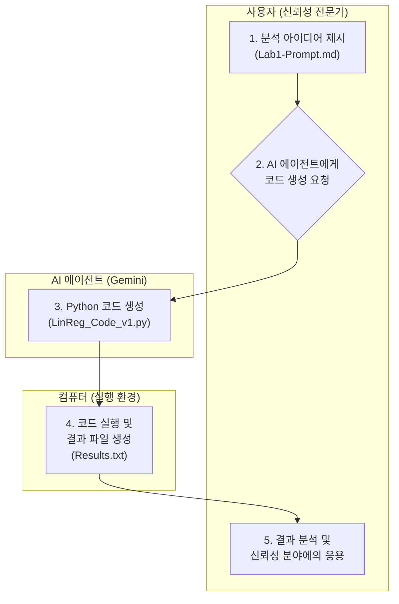

# [Lab 1] AI 에이전트를 활용한 파이썬 데이터 분석 입문: Vibe Coding

## 1. 들어가며: 전문가를 위한 새로운 코딩 방식, Vibe Coding

이 교재는 복잡한 통계 이론과 데이터 분석에는 익숙하지만, 파이썬(Python)이나 AI 기반 코딩은 낯선 분들을 위해 설계되었습니다. 우리는 이 실습을 통해, 코딩의 문법 하나하나를 외우는 대신 **'Vibe Coding'** 이라는 새로운 접근법을 체험하게 될 것입니다.

**Vibe Coding**이란, 내가 구현하고자 하는 기능의 '의도'나 '분위기(Vibe)'를 AI 에이전트에게 설명하면, AI가 구체적인 코드를 생성해주는 방식입니다. 이를 통해 전문 지식을 가진 우리는 코딩의 기술적인 장벽을 넘어, 데이터 분석이라는 본질적인 목표에 더 집중할 수 있습니다.

이 실습에서는 간단한 선형 회귀 모델을 만드는 전 과정을 Vibe Coding으로 진행하며, 다음과 같은 내용을 배우게 됩니다.

-   **명확한 의도 전달**: 어떻게 AI에게 분석 목표를 설명하는가? (프롬프트 설계)
-   **AI의 산출물 이해**: AI가 생성한 코드는 어떤 구조로 되어 있는가?
-   **결과 검증 및 활용**: 생성된 코드를 실행하고, 그 결과를 어떻게 해석하고 응용하는가?

## 2. 실습 전체 흐름도 (Vibe Coding Workflow)

우리가 진행할 실습의 전체 과정을 한눈에 파악할 수 있도록 다이어그램으로 표현했습니다. 사용자는 '아이디어 제시'와 '결과 분석'이라는 핵심적인 역할에 집중하고, 복잡한 코드 작성은 AI 에이전트가 담당합니다.



## 3. [1단계] 모든 것의 시작: 명확한 목표 설정 (프롬프트)

모든 분석은 '무엇을 하고 싶은가?'라는 질문에서 시작합니다. Vibe Coding에서 이 질문에 대한 구체적인 답변이 바로 **프롬프트(Prompt)**입니다. 우리는 AI 에이전트에게 단순히 "코딩해줘"가 아니라, 분석의 목표와 과정을 명확하게 알려주어야 합니다.

### 3.1. 개요

이 단계의 목표는 AI가 명확하게 이해하고 코드를 생성할 수 있도록, 우리의 요구사항을 체계적으로 정리하여 프롬프트로 만드는 것입니다. 이번 실습에서는 "특정 통계 모델을 따르는 데이터를 만들고, 그 데이터로 회귀 분석을 수행해달라"는 구체적인 임무를 부여했습니다.

### 3.2. 상세 내용 (`1.Lab1-Prompt.md` 분석)

실제 AI에게 전달된 프롬프트의 핵심 내용은 다음과 같습니다.

> **[목표]**
> Python을 사용하여 주어진 조건에 따라 데이터를 생성하고, 단순 선형 회귀 분석을 수행하는 예제 코드를 생성해 주세요.
>
> **[분석 과정 및 코드 요구사항]**
> 1.  **데이터 생성:** `y = 10 + 1*x + e` (오차항 `e`는 정규분포 `N(0, 3)`) 관계를 따르는 데이터 (X는 5~20)를 `numpy`로 생성.
> 2.  **모델 적합:** 생성된 데이터로 `statsmodels` 라이브러리를 사용해 선형 회귀 모델 적합.
> 3.  **결과 출력:** 모델 요약 결과를 출력하고, 기울기의 통계적 유의미성에 대한 해석을 주석으로 추가.
> 4.  **신규 값 예측:** X=30일 때의 95% 신뢰구간과 예측구간 계산.
> 5.  **코드 스타일:** 초보자를 위해 상세한 한글 주석과 가독성 좋은 코드를 요청.

이처럼 프롬프트는 **AI 에이전트가 수행할 작업 설명서**와 같습니다. 사용할 라이브러리(`numpy`, `statsmodels`)나 결과물의 형태(상세 주석, 결과 해석 포함)까지 구체적으로 명시할수록 우리가 원하는 코드에 가까운 결과물을 얻을 수 있습니다.

## 4. [2단계] AI의 응답: 코드 생성 (`2.LinReg_Code_v1.py`)

우리가 작성한 명확한 프롬프트를 기반으로, AI 에이전트는 분석 과정을 수행하는 파이썬 코드를 생성합니다. 이제 AI가 만든 코드를 함께 살펴보며 그 구조와 논리를 이해해 보겠습니다.

### 4.1. 개요

AI는 우리의 요구사항을 논리적 순서에 따라 5개의 단계로 나누어 코드를 작성했습니다.

1.  **라이브러리 호출**: 분석에 필요한 도구들을 불러옵니다.
2.  **데이터 생성**: 프롬프트에서 요청한 조건에 맞춰 가상의 데이터를 만듭니다.
3.  **모델 학습**: 생성된 데이터를 이용해 선형 회귀 모델을 학습시킵니다.
4.  **결과 분석**: 학습된 모델의 통계적 결과를 출력합니다.
5.  **미래 예측**: 새로운 데이터에 대한 예측값과 구간을 계산합니다.

### 4.2. 상세 내용 (코드 해설)

이제 코드의 각 부분이 어떤 의미를 갖는지 상세히 살펴보겠습니다.

#### 4.2.1. 라이브러리 불러오기

```python
# [1단계] 분석에 필요한 라이브러리 불러오기
import numpy as np
import pandas as pd
import statsmodels.api as sm

np.random.seed(0)
```

-   `import ... as ...`: 파이썬에서 특정 기능을 가진 도구 모음(라이브러리)을 가져오는 명령어입니다.
    -   `numpy`: 숫자, 특히 행렬과 배열 데이터를 효율적으로 다루는 도구입니다. (예: 여러 개의 센서 측정값)
    -   `pandas`: 엑셀 시트처럼 생긴 표(DataFrame) 형태로 데이터를 정리하고 다루는 도구입니다.
    -   `statsmodels.api`: 각종 통계 모델링과 검증, 회귀 분석 등 전문적인 통계 분석 기능을 제공하는 핵심 도구입니다.
-   `np.random.seed(0)`: 분석 결과를 재현하기 위한 중요한 코드입니다. AI가 데이터를 무작위로 생성할 때, 이 코드가 없으면 실행할 때마다 다른 데이터가 생성됩니다. `seed(0)`을 설정함으로써, 언제 누가 실행해도 프롬프트의 조건에 맞는 동일한 난수를 생성하여 항상 같은 결과를 얻을 수 있습니다.

#### 4.2.2. 데이터 생성

```python
# [2단계] 선형 회귀 모델을 따르는 데이터 생성
independent_variable_X = np.arange(5, 21)
true_intercept = 10
true_slope = 1
error_term_e = np.random.normal(loc=0, scale=3, size=len(independent_variable_X))
dependent_variable_Y = true_intercept + true_slope * independent_variable_X + error_term_e
```

-   AI는 우리가 프롬프트에 제시한 `y = 10 + 1*x + e` 공식을 그대로 코드로 구현했습니다.
-   `independent_variable_X`: 독립 변수 X를 5부터 20까지 생성합니다.
-   `true_intercept`, `true_slope`: 실제 데이터가 따르는 관계식의 절편(10)과 기울기(1)를 정의합니다.
-   `error_term_e`: 현실 세계의 데이터처럼 약간의 불확실성(노이즈)을 추가하기 위해, 평균이 0이고 표준편차가 3인 정규분포에서 오차항을 생성합니다. 이는 신뢰성 데이터에서 발생하는 측정 오차나 자연적인 산포를 모사합니다.
-   `dependent_variable_Y`: 위 요소들을 모두 합쳐 최종 종속 변수 Y를 계산합니다.

#### 4.2.3. 선형 회귀 모델 적합

```python
# [3단계] 선형 회귀 모델 적합
X_with_constant = sm.add_constant(independent_variable_X)
regression_model = sm.OLS(dependent_variable_Y, X_with_constant)
fitted_model = regression_model.fit()
```

-   `sm.add_constant()`: `statsmodels` 라이브러리는 기본적으로 절편(상수항)을 고려하지 않으므로, 분석 모델에 절편이 포함되도록 수동으로 상수항을 추가하는 과정입니다.
-   `sm.OLS()`: OLS(Ordinary Least Squares, 최소자승법)는 실제 데이터와 회귀선 사이의 거리(오차) 제곱의 합이 최소가 되는 선을 찾는 가장 기본적인 회귀 분석 방법입니다. `sm.OLS(종속변수, 독립변수)` 형태로 모델을 정의합니다.
-   `.fit()`: 정의된 모델에 실제 데이터를 입력하여 학습(적합)을 시키고 분석을 수행하라는 명령어입니다. 이 과정을 통해 모델은 데이터의 패턴을 가장 잘 설명하는 절편과 기울기를 찾아냅니다.

## 5. [3단계] 실행 및 결과 확인 (`3.Results.txt`)

AI가 생성한 코드를 실행하면 어떤 결과가 나오는지 확인하고, 그 의미를 해석하는 단계입니다.

### 5.1. 개요

`2.LinReg_Code_v1.py` 파일을 실행하면, 터미널 화면에 `3.Results.txt` 파일과 같은 내용이 출력됩니다. 이 결과는 크게 세 부분으로 나뉩니다.

1.  **생성된 데이터**: AI가 2단계에서 생성한 X, Y 데이터의 실제 값
2.  **회귀 분석 요약**: 모델의 성능과 추정된 계수(절편, 기울기)에 대한 통계 정보
3.  **신규 값 예측**: X=30일 때 Y값에 대한 예측치와 구간 정보

### 5.2. 상세 내용 (결과 분석)

#### 5.2.1. 회귀 분석 결과표 해석

```text
--- [선형 회귀 모델 분석 결과] ---
                            OLS Regression Results
==============================================================================
Dep. Variable:                      y   R-squared:                       0.726
Model:                            OLS   Adj. R-squared:                  0.706
Method:                 Least Squares   F-statistic:                     37.01
... (중략) ...
==============================================================================
                 coef    std err          t      P>|t|      [0.025      0.975]
------------------------------------------------------------------------------
const         14.3380      1.780      8.057      0.000      10.521      18.155
x1             0.8125      0.134      6.083      0.000       0.526       1.099
==============================================================================
```

-   **`R-squared` (결정계수)**: 0.726. 이는 모델이 데이터 변동의 72.6%를 설명한다는 의미로, 비교적 설명력이 높다고 볼 수 있습니다.
-   **`coef` (계수)**: 모델이 데이터를 분석하여 추정한 값입니다.
    -   `const` (절편): **14.3380**. 우리가 처음에 설정한 실제 절편 `10`과 차이가 있는데, 이는 오차항 `e` 때문에 발생한 자연스러운 현상입니다.
    -   `x1` (기울기): **0.8125**. 실제 기울기 `1`에 근접한 값을 추정해냈습니다.
-   **`P>|t|` (p-value)**: 계수가 통계적으로 유의미한지를 판단하는 핵심 지표입니다.
    -   `x1`의 p-value는 `0.000`으로, 일반적인 유의수준 0.05보다 훨씬 작습니다. 이는 **"X가 변할 때 Y도 변한다"는 관계(기울기)가 우연이 아니라 통계적으로 매우 유의미하다**는 강력한 증거입니다.

#### 5.2.2. 예측 결과 해석

```text
--- [X = 30일 때의 예측 결과] ---
예측값 (Y_hat): 38.7143
95% 신뢰구간: [33.5299, 43.8986]
95% 예측구간: [31.3129, 46.1156]
```

-   **예측값**: X가 30일 때, Y는 약 38.71로 예측됩니다.
-   **95% 신뢰구간**: "X=30인 조건에서 Y값들의 **평균**은 95% 확률로 33.53과 43.90 사이에 있을 것이다"라는 의미입니다. 이는 **모집단의 평균**에 대한 추정입니다.
-   **95% 예측구간**: "X=30일 때 **새로운 데이터 Y 하나**를 관측한다면, 그 값은 95% 확률로 31.31과 46.12 사이에 있을 것이다"라는 의미입니다. 개별 값의 불확실성까지 포함하므로 신뢰구간보다 항상 범위가 넓습니다. 신뢰성 분야에서 개별 부품의 수명을 예측할 때 더 중요한 개념일 수 있습니다.

## 6. 결론: 신뢰성 분석 전문성과 AI의 결합

이번 실습을 통해 우리는 Vibe Coding의 전 과정을 경험했습니다. 중요한 것은 파이썬 문법 하나하나를 암기하는 것이 아니라, **내가 무엇을 분석하고 싶은지 명확히 정의하고, AI가 제시한 결과를 비판적으로 해석하며, 그 의미를 우리의 전문 분야에 연결하는 능력**입니다.

예를 들어, 이 선형 회귀 모델은 다음과 같은 신뢰성 문제에 바로 응용할 수 있습니다.

-   **가속수명시험**: 스트레스(X) 수준에 따른 부품의 수명(Y) 관계를 모델링하여 정상 사용 조건에서의 수명을 예측합니다.
-   **열화 데이터 분석**: 사용 시간(X)에 따른 성능 저하(Y)를 분석하여 잔여 수명(RUL)을 예측합니다.
-   **공정 품질 관리**: 특정 공정 변수(X)가 제품의 품질 특성(Y)에 미치는 영향을 분석하여 수율을 개선합니다.

Vibe Coding은 신뢰성 전문가가 가진 도메인 지식의 가치를 더욱 높여주는 강력한 도구입니다. AI 에이전트와의 협업을 통해 데이터 기반의 의사결정을 더욱 빠르고 정확하게 내릴 수 있게 될 것입니다. 다음 실습에서는 더 복잡한 분석에 도전해 보겠습니다.
