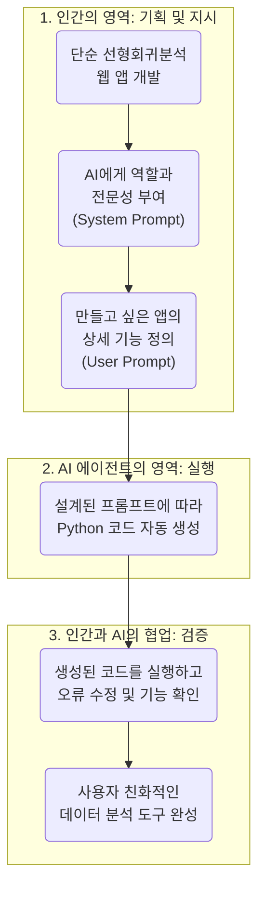

# [Lab 2] 신뢰성 전문가를 위한 Vibe Coding 및 Streamlit 기초


## 1. 과정 개요

본 과정은 Python이나 코딩 경험이 많지 않은 신뢰성 분야의 전문가들을 위해 설계되었습니다. 우리는 생성형 AI, 특히 **AI 에이전트(AI Agent)**의 개념을 활용하여 복잡한 코드를 직접 작성하는 대신, AI와 대화하고 요구사항을 명확히 전달함으로써 원하는 데이터 분석 애플리케이션을 손쉽게 개발하는 **"Vibe 코딩"** 방식을 학습합니다.

이번 실습에서는 통계 분석의 기초인 **단순 선형회귀분석**을 수행하고, 그 결과를 사용자가 직접 조작하며 확인할 수 있는 **인터랙티브 웹 애플리케이션**을 만들어봅니다. 이 과정을 통해 AI를 단순한 코드 생성기를 넘어, 개발의 전 과정을 함께하는 협업 파트너, 즉 AI 에이전트로 활용하는 방법을 체득하게 될 것입니다.

### 학습 목표
- AI 에이전트의 개념과 Vibe 코딩의 원리를 이해합니다.
- 명확한 요구사항 정의(프롬프트 설계)를 통해 AI의 결과물 품질을 높이는 방법을 배웁니다.
- Python의 `Streamlit` 라이브러리를 활용하여 인터랙티브 웹 앱을 개발하는 과정을 경험합니다.
- 단순 선형회귀분석의 핵심 개념을 시각적이고 직관적으로 이해합니다.

---

## 2. AI 에이전트를 활용한 개발 프로세스 시각화

우리가 진행할 전체 개발 과정은 다음과 같은 흐름으로 이루어집니다. 이는 마치 관리자가 실무자에게 업무를 지시하고 결과물을 보고받는 과정과 유사합니다.



---

## 3. 개발 과정 상세 안내 (단계별)

### 1단계: AI 에이전트 설정 (System Prompt 설계)

AI에게 단순히 "코드를 만들어줘"라고 요청하는 것과 "너는 최고의 데이터 분석 앱 개발 전문가야"라고 역할을 부여하고 구체적인 지침을 주는 것은 결과물의 품질에 큰 차이를 만듭니다. 우리는 AI가 따라야 할 **행동 강령과 원칙**을 정의하는 **시스템 프롬프트(System Prompt)**를 먼저 설계합니다.

이번 실습에서는 `gemini.md` 파일에 다음과 같이 AI 에이전트의 역할을 정의했습니다.

> #### **`gemini.md` : AI 에이전트의 역할 정의서**
>
> **- 역할:** Python 데이터 분석 및 시각화 애플리케이션 개발 전문가 (특히 Streamlit에 능숙)
> **- 목표:** 사용자의 요구사항을 정확히 이해하고, 깨끗하고, 효율적이며, 상세한 설명이 포함된 코드를 생성
> **- 핵심 원칙:**
>   1.  **가독성 우선:** PEP 8 스타일 가이드 준수, 직관적인 변수/함수명 사용
>   2.  **상세한 한글 주석:** 코드의 모든 주요 부분에 상세한 한글 주석 작성
>   3.  **구조화된 코드:** 기능별 모듈화, 전역 변수 사용 최소화
>   4.  **사용자 가이드 포함:** 코드 최상단에 앱 설명, 라이브러리 목록, 설치 및 실행 명령어 포함
>   5.  **표준 라이브러리 활용:** `pandas`, `numpy`, `statsmodels`, `matplotlib`/`plotly` 등 검증된 라이브러리 사용
>   6.  **예외 처리:** 사용자 입력 오류 등 예외 상황 고려

이처럼 AI 에이전트의 정체성과 작업 기준을 명확히 함으로써, 우리는 일관성 있고 품질 높은 결과물을 안정적으로 얻을 수 있습니다.

### 2단계: 요구사항 명세화 (User Prompt 설계)

이제 설정된 AI 에이전트에게 우리가 만들고 싶은 애플리케이션의 **구체적인 기능과 요구사항**을 전달할 차례입니다. 이를 **사용자 프롬프트(User Prompt)**라고 합니다. 프롬프트가 상세하고 명확할수록 AI는 우리의 의도를 더 정확하게 파악합니다.

이번 실습에서는 `1.Lab2-Prompt_UI(Streamlit).md` 파일의 내용을 기반으로 다음과 같이 요구사항을 정리하여 AI에게 전달했습니다.

> #### **요구사항 요약 (AI에게 전달된 내용)**
>
> 1.  **앱의 핵심 기능:**
>     - 사용자가 설정한 파라미터(`a`, `b`, `sigma` 등)로 가상의 데이터 생성
>     - 생성된 데이터로 단순 선형회귀모델(`y ~ x`) 적합
>     - 결과를 시각화하고 통계적으로 해석
>     - 특정 x값(`k`)에 대한 신뢰구간 및 예측구간 계산
>
> 2.  **UI/UX 요구사항 (Streamlit 사용):**
>     - 모든 사용자 입력은 화면 좌측의 **사이드바**에 배치
>     - `a`, `b`, `sigma`, `c`, `d`, `k` 값을 숫자로 입력받는 컨트롤 생성
>     - **"분석 실행"** 버튼을 눌렀을 때만 분석 과정이 수행되도록 구현
>
> 3.  **결과 출력 형식:**
>     - 데이터 산점도와 회귀선을 포함한 **그래프** 출력
>     - `statsmodels` 라이브러리의 **모델 요약표** 전체 출력
>     - 기울기의 **P-값을 해석**하여 통계적 유의성 여부를 문장으로 설명
>     - 계산된 **신뢰구간과 예측구간**을 친절한 설명과 함께 출력
>
> 4.  **품질 요구사항:**
>     - 앞서 정의한 시스템 프롬프트(`gemini.md`)의 모든 원칙을 준수할 것

이처럼 추상적인 아이디어를 구체적인 기능 명세로 바꾸는 과정이 프롬프트 설계의 핵심입니다.

### 3단계: AI의 코드 생성 및 분석

위의 시스템 프롬프트와 사용자 프롬프트를 기반으로, AI 에이전트는 `simple_linear_regression_app.py`라는 결과물을 생성했습니다. 이 코드는 우리의 모든 요구사항을 충실히 반영하고 있으며, 특히 시스템 프롬프트에서 지시한 대로 **상세한 주석과 사용자 가이드**가 포함되어 있습니다.

이제 코드의 주요 구조를 함께 살펴보겠습니다.

#### **`simple_linear_regression_app.py` 코드 구조 분석**

```python
"""
[사용자 실행 가이드]
- 앱 설명, 필요 라이브러리, 설치 및 실행 방법이 상세히 기술되어 있습니다.
- 이 부분만 복사해서 전달하면 누구나 쉽게 앱을 실행할 수 있습니다.
"""

# --- 1. 라이브러리 임포트 ---
# Streamlit, Pandas, Numpy 등 앱 구동과 분석에 필요한 도구들을 불러옵니다.
import streamlit as st
import pandas as pd
import numpy as np
import statsmodels.formula.api as smf
import matplotlib.pyplot as plt
# ... (한글 폰트 설정 등)

# --- 2. 메인 애플리케이션 로직 ---

# st.title() : 앱의 제목을 설정합니다.
st.title("📊 단순 선형회귀분석 시뮬레이터")

# --- 3. 사이드바 (사용자 입력 영역) ---
# with st.sidebar: 구문 안의 모든 내용은 좌측 사이드바에 표시됩니다.
with st.sidebar:
    st.header("⚙️ 파라미터 설정")
    # st.number_input() : 사용자가 숫자를 입력할 수 있는 위젯을 생성합니다.
    a = st.number_input(label="a (절편, Intercept)", ...)
    b = st.number_input(label="b (기울기, Slope)", ...)
    # ... (다른 파라미터 입력) ...

    # st.button() : 클릭 가능한 버튼을 생성합니다.
    run_button = st.button(label="🚀 분석 실행", ...)

# --- 4. 분석 실행 로직 ---
# "분석 실행" 버튼이 클릭되었을 때(run_button == True)만 내부 코드가 실행됩니다.
if run_button:
    # 4-1. 데이터 생성
    # 사용자가 입력한 a, b, sigma 등의 값으로 numpy를 이용해 가상 데이터를 만듭니다.
    x_data = np.arange(c, d + 1)
    e = np.random.normal(0, sigma, size=len(x_data))
    y_data = a + b * x_data + e
    df = pd.DataFrame({'x': x_data, 'y': y_data})

    # 4-2. 모델 적합
    # statsmodels를 사용해 'y ~ x' 형식으로 회귀모델을 정의하고 적합합니다.
    model = smf.ols('y ~ x', data=df).fit()

    # --- 5. 결과 출력 ---
    # st.subheader() : 소제목을 추가합니다.
    st.subheader("1. 데이터 시각화 및 회귀선")
    # matplotlib으로 그래프를 그리고 st.pyplot()으로 앱에 표시합니다.
    fig, ax = plt.subplots()
    ax.scatter(df['x'], df['y'], ...) # 산점도
    ax.plot(df['x'], model.predict(df['x']), ...) # 회귀선
    st.pyplot(fig)

    st.subheader("2. 회귀분석 모델 요약")
    # st.code() : 모델의 요약 정보를 코드 블록 형태로 보여줍니다.
    st.code(str(model.summary()))

    # ... (결과 해석, 신뢰/예측구간 출력 등) ...

# --- 6. 초기 화면 안내 ---
# 버튼이 눌리지 않았을 때 사용자에게 보여줄 안내 메시지입니다.
else:
    st.info("👈 사이드바에서 파라미터를 설정한 후 '분석 실행' 버튼을 클릭하세요.")

```

### 4단계: 애플리케이션 실행 및 검증

AI가 생성한 코드가 실제로 잘 동작하는지 확인하는 단계입니다.

1.  **필요 라이브러리 설치:**
    코드를 처음 실행하기 전, 터미널(명령 프롬프트)을 열고 코드 상단의 사용자 가이드에 명시된 대로 필요한 라이브러리들을 설치합니다.
    ```bash
    pip install streamlit pandas numpy statsmodels matplotlib
    ```

2.  **Streamlit 앱 실행:**
    터미널에서 `simple_linear_regression_app.py` 파일이 있는 폴더로 이동한 후, 다음 명령어를 입력합니다.
    ```bash
    streamlit run simple_linear_regression_app.py
    ```

3.  **결과 확인:**
    명령어를 실행하면 웹 브라우저에 자동으로 새 탭이 열리면서 우리가 설계한 앱이 나타납니다. 사이드바의 값들을 변경하고 '분석 실행' 버튼을 누르면서 모든 기능이 의도대로 동작하는지, 오류는 없는지 검증합니다.

