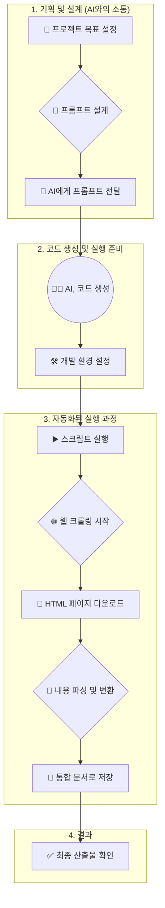

# [Lab 3] 신뢰성 분석을 위한 AI 기반 웹 문서 크롤러 개발 실습 (VibeCoding Lab)

## 1. 프로젝트 개요

본 실습은 신뢰성 공학 분야의 전문가들이 AI 기술을 활용하여 어떻게 연구 및 업무 효율성을 높일 수 있는지 체험하는 것을 목표로 합니다. Python이나 프로그래밍에 익숙하지 않은 분들을 위해, **생성형 AI(Generative AI)**를 활용하여 웹에 흩어져 있는 기술 문서를 수집하고, 이를 하나의 통합된 문서로 만드는 자동화된 '웹 크롤러'를 개발하는 전 과정을 상세히 안내합니다.

이 과정을 통해 수작업으로 문서를 복사하고 붙여넣는 번거로움을 해결하고, AI 에이전트에게 명확한 지시(프롬프트)를 통해 어떻게 원하는 소프트웨어를 만들 수 있는지 학습하게 됩니다.

### 최종 목표
> 특정 웹사이트(신뢰성 공학 라이브러리 기술 문서)의 모든 하위 페이지를 자동으로 방문하여 내용을 수집하고, 오프라인에서 쉽게 검색하고 읽을 수 있는 단일 마크다운(Markdown) 파일로 만드는 것입니다.

## 2. AI를 활용한 전체 개발 프로세스

본 프로젝트는 사람이 직접 코드를 한 줄씩 작성하는 대신, AI에게 명확한 요구사항을 전달하여 코드를 생성하도록 하는 방식으로 진행되었습니다. 전체 프로세스는 다음과 같은 흐름을 가집니다.



---

## 3. 단계별 상세 개발 과정

### 1단계: AI 요구사항 정의 (프롬프트 엔지니어링)

AI가 우리가 원하는 코드를 정확히 생성하도록 만들기 위해, '프롬프트'라는 명확하고 구조화된 요구사항 명세서를 작성했습니다. 이 과정은 좋은 소프트웨어를 만들기 위한 가장 중요한 첫 단계입니다.

- **파일 위치**: `1.Prompt/`
- **핵심 내용**:
    1.  **역할 부여(Persona)**: AI에게 '숙련된 Python 자동화 엔지니어'의 역할을 부여하여 전문가 수준의 코드를 생성하도록 유도했습니다.
    2.  **명확한 목표 설정**: "웹페이지들을 크롤링하여 하나의 마크다운 파일로 통합"이라는 구체적인 목표를 제시했습니다.
    3.  **상세 실행 계획**:
        - 최종 결과물이 저장될 폴더 구조(`output/crawled_html`, `output/integrated_documentation.md` 등)를 명시했습니다.
        - 필요한 Python 라이브러리(`requests`, `beautifulsoup4`, `html2text`)를 지정했습니다.
        - 코드가 수행해야 할 기능을 함수 단위로 나누어(모듈화), 각 함수가 어떤 역할을 해야 하는지 상세히 설명했습니다. (예: 링크 추출 함수, 페이지 처리 함수)
        - 실행 기록을 남기는 '로깅(Logging)' 기능과 오류가 발생해도 멈추지 않도록 하는 '예외 처리(Error Handling)' 기능을 필수로 포함하도록 지시했습니다.

> **[for Reliability Experts]**
> 프롬프트 엔지니어링은 마치 신뢰성 시험 계획을 수립하는 것과 같습니다. 시험 목적, 조건, 절차, 그리고 예상 결과물을 명확히 정의해야 원하는 데이터를 얻을 수 있듯, AI에게도 목표와 절차를 명확히 정의해주어야 원하는 소프트웨어를 얻을 수 있습니다.

### 2단계: 개발 환경 설정

AI가 생성한 Python 스크립트를 실행하기 위해 필요한 라이브러리들을 설치하는 과정입니다.

1.  **가상 환경 생성**: 내 컴퓨터의 다른 Python 프로젝트와 충돌하지 않도록, 이 프로젝트만을 위한 독립된 실행 환경을 만듭니다.
    ```bash
    # 'venv'라는 이름의 가상 환경 폴더 생성
    python -m venv venv
    ```

2.  **가상 환경 활성화**: 생성된 가상 환경에 진입합니다.
    ```bash
    # Windows
    .\venv\Scripts\activate
    
    # macOS / Linux
    source venv/bin/activate
    ```

3.  **필요 라이브러리 설치**: `requirements.txt` 파일은 이 프로젝트에 필요한 모든 라이브러리 목록을 담고 있습니다. 아래 명령어로 한 번에 설치할 수 있습니다.
    ```bash
    pip install -r 2.Code/requirements.txt
    ```
    - **`requests`**: 웹사이트에 접속하여 HTML 문서를 가져오는 역할을 합니다. (HTTP 통신 라이브러리)
    - **`beautifulsoup4`**: 가져온 HTML 문서의 구조를 분석하여 우리가 원하는 정보(예: 제목, 본문, 링크)를 쉽게 추출할 수 있도록 도와줍니다. (HTML 파서)
    - **`html2text`**: HTML 태그들을 깔끔한 마크다운 텍스트 형식으로 변환해주는 역할을 합니다.

### 3단계: AI 생성 코드 분석 (`webdoc_crawler_v1.py`)

AI가 생성한 핵심 코드의 구조와 동작 방식을 이해하는 단계입니다. 코드는 각 기능별로 잘 분리된 함수들로 구성되어 있습니다.

- **파일 위치**: `2.Code/webdoc_crawler_v1.py`

#### 코드의 주요 구성 요소:

1.  **설정 (Configuration)**
    - 스크립트 상단에는 `OUTPUT_DIR`, `LOG_FILE` 등 결과물이 저장될 위치나 파일명을 미리 정의해두어, 나중에 수정하기 쉽도록 만들었습니다.

2.  **`setup_project_structure()` 함수**
    - 스크립트 실행 시 결과물을 저장할 `output` 폴더와 `output/crawled_html` 폴더가 없으면 자동으로 생성합니다.

3.  **`setup_logging()` 함수**
    - 스크립트의 모든 실행 과정을 터미널 화면과 `crawl_log.log` 파일에 동시에 기록하도록 설정합니다. 어떤 페이지를 수집 중인지, 오류는 없는지 쉽게 확인할 수 있습니다.

4.  **`extract_main_links(base_url)` 함수**
    - **역할**: 가장 먼저 실행되는 핵심 기능 중 하나입니다.
    - **동작**:
        1.  입력받은 시작 URL(`base_url`)에 접속합니다.
        2.  `BeautifulSoup`을 이용해 페이지의 모든 링크(`<a>` 태그)를 수집합니다.
        3.  그중에서 우리가 원하는 내부 기술문서 링크(`.html`로 끝나는 링크)만 선별하여 목록으로 반환합니다.

5.  **`process_and_save_subpage(page_url)` 함수**
    - **역할**: `extract_main_links`에서 찾은 각 문서 링크를 처리합니다.
    - **동작**:
        1.  문서 URL에 접속하여 HTML 전체를 다운로드합니다.
        2.  `CONTENT_SELECTOR` 설정(`div[role='main']`)을 이용해 웹페이지의 광고, 메뉴 등 불필요한 부분을 제외하고 실제 본문 내용만 정확히 추출합니다.
        3.  추출한 본문 HTML을 `output/crawled_html` 폴더에 백업용으로 저장합니다.
        4.  `html2text`를 사용해 HTML을 마크다운 텍스트로 변환하여 반환합니다.

6.  **`main()` 함수**
    - **역할**: 이 모든 과정을 순서대로 지휘하는 오케스트라의 지휘자입니다.
    - **동작**:
        1.  폴더 생성, 로깅 설정 등 사전 준비 작업을 합니다.
        2.  `extract_main_links`를 호출해 수집할 문서 목록을 가져옵니다.
        3.  문서 목록을 하나씩 돌면서 `process_and_save_subpage`를 호출해 내용을 마크다운으로 변환합니다.
        4.  변환된 모든 마크다운 내용을 하나로 합쳐 `integrated_documentation.md` 파일에 최종 저장합니다.

### 4단계: 스크립트 실행 및 결과 확인

이제 모든 준비가 끝났습니다. 아래 명령어를 통해 스크립트를 실행하여 웹 크롤링을 시작합니다.

1.  **스크립트 실행**:
    - 터미널에서 `2.Code` 폴더로 이동합니다.
      ```bash
      cd 2.Code
      ```
    - 크롤링할 대상 URL을 인자로 넣어 스크립트를 실행합니다.
      ```bash
      # 예시: reliability 라이브러리의 index.html 페이지를 크롤링
      python webdoc_crawler_v1.py https://reliability.readthedocs.io/en/latest/index.html
      ```

2.  **결과물 확인**:
    - 실행이 완료되면 `2.Code/output/` 폴더에 다음과 같은 결과물들이 생성됩니다.
        - `crawled_html/`: 각 웹페이지의 원본 HTML 본문이 개별 파일로 저장되어 있습니다.
        - `crawl_log.log`: 스크립트가 실행되면서 어떤 작업을 했는지, 오류는 없었는지 모든 기록이 담겨 있습니다.
        - **`integrated_documentation.md`**: **최종 목표 산출물입니다.** 모든 기술 문서가 이 하나의 파일에 통합되어 있어, 인터넷 연결 없이도 내용을 확인하고 검색할 수 있습니다.

## 4. 결론 및 고찰

본 실습을 통해 우리는 생성형 AI가 단순한 대화 상대를 넘어, 복잡한 요구사항을 이해하고 실제 동작하는 소프트웨어를 만들어내는 강력한 개발 도구임을 확인했습니다. 신뢰성 전문가들은 이제 코딩 기술을 깊이 있게 배우지 않더라도, 자신의 전문 분야 지식을 바탕으로 AI에게 명확한 지시를 내림으로써 데이터 수집, 분석, 리포팅 등 반복적인 업무를 자동화하는 프로그램을 만들 수 있습니다.

앞으로는 여러분의 연구 및 업무 현장에서 마주치는 다양한 문제들을 'AI 에이전트에게 어떻게 지시하여 해결할 수 있을까?'라는 관점으로 바라보는 새로운 시각을 갖게 되기를 바랍니다.
