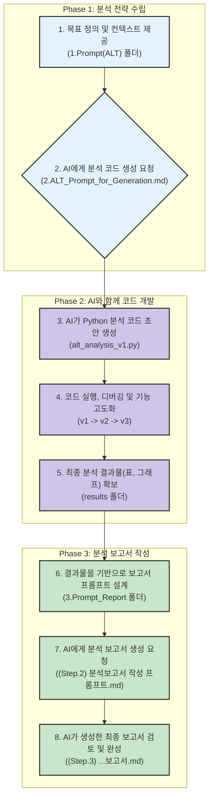

# **[Lab 4] 가속수명시험(ALT) 분석 및 보고서 작성**

### **과정 소개**

이번 실습(Lab)의 목표는 복잡하고 전문적인 지식이 필요했던 **가속수명시험(Accelerated Life Test, ALT)** 데이터 분석 과정을, 강력한 AI 도구와 AI 에이전트를 활용하여 누구나 쉽게 수행할 수 있도록 체험하는 것입니다. 과거에는 통계 전문가나 신뢰성 엔지니어가 복잡한 소프트웨어를 사용해야 했지만, 이제는 AI와의 대화를 통해 분석 코드를 만들고, 결과를 해석하며, 최종 보고서까지 작성할 수 있습니다.

---

### **CHAPTER 1: 전체 실습 과정 개요 (The Big Picture)**

우리가 진행할 실습은 크게 4개의 단계로 이루어집니다. 마치 요리사가 레시피를 구상하고(프롬프트 설계), 재료를 손질하여(데이터 준비), 요리를 하고(코드 실행), 마지막에 예쁘게 플레이팅(보고서 작성)하는 것과 같습니다.

아래는 우리가 거쳐갈 전체 과정의 흐름도입니다. 각 단계가 어떻게 연결되는지 눈으로 확인해 보세요.

---

### **CHAPTER 2: 가속수명시험(ALT) 프롬프트 설계 및 생성**

AI에게 일을 시키려면, "무엇을", "어떻게" 해달라고 명확하게 요청해야 합니다. 이 요청서를 **프롬프트(Prompt)**라고 부릅니다. 좋은 프롬프트는 AI를 유능한 전문가로 만들지만, 나쁜 프롬프트는 AI를 길 잃은 초보자로 만듭니다.

이 단계에서는 `1.Prompt(ALT)` 폴더의 파일들을 통해 어떻게 전문적인 분석을 위한 명확한 프롬프트를 만드는지 배웁니다.

#### **1. 개요**
- **목표:** AI가 '가속수명시험 데이터 분석 전문가'의 역할을 수행하도록, 분석에 필요한 모든 배경지식, 데이터 정보, 분석 절차, 원하는 결과 형태를 담은 명확한 지시서(프롬프트)를 만드는 것.
- **핵심:** "내가 원하는 게 정확히 이거야"라고 AI에게 명확히 알려주는 과정입니다.

#### **2. 구체적인 내용 (`1.Prompt(ALT)` 폴더)**

- **`0.ALT Context 1.md`, `0.ALT Context 2.md` (배경지식 제공)**
    - **내용:** 가속수명시험(ALT)이 무엇인지, 왜 하는지, 어떤 통계 모델(와이블, 로그노멀 분포 등)과 가속 모델(아레니우스, 아이링 모델 등)이 사용되는지에 대한 이론적 배경지식이 담겨 있습니다.
    - **목적:** 사람도 특정 분야의 일을 하려면 관련 지식을 공부해야 하듯, AI에게 전문적인 분석을 맡기기 전에 "교과서"를 읽게 하는 것과 같습니다. 이 컨텍스트를 통해 AI는 단순 코더가 아닌, 신뢰성 공학 지식을 갖춘 분석가로서 생각하게 됩니다.

- **`1.ALT_Prompt_Design.md` (프롬프트 설계도)**
    - **내용:** 좋은 프롬프트를 만들기 위한 구조적인 설계도입니다. 보통 다음과 같은 요소로 구성됩니다.
        - **Persona (역할):** AI에게 "너는 최고의 신뢰성 데이터 분석 전문가야"라고 역할을 부여합니다.
        - **Task (과업):** "엑셀 데이터를 읽고, 통계 분석을 수행하고, 결과를 시각화하는 Python 코드를 만들어줘" 와 같이 구체적인 임무를 부여합니다.
        - **Context (맥락):** 위에서 설명한 ALT 배경지식과 우리가 분석할 데이터(`ALT_Chip_temperature.xlsx`)의 정보를 제공합니다.
        - **Format (결과 형식):** "결과는 Jupyter Notebook(.ipynb) 파일로 만들어줘" 와 같이 원하는 결과물의 형태를 지정합니다.
    - **목적:** 체계적으로 프롬프트를 설계하여, 빠뜨리는 내용 없이 AI에게 명확한 지시를 내리기 위함입니다.

- **`2.ALT_Prompt_for_Generation.md` (최종 실행 프롬프트)**
    - **내용:** 위의 모든 내용을 종합하여 AI에게 최종적으로 전달하는 완성된 프롬프트입니다. 이 파일을 복사하여 생성형 AI(예: Gemini, ChatGPT)에 붙여넣으면, AI가 이 지시를 바탕으로 코드를 생성하기 시작합니다.
    - **목적:** AI가 작업을 수행할 수 있도록 최종 명령을 전달하는 단계입니다.

---

### **CHAPTER 3: AI와 함께 코드 개발 및 수정하기**

이제 AI가 만들어준 코드를 직접 실행해보고, 원하는 방향으로 개선해나가는 과정입니다. 코딩 경험이 없어도 괜찮습니다. AI와 대화하며 코드를 고쳐나가는 과정을 체험하는 것이 중요합니다.

이 단계에서는 `2.Code(ALT)` 폴더의 파일들을 중심으로 학습합니다.

#### **1. 개요**
- **목표:** AI가 생성한 초기 코드를 바탕으로, 실제 데이터를 분석하고 원하는 결과를 얻을 때까지 코드를 실행, 테스트, 수정하는 반복적인 개발 과정을 이해합니다.
- **핵심:** 코딩은 한 번에 완벽하게 짜는 것이 아니라, 계속해서 테스트하고 고쳐나가는 과정(Iterative Development)임을 이해하는 것입니다.

#### **2. 구체적인 내용 (`2.Code(ALT)` 폴더)**

- **`ALT_Chip_temperature.xlsx` (입력 데이터)**
    - **내용:** 이번 실습에서 분석할 '반도체 칩의 온도 스트레스에 따른 수명 데이터'가 담긴 엑셀 파일입니다. 특정 온도(Stress)에서 각 샘플이 언제 고장났는지(Failure Time) 기록되어 있습니다.
    - **의미:** 모든 분석의 시작점이 되는 원재료입니다.

- **`alt_analysis_v1.ipynb`, `alt_analysis_v2.ipynb`, `alt_analysis_v3.ipynb` (코드 개발 과정)**
    - **v1 (초기 버전):** AI가 처음 생성해준 코드일 가능성이 높습니다. 데이터를 불러오고, 기본적인 통계량을 계산하는 등의 기초적인 기능이 담겨 있습니다.
    - **v2 (개선 버전):** v1을 실행해 본 후, "그래프를 더 예쁘게 그려줘" 또는 "다른 통계 모델도 추가해줘" 와 같은 추가 요청을 통해 개선된 버전입니다.
    - **v3 (최종 버전):** 여러 번의 수정을 거쳐 분석 절차를 완성하고, 결과를 체계적으로 정리하는 기능까지 포함된 최종 코드입니다. `alt_analysis_v3_onestop.html` 파일은 이 코드를 실행한 결과 전체를 하나의 웹페이지로 저장한 것입니다.
    - **목적:** `v1` -> `v2` -> `v3`로 발전하는 과정을 통해, AI와 협업하여 소프트웨어를 점진적으로 완성해나가는 실제 개발 프로세스를 체험할 수 있습니다.

- **`results` (결과물 폴더)**
    - **내용:** 최종 코드를 실행하여 얻어진 모든 분석 결과(데이터 파일, 그래프 이미지 등)가 저장되는 공간입니다.
    - **주요 파일 설명:**
        - `step1_data_summary.csv`: 데이터의 기초 통계 요약.
        - `step2_distribution_fitting_results.csv`: 어떤 통계 분포가 우리 데이터에 가장 적합한지 분석한 결과.
        - `step3_confidence_ellipse_plot.png`: 분석 결과가 통계적으로 얼마나 신뢰할 수 있는지 보여주는 타원형 그래프.
        - `step4_best_alt_life_stress_plot.png`: 스트레스 수준에 따른 제품의 수명을 예측하는 가장 중요한 결과 그래프.
        - `step5_reliability_prediction.csv`: 정상 사용 조건에서 제품의 기대 수명과 신뢰도를 예측한 최종 결과표.
    - **목적:** 이 결과물들은 다음 장에서 AI를 통해 최종 보고서를 작성할 때 핵심 재료로 사용됩니다.

---

### **CHAPTER 4: AI를 활용한 분석 보고서 생성**

이제 복잡한 숫자와 그래프로 가득한 분석 결과를, 누가 봐도 이해하기 쉬운 전문적인 보고서로 만드는 마지막 단계입니다.

이 단계에서는 `3.Prompt_Report(ALT_report)` 폴더의 파일들을 사용합니다.

#### **1. 개요**
- **목표:** `results` 폴더에 저장된 분석 결과물(표, 그래프)을 AI에게 제공하고, 전문가 수준의 "가속수명시험 분석 결과 보고서" 초안을 자동으로 생성하게 합니다.
- **핵심:** 데이터를 해석하고, 스토리를 부여하여 가치 있는 정보로 만드는 과정입니다.

#### **2. 구체적인 내용 (`3.Prompt_Report(ALT_report)` 폴더)**

- **`(Step.1) 분석보고서 작성 프롬프트 설계.md`**
    - **내용:** 어떤 구조와 내용으로 보고서를 쓸지에 대한 설계도입니다. "서론, 분석 방법, 분석 결과, 결론 순서로 작성해줘. 각 분석 결과 그래프를 설명하고, 최종적으로 이 제품의 예상 수명은 얼마인지 명확히 제시해줘" 와 같이 보고서의 뼈대를 설계합니다.
    - **목적:** 사람이 보고서 목차를 짜는 것과 같이, AI가 체계적인 글을 쓸 수 있도록 가이드라인을 제공합니다.

- **`(Step.2) 분석보고서 작성 프롬프트.md`**
    - **내용:** 위 설계도를 바탕으로, `results` 폴더의 핵심 결과(예: `step5_reliability_prediction.csv`의 내용, 주요 그래프 설명)를 포함하여 작성한 최종 보고서 생성용 프롬프트입니다.
    - **목적:** 보고서 작성에 필요한 모든 재료와 지시사항을 AI에게 한 번에 전달하기 위함입니다.

- **`(Step.3) 가속수명시험 분석 결과 보고서.md`**
    - **내용:** AI가 위의 프롬프트를 바탕으로 생성한 최종 보고서 초안입니다. 서론부터 결론까지, 분석 과정과 결과를 논리적으로 설명하는 글로 구성되어 있습니다.
    - **목적:** 거의 완성된 보고서를 얻음으로써, 사용자는 내용의 사실관계만 확인하고 약간의 수정만 거치면 되므로 보고서 작성 시간을 획기적으로 단축할 수 있습니다.

- **`(Step.4) Follow up Q&A.md`**
    - **내용:** AI가 생성한 보고서 초안에 대해 "이 부분은 좀 더 쉽게 설명해줘" 또는 "이 분석 결과가 의미하는 바를 한 문장으로 요약해줘" 와 같이 추가적인 질문과 답변을 통해 보고서를 다듬어가는 과정을 기록한 문서입니다.
    - **목적:** AI와의 상호작용을 통해 결과물을 더욱 완벽하게 만들어나가는 과정을 보여줍니다.
