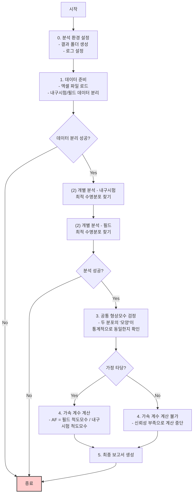
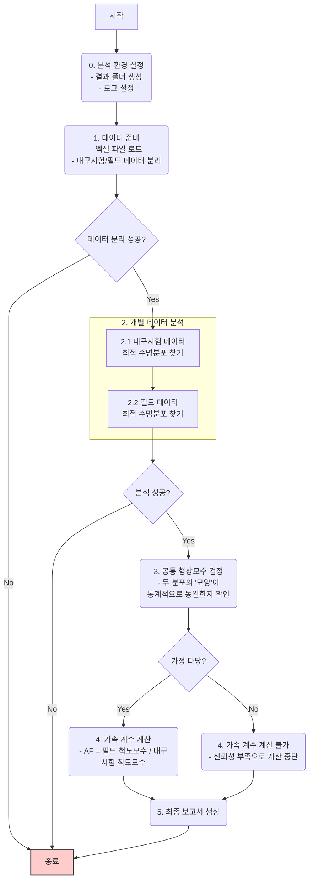

# ⚙️ 브레이크 패드 수명 데이터 분석 코드(lifedata_v6.py) 해설서

안녕하세요! AI를 활용한 신뢰성 분석 과정에 오신 것을 환영합니다.

이 문서는 `lifedata_v6.py` 파이썬 코드를 이해하고 직접 실행해보는 데 도움을 드리기 위해 만들어졌습니다. 우리는 이 코드를 통해 **내구 시험 데이터**와 **실제 필드 데이터**를 통계적으로 비교하여, 두 환경 사이의 **가속 계수(Acceleration Factor)**를 찾아내는 흥미로운 여정을 떠나게 될 것입니다.

이 해설서를 차근차근 따라오시면, 신뢰성 데이터 분석의 핵심 개념과 파이썬을 활용한 자동화 분석 방법을 모두 익히실 수 있을 것입니다.

---

## 목차
- [⚙️ 브레이크 패드 수명 데이터 분석 코드(lifedata\_v6.py) 해설서](#️-브레이크-패드-수명-데이터-분석-코드lifedata_v6py-해설서)
  - [목차](#목차)
  - [1. 코드의 목적 및 목표](#1-코드의-목적-및-목표)
  - [2. 분석 전체 흐름도](#2-분석-전체-흐름도)
  - [3. 핵심 분석 방법론](#3-핵심-분석-방법론)
    - [3.1. 수명 분포 피팅](#31-수명-분포-피팅)
    - [3.2. 공통 형상모수 검정](#32-공통-형상모수-검정)
    - [3.3. 가속 계수(AF) 산출](#33-가속-계수af-산출)
  - [4. 주요 함수 상세 설명](#4-주요-함수-상세-설명)
    - [4.1. `setup_environment`](#41-setup_environment)
    - [4.2. `load_and_prepare_data`](#42-load_and_prepare_data)
    - [4.3. `analyze_dataset`](#43-analyze_dataset)
    - [4.4. `compare_shape_parameters`](#44-compare_shape_parameters)
    - [4.5. `calculate_acceleration_factor`](#45-calculate_acceleration_factor)
    - [4.6. `generate_final_report`](#46-generate_final_report)
    - [4.7. `main`](#47-main)
  - [5. 코드 실행 및 재현 방법](#5-코드-실행-및-재현-방법)
    - [5.1. 준비물](#51-준비물)
    - [5.2. 실행](#52-실행)
    - [5.3. 결과 확인](#53-결과-확인)

---

## 1. 코드의 목적 및 목표

이 코드의 핵심 목표는 **"실험실에서 수행한 가혹한 내구 시험이 실제 고객이 사용하는 환경(필드)보다 얼마나 더 가혹한가?"** 라는 질문에 대한 답을 데이터 기반으로 찾는 것입니다.

-   **목적**: 내구 시험과 필드에서 수집된 브레이크 패드의 수명(주행거리) 데이터를 비교 분석하여, 두 환경 간의 상관관계를 나타내는 **가속 계수(AF)**를 정량적으로 산출합니다.
-   **최종 목표**: 분석의 모든 과정을 자동화하고, 결과를 담은 최종 보고서(`final_report.md`)를 생성하여 누구나 쉽게 이해할 수 있도록 합니다.

> **잠깐! 가속 계수(Acceleration Factor, AF)란?**
>
> 실험실의 가속 시험 조건이 실제 사용 조건에 비해 수명을 얼마나 단축시키는지를 나타내는 비율입니다. 예를 들어 AF가 10이라면, 실험실에서의 1시간은 실제 사용 환경에서의 10시간과 동일한 스트레스를 제품에 가한다는 의미입니다. 이를 통해 우리는 짧은 시간의 내구 시험만으로도 장기간의 필드 수명을 예측할 수 있습니다.

---

## 2. 분석 전체 흐름도

코드는 아래와 같은 체계적인 절차에 따라 분석을 수행합니다. 각 단계는 독립적인 함수로 구현되어 있어 코드의 구조를 이해하기 쉽습니다.





---

## 3. 핵심 분석 방법론

이 코드는 신뢰성 공학의 3가지 핵심 통계 기법을 사용합니다.

### 3.1. 수명 분포 피팅

-   **무엇인가요?**: 수집된 수명 데이터(고장 데이터)가 어떤 확률 분포(예: 와이블 분포, 로그정규분포 등)를 가장 잘 따르는지 찾아내는 과정입니다. 제품의 고장 패턴을 수학적 모델로 표현하는 것과 같습니다.
-   **어떻게 하나요?**: `reliability` 라이브러리의 `Fit_Everything` 함수를 사용해 여러 후보 분포(와이블, 로그정규, 정규, 지수 분포)에 데이터를 피팅해보고, **BIC(Bayesian Information Criterion)**라는 통계적 점수가 가장 낮은, 즉 가장 설명력이 좋은 분포를 최적 분포로 선택합니다.

### 3.2. 공통 형상모수 검정

-   **왜 필요한가요?**: 가속 계수를 신뢰성 있게 계산하려면, 내구 시험과 필드 데이터의 **고장 메커니즘(패턴)이 동일하다**는 가정이 필요합니다. 수명 분포의 **형상모수(Shape Parameter)**는 바로 이 고장 패턴을 나타냅니다. 따라서 두 데이터 그룹의 형상모수가 통계적으로 같다고 볼 수 있는지 검증해야 합니다.
-   **어떻게 하나요?**: 각 데이터 그룹의 형상모수와 그 **신뢰구간**을 계산합니다. 그리고 두 신뢰구간이 **서로 겹치는지**를 확인합니다. 만약 겹친다면, "두 그룹의 형상모수는 통계적으로 유의한 차이가 없으므로, 고장 패턴이 동일하다"는 가정을 받아들일 수 있습니다.

### 3.3. 가속 계수(AF) 산출

-   **무엇인가요?**: 두 데이터 그룹의 고장 패턴(형상모수)이 같다고 확인되면, 수명의 스케일을 나타내는 **척도모수(Scale Parameter)**의 비율을 통해 가속 계수를 계산합니다.
-   **어떻게 하나요?**: `AF = 필드 데이터의 척도모수 / 내구시험 데이터의 척도모수` 공식을 사용합니다. 예를 들어, 와이블 분포에서는 특성 수명(α, 알파)이 척도모수가 됩니다. 이 비율이 바로 실험실 시험이 필드 환경을 얼마나 가속시켰는지를 나타내는 값이 됩니다.

---

## 4. 주요 함수 상세 설명

이제 코드의 각 함수가 어떤 역할을 하는지 자세히 살펴보겠습니다.

### 4.1. `setup_environment`

-   **역할**: 분석을 시작하기 전, 결과물을 저장할 환경을 설정합니다.
-   **주요 코드**:
    -   `os.makedirs('results')`: 분석 결과(플롯, 로그, 보고서)를 저장할 `results` 폴더를 생성합니다.
    -   `logging.basicConfig(...)`: 분석의 모든 과정을 기록할 로그(log) 시스템을 설정합니다. 로그는 화면과 `results/analysis_log.txt` 파일에 동시에 출력되어, 분석 중 어떤 일이 일어났는지 쉽게 추적할 수 있게 해줍니다.

### 4.2. `load_and_prepare_data`

-   **역할**: `Brakepad_lifedata.xlsx` 파일에서 데이터를 읽어와, '내구시험'과 '필드' 데이터로 분리하여 분석에 사용할 수 있는 형태로 준비합니다.
-   **주요 코드**:
    -   `pd.read_excel(file_path)`: `pandas` 라이브러리를 사용해 엑셀 파일을 읽어옵니다.
    -   `df[df[Config.TYPE_COLUMN] == Config.DURABILITY_TYPE_VALUE]`: 데이터프레임의 'type' 컬럼 값이 'test'인 행들만 필터링하여 내구시험 데이터로 분리합니다. ('field'도 동일한 방식으로 분리)
    -   `durability_df[Config.LIFETIME_COLUMN].dropna().tolist()`: 분리된 데이터에서 수명 값('distance(km)' 컬럼)만 추출하여 파이썬 리스트 형태로 반환합니다.

### 4.3. `analyze_dataset`

-   **역할**: 데이터 리스트 하나(내구시험 또는 필드)를 입력받아, 최적의 수명 분포를 찾고 상세 분석 결과를 반환합니다.
-   **주요 코드**:
    -   `Fitters.Fit_Everything(...)`: `reliability` 라이브러리의 핵심 함수입니다. 입력된 수명 데이터(`failures`)에 대해 여러 분포를 피팅하고, `sort_by='BIC'` 옵션에 따라 BIC 값이 가장 낮은 최적의 분포를 찾아줍니다.
    -   `getattr(Fitters, f'Fit_{best_dist_name}')`: `Fit_Everything`으로 찾은 최적 분포(예: 'Weibull_2P')의 이름을 이용해, 해당 분포에 대한 상세 분석 함수(예: `Fitters.Fit_Weibull_2P`)를 동적으로 호출합니다.
    -   `detailed_fit_results = fitter_function(...)`: 상세 분석 함수를 재실행하여 파라미터의 신뢰구간(`CI=0.95`)과 같은 추가 정보를 얻고, 확률도(Probability Plot)를 생성하여 `results` 폴더에 이미지 파일로 저장합니다.

### 4.4. `compare_shape_parameters`

-   **역할**: 두 분석 결과(내구시험, 필드)를 입력받아, 형상모수의 신뢰구간이 겹치는지 검정하고 결과를 반환합니다.
-   **주요 코드**:
    -   `shape_param_name_map = {'Weibull_2P': 'beta', ...}`: 분포별로 형상모수의 이름이 다르기 때문에(와이블은 'beta', 로그정규는 'sigma'), 딕셔너리를 이용해 이름을 매핑합니다.
    -   `p1_lower = getattr(fit_results_1, f'{shape_param_name}_lower')`: 분석 결과 객체에서 형상모수의 신뢰구간 하한값(`beta_lower`)과 상한값(`beta_upper`)을 가져옵니다.
    -   `is_overlapping = (p1_lower <= p2_upper) and (p2_lower <= p1_upper)`: 두 신뢰구간이 겹치는지 확인하는 핵심 로직입니다. 이 조건이 참(True)이면 공통 형상모수 가정이 타당하다고 판단합니다.
    -   `plt.errorbar(...)`: `matplotlib`을 이용해 두 형상모수의 추정치와 신뢰구간을 막대그래프로 시각화하여 비교하기 쉽게 만들고, 이미지 파일로 저장합니다.

### 4.5. `calculate_acceleration_factor`

-   **역할**: 공통 형상모수 가정이 타당할 경우, 두 분석 결과로부터 척도모수를 추출하여 가속 계수를 계산합니다.
-   **주요 코드**:
    -   `if not common_shape_plausible:`: `compare_shape_parameters` 함수의 결과가 '타당하지 않음(False)'이면, AF 계산을 건너뜁니다.
    -   `scale_param_field / scale_param_durability`: 가속 계수를 계산하는 핵심 공식입니다. 분포의 종류에 따라 척도모수를 가져오는 방식이 다릅니다. (예: 와이블은 `alpha`, 로그정규는 `np.exp(mu)`)
    -   `interpretation = f"..."`: 계산된 AF 값을 이용해 "내구시험 모드는 필드 주행 환경을 약 X배 가속시킨다"와 같이 사람이 이해하기 쉬운 해석 문장을 생성합니다.

### 4.6. `generate_final_report`

-   **역할**: 지금까지의 모든 분석 단계에서 얻은 결과(최적 분포, 파라미터, 플롯 경로, AF 등)를 종합하여 최종 분석 보고서를 마크다운(`.md`) 파일 형식으로 생성합니다.
-   **주요 코드**:
    -   `report_content = f"""..."""`: f-string을 사용하여 마크다운 템플릿 안에 분석 결과 변수들을 동적으로 채워 넣어 전체 보고서 내용을 구성합니다.
    -   `with open(report_path, 'w', ...) as f: f.write(...)`: 완성된 보고서 내용을 `results/final_report.md` 파일에 기록합니다.

### 4.7. `main`

-   **역할**: 프로그램의 진입점(Entry Point)으로, 위에서 설명한 모든 함수들을 정해진 순서에 따라 차례대로 호출하여 전체 분석 파이프라인을 실행합니다.

---

## 5. 코드 실행 및 재현 방법

이제 직접 코드를 실행해보고 분석 결과를 확인해봅시다!

### 5.1. 준비물

1.  **파이썬(Python)**: 컴퓨터에 파이썬이 설치되어 있어야 합니다.
2.  **필요 라이브러리 설치**: 터미널 또는 명령 프롬프트에서 아래 명령어를 실행하여 분석에 필요한 라이브러리들을 설치합니다.
    ```bash
    pip install reliability pandas openpyxl matplotlib
    ```
3.  **데이터 파일**: `lifedata_v6.py` 파일과 동일한 폴더에 `Brakepad_lifedata.xlsx` 데이터 파일이 있어야 합니다.

### 5.2. 실행

터미널에서 `lifedata_v6.py` 파일이 있는 폴더로 이동한 후, 아래 명령어를 입력하여 코드를 실행합니다.

```bash
python lifedata_v6.py
```

### 5.3. 결과 확인

코드가 성공적으로 실행되면, 현재 폴더 안에 `results`라는 새로운 폴더가 생성됩니다. 이 폴더 안에서 아래와 같은 결과물들을 확인하실 수 있습니다.

-   📄 `analysis_log.txt`: 코드 실행 과정이 모두 기록된 로그 파일.
-   📊 `Durability_Test_best_fit_probplot.png`: 내구시험 데이터의 최적 분포 확률도.
-   📊 `Field_best_fit_probplot.png`: 필드 데이터의 최적 분포 확률도.
-   📊 `shape_parameter_comparison_plot.png`: 두 데이터의 형상모수 신뢰구간 비교 그래프.
-   📑 `final_report.md`: 모든 분석 결과가 정리된 최종 보고서. 이 파일을 열어 분석의 결론을 확인해보세요!

---

이 해설서가 여러분의 학습에 도움이 되었기를 바랍니다. 직접 코드를 수정해보거나 다른 데이터에 적용해보면서 신뢰성 분석의 세계를 더 깊이 탐험해보세요! 궁금한 점이 있다면 언제든지 질문해주세요.
