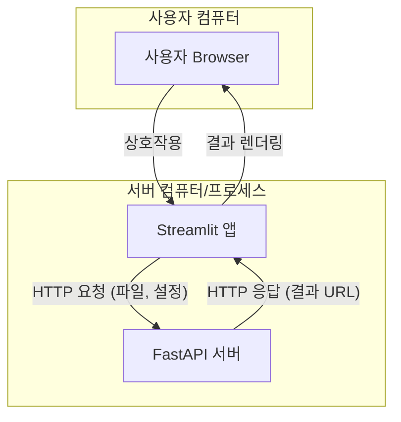
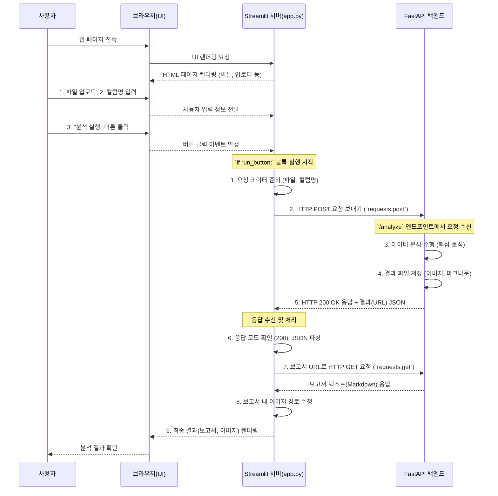

## Streamlit(프론트엔드)와 FastAPI(백엔드) 연동 아키텍처 심층 분석

이 문서는 `frontend_streamlit/app.py`가 백엔드 FastAPI 서버와 어떻게 통신하고 상호작용하여 "브레이크 패드 수명 분석"이라는 완결된 웹 애플리케이션을 구성하는지 상세히 설명합니다. Python 초보 개발자도 쉽게 이해할 수 있도록 기본 개념부터 실제 코드의 동작까지 단계별로 안내합니다.

### 1. 기본 개념: 클라이언트-서버 모델

우리가 만드는 웹 애플리케이션은 두 개의 독립적인 프로그램으로 구성된 **클라이언트-서버 모델**을 따릅니다.

-   **서버 (Server):** FastAPI 백엔드. 데이터 분석이라는 핵심 로직을 수행하고, 계산 결과를 저장하며, 외부의 요청에 응답할 준비를 하고 있는 "전문가"입니다. 항상 특정 주소(예: `http://127.0.0.1:8000`)에서 요청을 기다립니다.
-   **클라이언트 (Client):** Streamlit 프론트엔드. 사용자가 직접 상호작용하는 "창구" 역할을 합니다. 사용자의 요청(파일 업로드, 버튼 클릭 등)을 받아서 서버(전문가)에게 전달하고, 서버가 보내준 결과를 사용자에게 보기 좋게 표시해 줍니다.

이 둘은 **HTTP(HyperText Transfer Protocol)** 라는 약속(프로토콜)을 통해 대화합니다. 클라이언트가 서버에게 "요청(Request)"을 보내면, 서버는 작업을 처리한 후 "응답(Response)"을 돌려주는 방식입니다.

#### 시각화: 클라이언트-서버 아키텍처



### 2. 핵심 라이브러리 역할

-   `streamlit`: Python 코드만으로 웹 UI를 빠르고 쉽게 만들어주는 라이브러리입니다. 버튼, 파일 업로더, 텍스트 입력창 등을 만드는 데 사용됩니다.
-   `requests`: Python에서 HTTP 요청을 매우 쉽게 보낼 수 있게 해주는 라이브러리입니다. Streamlit(클라이언트)이 FastAPI(서버)와 통신하는 데 사용하는 "전화기"와 같습니다.

### 3. `app.py` 작동 원리 상세 분석 (단계별)

사용자가 웹 브라우저에서 Streamlit 앱을 열고 분석을 완료하기까지의 전체 프로세스를 코드와 함께 살펴보겠습니다.

#### 전체 워크플로우 시각화 (Sequence Diagram)



---

#### **1단계: 사용자 인터페이스(UI) 생성 및 입력 대기**

-   **코드:**
    ```python
    st.title("브레이크 패드 수명 분석기")
    # ...
    with st.sidebar:
        uploaded_file = st.file_uploader(...)
        lifetime_col = st.text_input(...)
        type_col = st.text_input(...)
        run_button = st.button("분석 실행")
    ```
-   **설명:**
    -   Streamlit이 `app.py`를 실행하면, `st.`로 시작하는 함수들이 웹 페이지의 각 요소를 만듭니다.
    -   `st.file_uploader`는 파일 선택창을, `st.text_input`은 텍스트 입력 상자를, `st.button`은 클릭 가능한 버튼을 생성합니다.
    -   사용자가 파일을 올리거나 텍스트를 입력하면, 그 정보는 `uploaded_file`, `lifetime_col` 같은 변수에 임시로 저장됩니다.
    -   이 단계에서는 아직 백엔드 서버와 아무런 통신도 하지 않습니다. 모든 것은 사용자의 브라우저와 이를 제어하는 Streamlit 프로세스 안에서 일어납니다.

#### **2단계: 분석 실행 트리거 및 데이터 준비**

-   **코드:**
    ```python
    if run_button:
        if uploaded_file is not None:
            with st.spinner("분석 중..."):
                files = {'file': (uploaded_file.name, uploaded_file.getvalue(), uploaded_file.type)}
                data = {'lifetime_column': lifetime_col, 'type_column': type_col}
                # ...
    ```
-   **설명:**
    -   사용자가 "분석 실행" 버튼을 누르면 `run_button` 변수가 `True`가 되어 `if` 문 안의 코드가 실행됩니다.
    -   **가장 중요한 부분:** 백엔드로 보낼 데이터를 "소포"로 포장하는 과정입니다.
        -   `uploaded_file.getvalue()`: 업로드된 파일의 내용을 순수한 바이너리 데이터(컴퓨터가 읽는 원본 데이터)로 읽어옵니다.
        -   `files = {'file': ...}`: HTTP 요청 중에서도 파일 첨부를 위한 특별한 형식(`multipart/form-data`)으로 데이터를 준비합니다. 파일 이름, 파일의 실제 내용(바이너리), 파일 종류(MIME 타입)를 튜플로 묶어 딕셔너리에 담습니다.
        -   `data = {'lifetime_column': ...}`: 파일 외에 함께 보낼 텍스트 데이터(수명 데이터 컬럼명 등)를 별도의 딕셔너리로 만듭니다.

#### **3단계: 백엔드 API에 HTTP 요청 전송**

-   **코드:**
    ```python
    response = requests.post(BACKEND_URL, files=files, data=data)
    ```
-   **설명:**
    -   `requests.post(...)`: `requests` 라이브러리를 사용해 백엔드 서버에 **POST** 방식의 HTTP 요청을 보냅니다. POST는 보통 클라이언트가 서버에 새로운 데이터를 생성하거나 전송할 때 사용됩니다.
    -   `BACKEND_URL`: 요청을 보낼 목적지 주소입니다. (`http://127.0.0.1:8000/analyze/`)
    -   `files=files`: 2단계에서 준비한 파일 "소포"를 요청에 첨부합니다.
    -   `data=data`: 2단계에서 준비한 텍스트 데이터 "소포"를 함께 첨부합니다.
    -   이 코드가 실행되는 순간, Streamlit 앱은 FastAPI 서버로 네트워크를 통해 데이터를 전송하고, 서버의 응답이 올 때까지 잠시 기다립니다.

#### **4단계: 백엔드 응답 수신 및 처리**

-   **코드:**
    ```python
    if response.status_code == 200:
        st.success("분석이 성공적으로 완료되었습니다!")
        results = response.json()
        # ...
    else:
        st.error(f"분석에 실패했습니다. (상태 코드: {response.status_code})")
    ```
-   **설명:**
    -   `response` 변수에는 FastAPI 서버가 보낸 모든 응답 정보가 담겨 있습니다.
    -   `response.status_code`: HTTP 상태 코드를 확인합니다. `200`은 "요청이 성공적으로 처리되었다"는 의미의 약속된 숫자입니다. 만약 `404`(페이지 없음), `500`(서버 내부 오류) 등이 오면 에러로 처리합니다.
    -   `response.json()`: 응답의 본문(body)에 담긴 JSON 형식의 문자열을 Python 딕셔너리로 변환해 줍니다. `results` 변수에는 이제 `{"report_url": "...", "plot_urls": [...]}` 와 같은 데이터가 들어있게 됩니다.

#### **5단계: 결과 표시**

-   **코드:**
    ```python
    report_url = results.get("report_url")
    if report_url:
        report_response = requests.get(report_url) # 또 다른 HTTP 요청!
        report_text = report_response.text
        # ... 이미지 경로 수정 로직 ...
        st.markdown(report_text, unsafe_allow_html=True)

    plot_urls = results.get("plot_urls", [])
    if plot_urls:
        for plot_url in plot_urls:
            st.image(plot_url)
    ```
-   **설명:**
    -   백엔드는 분석 결과 자체(이미지, 텍스트)를 직접 보내주지 않고, 결과가 저장된 **위치(URL)** 를 알려줬습니다. 이는 큰 데이터를 직접 주고받는 것보다 효율적입니다.
    -   `requests.get(report_url)`: Streamlit 앱은 백엔드가 알려준 보고서 URL로 다시 **GET** 방식의 HTTP 요청을 보냅니다. GET은 특정 위치의 정보를 조회(가져오기)할 때 사용됩니다.
    -   `st.markdown(...)`: 백엔드에서 받아온 보고서 텍스트(마크다운 형식)를 웹 페이지에 예쁘게 렌더링합니다.
    -   `st.image(plot_url)`: 백엔드가 알려준 각 이미지 URL을 `st.image` 함수에 넘겨주면, Streamlit이 해당 URL의 이미지를 다운로드하여 웹 페이지에 표시해 줍니다.

### 4. 케이스 스터디: 신뢰성 엔지니어 '김하나'의 분석 과정

1.  **접속 및 준비:** 김하나 씨가 브라우저를 열고 Streamlit 앱 주소로 접속합니다. 화면에는 "브레이크 패드 수명 분석기" 제목과 파일 업로더, 입력창들이 나타납니다.
2.  **데이터 입력:** 김하나 씨는 `Brakepad_lifedata.xlsx` 파일을 업로드하고, 수명 데이터 컬럼이 `distance(km)`, 데이터 구분 컬럼이 `type`임을 확인합니다.
3.  **분석 시작:** 그녀가 '분석 실행' 버튼을 클릭합니다.
4.  **클라이언트(Streamlit) 동작:**
    -   `app.py`는 버튼 클릭을 감지합니다.
    -   엑셀 파일의 내용을 바이너리 데이터로 읽고, 입력된 컬럼명과 함께 HTTP POST 요청 "소포"를 만듭니다.
    -   `requests.post`를 호출하여 이 "소포"를 `http://127.0.0.1:8000/analyze/`로 발송합니다.
    -   화면에는 "분석 중..." 스피너가 나타납니다.
5.  **서버(FastAPI) 동작:**
    -   FastAPI 서버는 `/analyze/` 경로로 들어온 POST 요청을 받습니다.
    -   첨부된 엑셀 파일과 컬럼명 데이터를 추출합니다.
    -   `reliability`, `pandas` 라이브러리를 사용해 복잡한 통계 분석을 수행합니다.
    -   분석 결과로 생성된 와이블 플롯, 형상모수 비교 플롯 등 이미지 3개와 `analysis_report.md` 마크다운 파일을 서버의 `results/` 폴더에 저장합니다.
    -   저장된 파일들에 접근할 수 있는 URL(예: `http://127.0.0.1:8000/results/weibull_plot.png`)들을 포함한 JSON 응답을 생성합니다.
    -   이 JSON을 담아 HTTP 응답(상태 코드 200)을 클라이언트(Streamlit)에게 보냅니다.
6.  **결과 처리 및 표시 (다시 클라이언트):**
    -   `app.py`는 서버의 응답을 받고, 상태 코드가 200인 것을 확인합니다.
    -   응답에 포함된 JSON을 파싱하여 보고서 URL과 이미지 URL 목록을 얻습니다.
    -   먼저 보고서 URL로 `requests.get` 요청을 보내 마크다운 텍스트를 가져옵니다.
    -   가져온 마크다운 텍스트 안의 이미지 경로 `(weibull_plot.png)`를 완전한 URL `(http://127.0.0.1:8000/results/weibull_plot.png)`로 교체합니다.
    -   수정된 마크다운을 `st.markdown`으로 화면에 표시합니다.
    -   이미지 URL 목록을 하나씩 돌면서 `st.image`를 호출하여 화면에 플롯들을 차례로 보여줍니다.
7.  **분석 완료:** 김하나 씨는 브라우저 화면에 나타난 깔끔한 보고서와 플롯들을 보며 분석 결과를 확인합니다.

이처럼 Streamlit과 FastAPI는 각자의 역할(UI 표시, 핵심 분석)에 충실하면서 HTTP 통신을 통해 유기적으로 협력하여 하나의 완벽한 데이터 분석 애플리케이션을 사용자에게 제공합니다.
