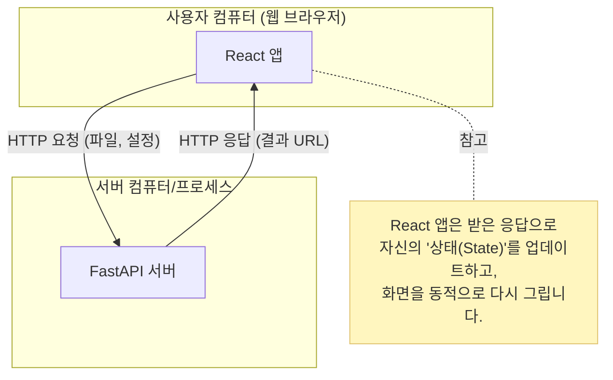
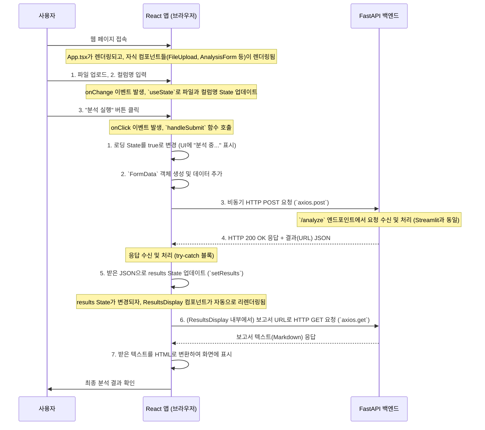

## React(프론트엔드)와 FastAPI(백엔드) 연동 아키텍처 심층 분석

  

이 문서는 `frontend_react` 폴더에 있는 React 애플리케이션이 백엔드 FastAPI 서버와 어떻게 통신하고 상호작용하여, 동적이고 현대적인 "브레이크 패드 수명 분석" 웹 애플리케이션을 구성하는지 상세히 설명합니다. 웹 개발이 처음인 분들도 이해할 수 있도록 React의 핵심 개념부터 실제 코드의 동작까지 단계별로 안내합니다.

  

### 1. 기본 개념: 클라이언트-서버 모델

  

이 프로젝트의 아키텍처는 Streamlit 버전과 마찬가지로 **클라이언트-서버 모델**을 따릅니다. 하지만 클라이언트가 더 정교하고 동적인 방식으로 동작합니다.

  

-  **서버 (Server):** FastAPI 백엔드. 데이터 분석 로직을 수행하고 API를 제공하는 "전문가"입니다. `http://127.0.0.1:8000` 주소에서 요청을 기다립니다. (역할 동일)

-  **클라이언트 (Client):** React 프론트엔드. 사용자와 직접 상호작용하는 "고급 창구" 역할을 합니다. 단순한 페이지 표시를 넘어, 자체적으로 상태를 관리하고 사용자의 행동에 따라 페이지 전체를 새로고침하지 않고 필요한 부분만 동적으로 변경하는 **단일 페이지 애플리케이션(SPA, Single Page Application)**입니다.

  

이 둘은 여전히 **HTTP**를 통해 대화하지만, React 앱은 마치 하나의 완성된 프로그램처럼 브라우저 위에서 동작하며 필요할 때만 서버와 통신합니다.

  

#### 시각화: 클라이언트-서버 아키텍처 (React)


  

### 2. React.js란 무엇인가? - 핵심 개념 소개

  

React는 Facebook(현 Meta)에서 개발한, 사용자 인터페이스(UI)를 만들기 위한 JavaScript 라이브러리입니다. React를 이해하기 위한 핵심 개념은 다음과 같습니다.

  

-  **컴포넌트 (Components):** React 앱은 작고 재사용 가능한 코드 조각인 **컴포넌트**들로 만들어집니다. 예를 들어, 이 프로젝트의 `FileUpload.tsx`, `AnalysisForm.tsx`는 각각 파일 업로드 UI, 분석 설정 UI를 담당하는 독립적인 컴포넌트입니다. 이렇게 UI를 조립 가능한 부품처럼 만들어 개발 효율성과 유지보수성을 높입니다.

  

-  **JSX (JavaScript XML):** JavaScript 코드 안에서 HTML과 유사한 문법을 사용하여 UI를 선언적으로 작성할 수 있게 해줍니다. 개발자는 UI가 어떻게 보일지에만 집중하면, React가 실제 브라우저에 렌더링하는 복잡한 과정을 처리합니다.

```jsx

// 이것은 JSX입니다. HTML처럼 보이지만 JavaScript입니다.

return (
<div className="App">
<h1>수명 분석기</h1>
<FileUpload />
</div>
);

```

  

-  **상태 (State)와 `useState`:**  **State**는 컴포넌트가 "기억"해야 할 데이터입니다. 예를 들어, 사용자가 업로드한 파일, 입력창의 텍스트, 분석 결과 데이터 등이 모두 State로 관리됩니다. `useState`는 React에서 State를 만드는 도구(Hook)입니다. **State가 변경되면, React는 해당 State를 사용하는 컴포넌트의 UI를 자동으로 다시 렌더링(업데이트)합니다.** 이것이 React의 가장 강력하고 핵심적인 특징입니다.

  

-  **이벤트 처리 (Event Handling):** 사용자의 클릭(`onClick`), 입력(`onChange`) 같은 이벤트를 처리하는 방식을 정의합니다. React에서는 이벤트가 발생했을 때 실행할 함수를 JSX에 직접 연결합니다.

  

### 3. 핵심 라이브러리 역할

  

-  `react`: React의 핵심 기능(컴포넌트, 상태 관리 등)을 제공하는 라이브러리입니다.

-  `axios`: HTTP 통신을 쉽게 할 수 있게 해주는 JavaScript 라이브러리입니다. React(클라이언트)가 FastAPI(서버)와 통신하는 데 사용하는 "최신 스마트폰"과 같습니다. 비동기(Asynchronous) 요청을 깔끔하게 처리할 수 있습니다.

-  `marked`: 서버에서 받은 Markdown 형식의 텍스트를 HTML로 변환해 주는 라이브러리입니다.

  

### 4. `frontend_react` 작동 원리 상세 분석 (단계별)

  

사용자가 React 앱과 상호작용하여 분석을 완료하기까지의 전체 프로세스를 코드와 함께 살펴보겠습니다.

  

#### 전체 워크플로우 시각화 (Sequence Diagram)

  



  

---

  

#### **1단계: UI 렌더링 및 상태(State) 초기화**

  

-  **코드 (`App.tsx`):**

```typescript
const App: React.FC = () => {
const [file, setFile] = useState<File | null>(null);
const [lifetimeColumn, setLifetimeColumn] = useState('distance(km)');
const [results, setResults] = useState<AnalysisResult | null>(null);
const [loading, setLoading] = useState(false);
// ...

return (
<div className="App">
{/* ... */}
<FileUpload onFileSelect={setFile} />
<AnalysisForm /* ... */ />
{/* ... */}
</div>
);
};

```

-  **설명:**

-  `App` 컴포넌트가 처음 렌더링될 때, `useState`를 통해 필요한 모든 상태 변수(`file`, `lifetimeColumn`, `results` 등)가 `null`이나 기본값으로 초기화됩니다.

- JSX가 반환되어 화면에 초기 UI가 그려집니다. 이때 `FileUpload` 같은 자식 컴포넌트들이 함께 렌더링됩니다.

-  `onFileSelect={setFile}`: `App` 컴포넌트의 `setFile` 함수를 `FileUpload` 컴포넌트로 전달(이를 **props**라 부름)합니다. 자식 컴포넌트가 부모의 상태를 변경할 수 있게 해주는 핵심 패턴입니다.

  

#### **2단계: 사용자 입력과 상태(State) 업데이트**

  

-  **코드 (`FileUpload.tsx`):**

```typescript

const FileUpload: React.FC<FileUploadProps> = ({ onFileSelect }) => {
const handleFileChange = (event: React.ChangeEvent<HTMLInputElement>) => {
if (event.target.files && event.target.files[0]) {
onFileSelect(event.target.files[0]); // 부모로부터 받은 함수 호출
}
};
return <input type="file" onChange={handleFileChange} />;
};

```

-  **설명:**

- 사용자가 파일을 선택하면 `input` 태그의 `onChange` 이벤트가 발생하여 `handleFileChange` 함수가 실행됩니다.

- 이 함수는 부모(`App.tsx`)로부터 전달받은 `onFileSelect` 함수(실제로는 `setFile` 함수)를 호출하여, 선택된 파일을 인자로 넘깁니다.

-  `setFile(선택된_파일)`이 실행되는 순간, `App` 컴포넌트의 `file` 상태가 업데이트되고, React는 변경을 감지하여 UI를 자동으로 다시 그립니다. (물론 이 경우에는 눈에 띄는 시각적 변화는 없습니다.)

  

#### **3단계: 분석 실행 및 비동기(Asynchronous) API 호출**

  

-  **코드 (`App.tsx`):**

```typescript

const handleSubmit = async () => {
// ...
setLoading(true); // 로딩 상태 시작
const formData = new FormData();
formData.append('file', file);
formData.append('lifetime_column', lifetimeColumn);
// ...
try {
const response = await axios.post<AnalysisResult>('http://127.0.0.1:8000/analyze/', formData, { /* ... */ );
setResults(response.data);
} catch (err) {
// ... 에러 처리
} finally {
setLoading(false); // 로딩 상태 종료
}
};

```

-  **설명:**

- 사용자가 "분석 실행" 버튼을 누르면 `handleSubmit` 함수가 호출됩니다.

-  `setLoading(true)`로 상태를 변경하여 UI에 "분석 중..."이라는 텍스트와 함께 버튼을 비활성화시킵니다. (이를 **조건부 렌더링**이라 합니다.)

-  `FormData`는 파일을 포함한 데이터를 서버에 쉽게 보낼 수 있도록 도와주는 웹 표준 객체입니다. 여기에 `file`과 `lifetimeColumn` 상태 값을 담습니다.

-  `await axios.post(...)`: `axios`를 사용해 백엔드에 비동기 POST 요청을 보냅니다. `async/await` 문법 덕분에 비동기 코드를 동기 코드처럼 깔끔하게 작성할 수 있습니다. 앱은 서버의 응답을 기다리는 동안 멈추지 않고(non-blocking) 다른 사용자 입력을 받을 수 있습니다.

  

#### **4단계: 응답 처리 및 결과 렌더링**

  

-  **코드 (`App.tsx`):**

```typescript

// ... try 블록 내부
setResults(response.data);
// ...
// ... JSX 내부
{results && <ResultsDisplay results={results} />}

```

-  **설명:**

- 서버로부터 성공적인 응답(`response`)을 받으면, `setResults(response.data)`를 호출하여 `results` 상태를 서버가 보내준 JSON 데이터로 업데이트합니다.

-  **React의 마법:**  `results` 상태가 `null`에서 실제 데이터 객체로 변경되었기 때문에, React는 UI를 다시 렌더링합니다.

-  `{results && <ResultsDisplay ... />}`: 이 부분은 "만약 `results` 상태가 존재하면(truthy), `<ResultsDisplay>` 컴포넌트를 렌더링하라"는 의미의 조건부 렌더링입니다.

- 이제 `ResultsDisplay` 컴포넌트가 화면에 나타나고, `results` 데이터를 props로 전달받습니다.

  

#### **5단계: 상세 결과 표시와 `useEffect`**

  

-  **코드 (`ResultsDisplay.tsx`):**

```typescript

const ResultsDisplay: React.FC<ResultsDisplayProps> = ({ results }) => {
const [reportHtml, setReportHtml] = useState<string>('');
  

useEffect(() => {
if (results?.report_url) {
axios.get(results.report_url, { responseType: 'text' })
.then(response => {
// ... 마크다운 텍스트 처리 ...
setReportHtml(marked(processedText) as string);
});
}
}, [results]); // `results`가 변경될 때만 이 코드를 실행
  
return <div dangerouslySetInnerHTML={{ __html: reportHtml }} />;
};

```

-  **설명:**

-  `useEffect`는 컴포넌트가 렌더링된 후에 특정 작업을 수행하고 싶을 때 사용합니다. 이를 **Side Effect** 처리라고 합니다.

-  `useEffect`의 두 번째 인자인 `[results]`는 "이 `useEffect` 안의 코드는 `results` props가 변경되었을 때만 다시 실행해라"는 의미입니다.

- 따라서 `ResultsDisplay`가 처음 렌더링될 때, `results.report_url`로 다시 `axios.get` 요청을 보내 보고서 내용을 가져옵니다.

- 가져온 Markdown 텍스트를 `marked`로 HTML로 변환하고, `setReportHtml`을 통해 `reportHtml` 상태를 업데이트합니다.

-  `reportHtml` 상태가 바뀌면 컴포넌트가 다시 렌더링되고, `dangerouslySetInnerHTML`을 통해 최종 HTML 보고서가 화면에 표시됩니다.

  

### 5. 결론

  

React와 FastAPI의 연동은 현대적인 웹 애플리케이션 개발의 표준적인 모습입니다.

  

-  **FastAPI (백엔드)** 는 데이터 처리와 분석이라는 무거운 작업을 책임지는 안정적인 전문가 역할을 합니다.

-  **React (프론트엔드)** 는 컴포넌트 기반 구조와 상태 관리를 통해 사용자에게 빠르고 동적인 인터페이스를 제공하는 세련된 창구 역할을 합니다.

  

이 둘은 명확하게 역할을 분담하고 약속된 API(HTTP)를 통해 통신함으로써, 복잡한 애플리케이션도 체계적이고 효율적으로 개발할 수 있게 해줍니다.