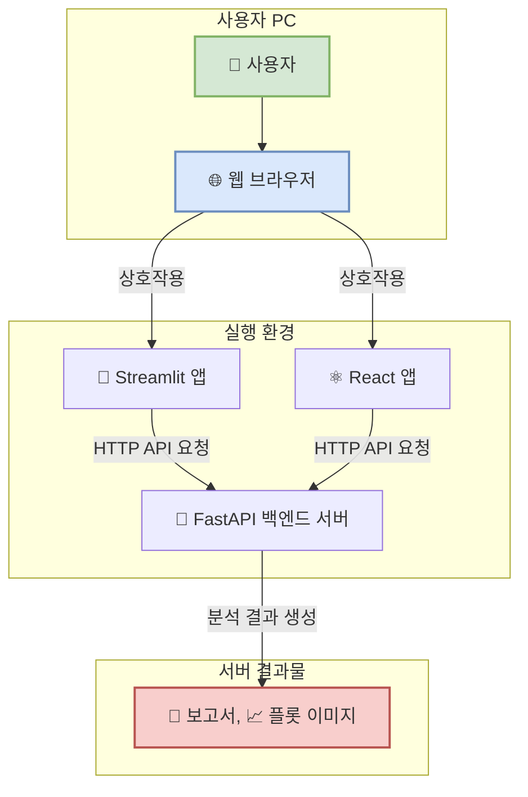
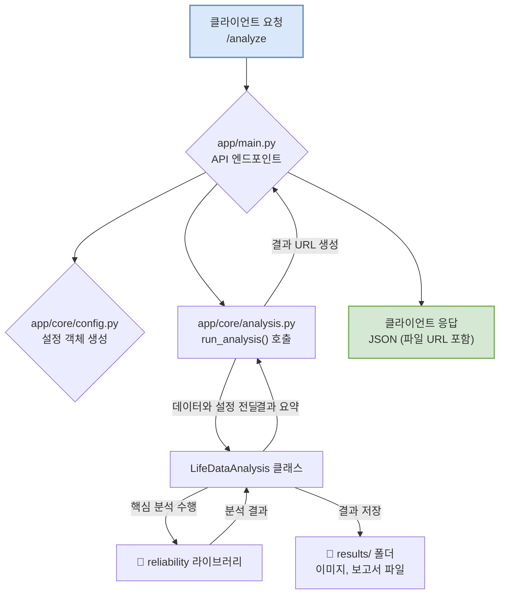
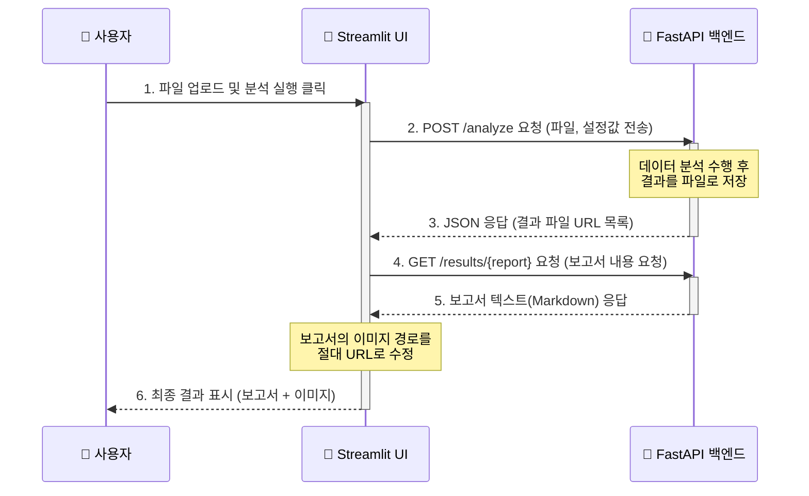
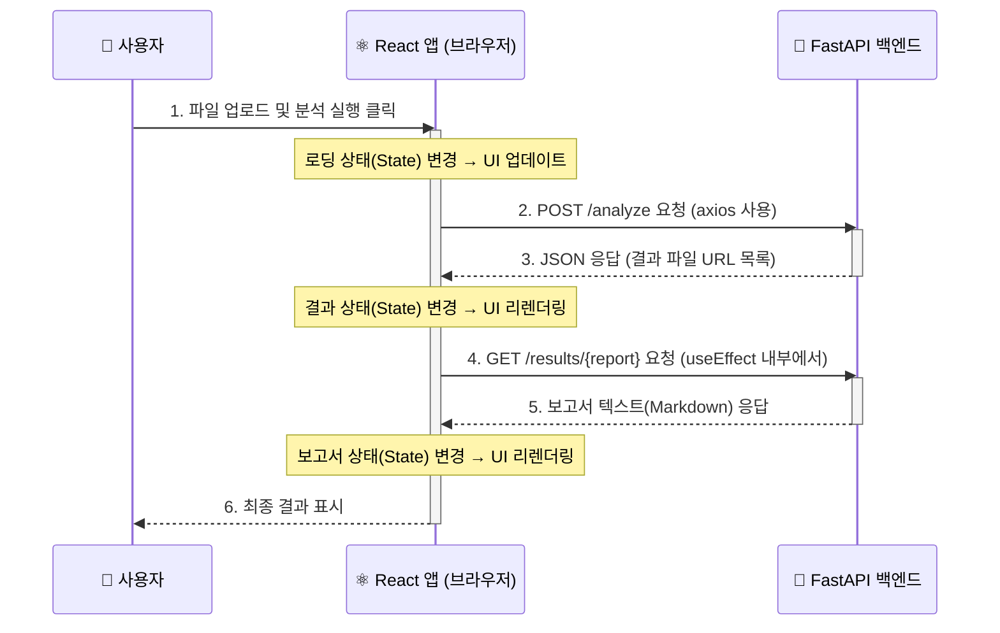

# 브레이크 패드 내구-필드 수명 분석 및 가속계수 산출 AI 에이전트

이 프로젝트는 브레이크 패드의 내구 시험 데이터와 필드 데이터를 분석하여 가속계수를 산출하는 AI 에이전트입니다. 최신 소프트웨어 아키텍처인 **클라이언트-서버 모델**을 기반으로 하며, 다음과 같이 세 개의 독립적인 애플리케이션으로 구성됩니다.

- **`backend`**: 데이터 분석 및 API 제공을 담당하는 핵심 서버입니다.
- **`frontend_streamlit`**: 사용자가 쉽게 상호작용할 수 있는 웹 GUI (Python 기반)입니다.
- **`frontend_react`**: 동적인 사용자 경험을 제공하는 웹 GUI (TypeScript/React 기반)입니다.

각각의 애플리케이션은 독립적으로 실행되며, 프론트엔드(클라이언트)는 백엔드(서버)에 분석을 요청하고 그 결과를 받아 사용자에게 보여주는 방식으로 동작합니다.

## 🚀 프로젝트 아키텍처

이 프로젝트는 역할에 따라 명확하게 분리된 세 부분으로 구성되어 있습니다. 아래 다이어그램은 전체 시스템이 어떻게 상호작용하는지 보여줍니다.



1.  **백엔드 (Backend)**
    - **역할**: 데이터 처리, 통계 분석, 결과 생성 등 모든 핵심 로직을 수행합니다.
    - **기술**: Python, FastAPI, `reliability` 라이브러리
    - **설명**: 프론트엔드로부터 데이터와 분석 요청을 받으면, 이를 처리하여 분석 보고서와 플롯 이미지를 생성하고 그 결과물의 위치(URL)를 프론트엔드에 알려줍니다.

2.  **프론트엔드 (Frontend)**
    - **역할**: 사용자가 파일을 업로드하고 분석을 실행하며, 결과를 확인할 수 있는 그래픽 사용자 인터페이스(GUI)를 제공합니다.
    - **기술**: Streamlit 또는 React
    - **설명**: 사용자의 입력을 받아 백엔드에 전달하고, 백엔드로부터 받은 결과(보고서, 이미지)를 웹 화면에 예쁘게 표시합니다. 두 가지 버전의 프론트엔드가 제공되므로, 필요에 따라 선택하여 사용할 수 있습니다.

---

## 1. Backend (FastAPI)

### 역할 및 기능

FastAPI 백엔드 서버는 이 AI 에이전트의 **두뇌** 역할을 합니다. 클라이언트의 요청을 받아 실제 데이터 분석을 수행하고 결과를 제공하는 핵심부입니다. 내부 동작 흐름은 아래와 같습니다.



-   **API 제공**: `/analyze` 엔드포인트를 통해 파일 업로드 및 분석 요청을 받습니다.
-   **데이터 분석**: `reliability` 라이브러리를 사용하여 통계 분석을 수행합니다.
-   **결과 생성 및 저장**: 분석 결과를 `backend/results/` 폴더에 저장합니다.
-   **결과 제공**: 분석 완료 후, 결과 파일에 접근할 수 있는 URL을 클라이언트에 응답으로 전달합니다.

### 주요 파일 구조

```
backend/
├── Dockerfile           # 백엔드 서버를 컨테이너화하기 위한 설정 파일
├── requirements.txt     # 필요한 Python 라이브러리 목록
└── app/
    ├── main.py          # FastAPI 애플리케이션의 메인 파일, API 엔드포인트 정의
    ├── core/
    │   ├── analysis.py  # 실제 수명 데이터 분석 로직을 담고 있는 파일
    │   └── config.py    # 분석에 필요한 설정(입력 파일 경로, 컬럼명 등)을 관리
    └── models/
        └── schemas.py   # API 요청 및 응답 데이터의 형식을 정의 (Pydantic 모델)
```

### 실행 방법

**전제 조건:**
- Python 3.9+
- `pip` (Python 패키지 설치 도구)

**실행 순서:**

1.  **터미널(명령 프롬프트)을 엽니다.**

2.  **`backend` 디렉토리로 이동합니다.**
    ```bash
    cd backend
    ```

3.  **가상환경 생성 및 활성화 (권장):**
    독립된 Python 환경을 만들어 다른 프로젝트와의 충돌을 방지합니다.
    ```bash
    # 가상환경 생성
    python -m venv venv
    
    # 가상환경 활성화 (Windows)
    venv\Scripts\activate
    
    # 가상환경 활성화 (macOS/Linux)
    # source venv/bin/activate
    ```

4.  **의존성 라이브러리를 설치합니다.**
    `requirements.txt` 파일에 명시된 모든 라이브러리를 한 번에 설치합니다.
    ```bash
    pip install -r requirements.txt
    ```

5.  **FastAPI 서버를 실행합니다.**
    Uvicorn이라는 ASGI 서버를 사용하여 FastAPI 애플리케이션을 실행합니다.
    ```bash
    uvicorn app.main:app --reload --host 0.0.0.0 --port 8000
    ```
    -   `--reload`: 소스 코드가 변경될 때마다 서버를 자동으로 재시작해주는 편리한 옵션입니다.
    -   서버가 성공적으로 실행되면, 터미널에 `Uvicorn running on http://0.0.0.0:8000` 메시지가 표시됩니다.
    -   이제 백엔드 서버는 프론트엔드의 요청을 받을 준비가 되었습니다.
    -   웹 브라우저에서 `http://127.0.0.1:8000/docs`로 접속하면, API 명세를 확인하고 직접 테스트해볼 수 있는 Swagger UI 화면을 볼 수 있습니다.

6.  **서버 종료:**
    서버를 종료하려면 터미널에서 `Ctrl + C`를 누릅니다.

---

## 2. Frontend (Streamlit)

### 역할 및 기능

Streamlit 프론트엔드는 Python 코드만으로 사용자가 상호작용할 수 있는 간단한 웹 화면을 제공합니다. 백엔드와의 통신 과정은 아래 시퀀스 다이어그램과 같습니다.



-   **사용자 인터페이스(UI) 제공**: 파일 업로더, 텍스트 입력, 버튼을 화면에 표시합니다.
-   **백엔드 연동**: `requests` 라이브러리를 사용해 백엔드에 분석을 요청하고 결과를 받습니다.
-   **결과 시각화**: 백엔드가 알려준 URL을 이용해 보고서 내용과 플롯 이미지를 화면에 보여줍니다.

### 주요 파일 구조

```
frontend_streamlit/
├── app.py            # Streamlit 애플리케이션의 전체 UI 및 로직
└── requirements.txt  # 필요한 Python 라이브러리 목록 (streamlit, requests)
```

### 실행 방법

**전제 조건:**
- Python 3.9+
- `pip`

**실행 순서:**

1.  **새로운 터미널을 엽니다.** (백엔드 서버가 실행 중인 터미널은 그대로 둡니다.)

2.  **`frontend_streamlit` 디렉토리로 이동합니다.**
    ```bash
    cd frontend_streamlit
    ```

3.  **가상환경 생성 및 활성화 (권장):**
    ```bash
    python -m venv venv
    venv\Scripts\activate  # Windows
    # source venv/bin/activate # macOS/Linux
    ```

4.  **의존성 라이브러리를 설치합니다.**
    ```bash
    pip install -r requirements.txt
    ```

5.  **Streamlit 앱을 실행합니다.**
    ```bash
    streamlit run app.py
    ```
    -   명령을 실행하면 자동으로 웹 브라우저 새 탭이 열리며, 보통 `http://localhost:8501` 주소로 앱이 실행됩니다.
    -   이제 웹 화면을 통해 파일을 올리고 분석을 실행할 수 있습니다.

---

## 3. Frontend (React)

### 역할 및 기능

React 프론트엔드는 더 동적이고 현대적인 사용자 경험을 제공하는 **단일 페이지 애플리케이션(SPA)**입니다. 컴포넌트 기반으로 UI를 만들고, 사용자의 행동에 따라 화면이 즉각적으로 반응합니다.



-   **컴포넌트 기반 UI**: UI를 재사용 가능한 조각(컴포넌트)으로 만들어 관리합니다.
-   **동적인 상태 관리**: `useState`, `useEffect` 같은 React Hook을 사용하여 앱의 상태가 바뀌면 UI가 자동으로 업데이트됩니다.
-   **백엔드 연동**: `axios`를 사용하여 비동기적으로 API를 호출합니다.
-   **결과 렌더링**: Markdown 보고서를 HTML로 변환하여 표시합니다.

### 주요 파일 구조

```
frontend_react/
├── package.json      # 프로젝트 정보, 의존성 라이브러리, 실행 스크립트 정의
└── src/
    ├── App.tsx       # 메인 애플리케이션 컴포넌트, 전체 레이아웃과 상태 관리
    └── components/   # 재사용 가능한 UI 컴포넌트 폴더
```

### 실행 방법

**전제 조건:**
-   Node.js (LTS 버전 권장)
-   `npm` (Node.js 설치 시 함께 설치됨)

**실행 순서:**

1.  **새로운 터미널을 엽니다.** (백엔드 서버가 실행 중인 터미널은 그대로 둡니다.)

2.  **`frontend_react` 디렉토리로 이동합니다.**
    ```bash
    cd frontend_react
    ```

3.  **의존성 라이브러리를 설치합니다.**
    `package.json`에 명시된 모든 라이브러리를 `node_modules` 폴더에 설치합니다. (최초 실행 시 다소 시간이 걸릴 수 있습니다.)
    ```bash
    npm install
    ```

4.  **React 개발 서버를 실행합니다.**
    ```bash
    npm start
    ```
    -   명령을 실행하면 자동으로 웹 브라우저 새 탭이 열리며, 보통 `http://localhost:3000` 주소로 앱이 실행됩니다.
    -   소스 코드를 수정하면 화면이 자동으로 새로고침되어 변경사항을 즉시 확인할 수 있습니다.