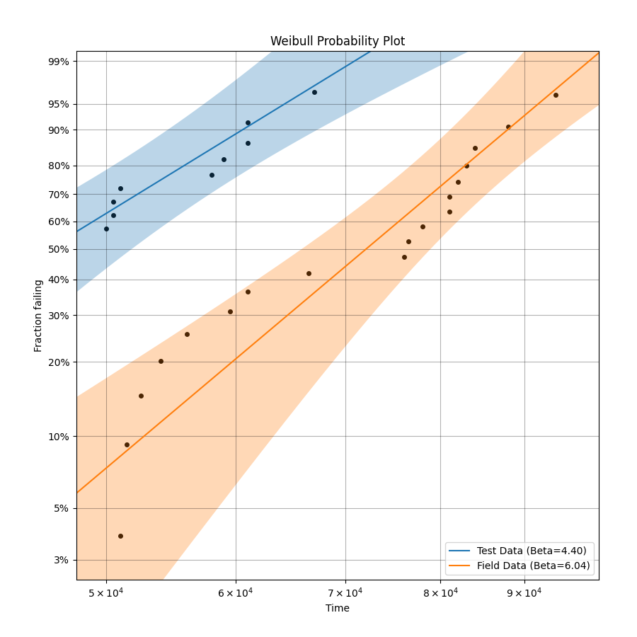

# 수명 데이터 분석 보고서

## 1. 분석 개요
- **데이터 파일:** Brakepad_lifedata.xlsx
- **신뢰수준:** 90.0%

## 2. 와이블 분포 피팅 결과
- **내구시험 데이터:**
  - 형상모수 (Beta): 4.3958 (CI: [3.2826, 5.8864])
  - 척도모수 (Alpha): 50101.9480
- **필드 데이터:**
  - 형상모수 (Beta): 6.0387 (CI: [4.4095, 8.2697])
  - 척도모수 (Alpha): 76558.7119

## 3. 형상모수 동일성 검증
- **검증 방법:** 각 데이터셋의 와이블 분포 형상모수(Beta)에 대한 90.0% 신뢰구간을 비교합니다.
- **검증 결과:** 두 데이터셋의 형상모수 신뢰구간이 겹치므로, 공통 형상모수 가정은 통계적으로 타당합니다.

## 4. 가속계수(AF) 산출
- **가속계수 (AF):** 1.5281
- **결과 해석:** 가속계수(AF)는 1.53 입니다. 이는 내구시험이 필드 조건보다 약 1.53배 가혹하다는 것을 의미합니다.

## 5. 분석 결과 플롯

