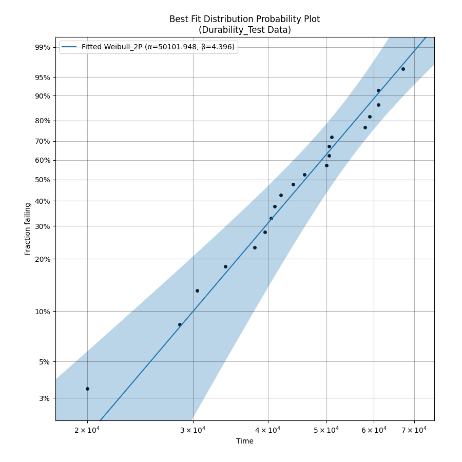
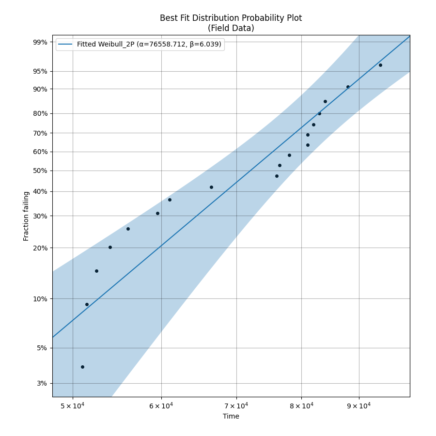
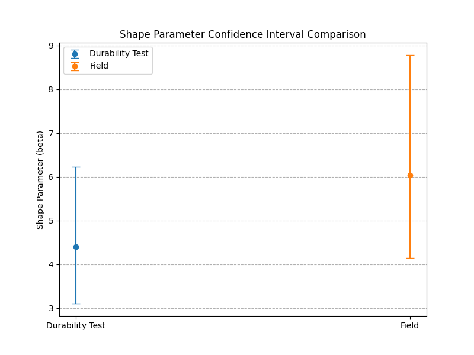

# 브레이크 패드 수명 데이터 분석 및 가속계수 산출 보고서
## 1. 분석 개요
- **분석 목적:** 내구시험과 필드에서 수집된 브레이크 패드 수명 데이터를 비교하여, 내구시험의 가속성을 정량적으로 평가하고 가속계수를 산출합니다.
- **분석 데이터:** 내구시험 데이터 (n=20), 필드 데이터 (n=18). 
- **분석 도구:** Python `reliability` 패키지.
## 2. 개별 수명 분포 분석
### 2.1. 내구시험 데이터 분석
- **최적 분포:** Weibull_2P
- **파라미터 추정치 (95.0% 신뢰구간 포함):**
```
  Parameter  Point Estimate  Standard Error  Lower CI  Upper CI
0     Alpha         50101.9         2683.62   45108.8   55647.8
1      Beta         4.39577        0.780355   3.10403   6.22506
```
- **BIC 값:** 437.7038
- **확률도:**
  
### 2.2. 필드 데이터 분석
- **최적 분포:** Weibull_2P
- **파라미터 추정치 (95.0% 신뢰구간 포함):**
```
  Parameter  Point Estimate  Standard Error  Lower CI  Upper CI
0     Alpha         76558.7         3150.87   70625.6   82990.2
1      Beta         6.03868          1.1543   4.15178   8.78315
```
- **BIC 값:** 399.5488
- **확률도:**
  
## 3. 공통 형상모수 검정
- **신뢰구간 비교 플롯:**
  
- **검정 결과:** 두 데이터셋의 형상모수 신뢰구간이 겹치므로, 공통 형상모수 가정은 통계적으로 타당하다고 볼 수 있습니다.
## 4. 가속 계수 분석
- **계산된 가속 계수(AF):** 1.5281
- **결과 해석:** 가속 계수가 약 1.53로 계산되었습니다. 이는 내구시험 모드가 필드 주행 환경을 약 1.53배 가속시킨다는 것을 의미합니다.
## 5. 결론 및 제언
- **결론:** 가속 계수가 약 1.53로 계산되었습니다. 이는 내구시험 모드가 필드 주행 환경을 약 1.53배 가속시킨다는 것을 의미합니다.
- **제언:** 본 분석은 샘플 수가 제한적이므로, 더 높은 신뢰도를 위해 샘플을 추가 확보하여 분석하는 것을 권장합니다.
