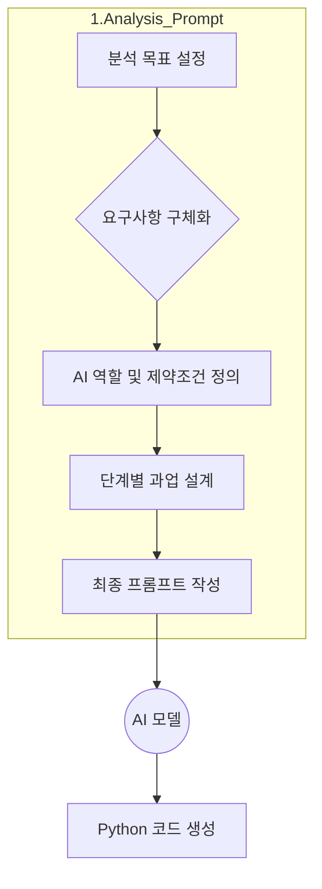
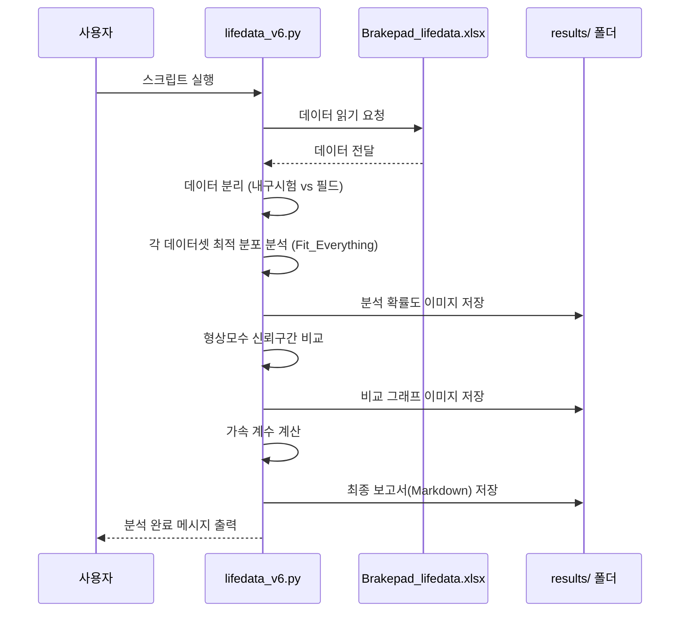
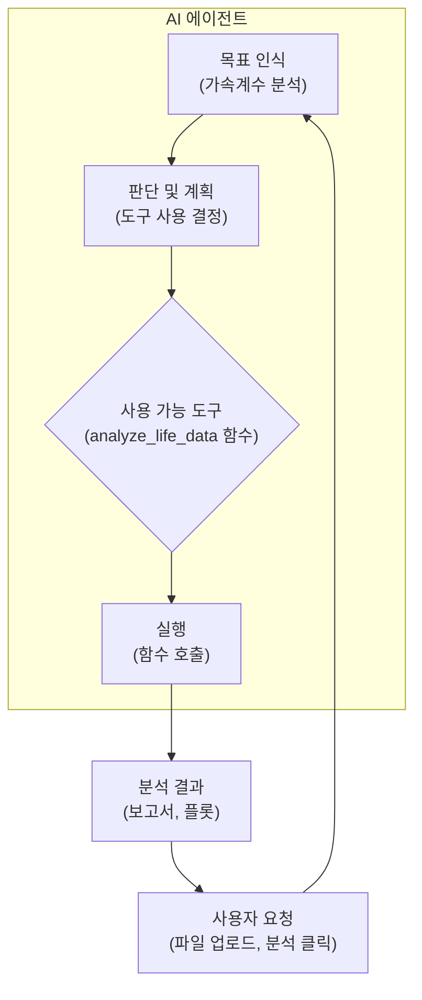
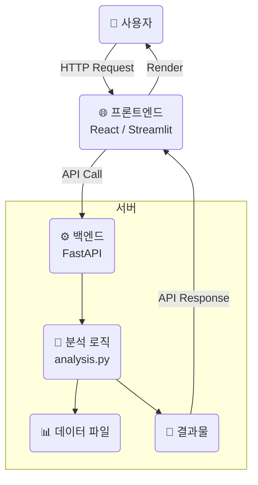

# [Lab 5] 내구-필드 수명데이터 분석 어플리케이션 개발

## **과정 소개**

본 과정은 신뢰성 공학 전문가분들을 위해 최신 AI 기술을 활용하여 데이터 분석을 자동화하고, 더 나아가 사용자 친화적인 AI 에이전트 서비스를 개발하는 전 과정을 안내합니다. Python 코딩이나 AI 모델에 익숙하지 않으시더라도, 현업의 신뢰성 분석 문제를 어떻게 AI로 해결해 나가는지 그 여정을 단계별로 체험하고 이해하실 수 있도록 구성되었습니다.

이 실습(Lab)에서는 **브레이크 패드의 내구시험 데이터와 필드(실사용) 데이터를 비교 분석하여 '가속 계수(Acceleration Factor)'를 산출**하는 구체적인 사례를 통해, 아이디어 구상부터 실제 작동하는 웹 애플리케이션 개발까지의 전 과정을 다룹니다.

### **학습 목표**

1.  **AI와의 협업(Vibe 코딩):** 생성형 AI에게 명확한 지시(프롬프트)를 내려 원하는 분석 코드를 얻어내는 방법을 배웁니다.
2.  **데이터 분석 자동화:** Python을 사용하여 수명 데이터 분석의 핵심 로직을 구현하고 자동화하는 방법을 이해합니다.
3.  **AI 에이전트 설계:** 단순한 코드 스크립트를 넘어, 특정 목표를 가지고 스스로 작업을 수행하는 'AI 에이전트'를 설계하는 개념을 학습합니다.
4.  **웹 애플리케이션 개발:** 분석 기능을 누구나 쉽게 사용할 수 있도록 웹 기반의 사용자 인터페이스(UI)를 구축하는 과정을 체험합니다.

### **실습 프로젝트 폴더 구조**

본 실습은 4개의 주요 단계에 따라 폴더가 구성되어 있습니다. 각 폴더는 아이디어가 구체화되고 발전해나가는 과정을 보여줍니다.

```
C:\ai-agent\1.Labs\Lab5_Test-Field_Analysis_UI\
├───1.Analysis_Prompt/  (1단계: AI에게 분석을 지시하기 위한 '요구사항' 설계)
├───2.Analysis_Code/    (2단계: AI가 생성한 코드를 실행하고 검증하는 '단독 실행' 단계)
├───3.Agent_Dev_Prompt/ (3단계: 분석 기능을 'AI 에이전트'로 만들기 위한 설계)
└───4.Agent/            (4단계: 사용자가 직접 상호작용할 수 있는 '웹 앱' 개발)
```

---

## **1단계: 아이디어 구체화 및 AI 지시서 작성 (`1.Analysis_Prompt`)**

모든 개발의 시작은 '무엇을 만들고 싶은가?'에 대한 명확한 정의에서 출발합니다. 이 단계에서는 우리의 분석 목표를 구체화하고, 이 목표를 생성형 AI가 이해하고 코드로 만들어낼 수 있도록 '프롬프트(Prompt, 지시서)'를 설계합니다.

### **1-1. 학습 내용**

-   **프롬프트 엔지니어링(Prompt Engineering):** AI에게 원하는 결과물을 얻어내기 위해 지시사항을 체계적으로 설계하는 기술입니다. 단순히 "코드 짜줘"가 아니라, 전문가의 역할을 부여하고(Persona), 구체적인 과업을 단계별로 지시하며(Task), 원하는 결과물의 형식(Format)까지 지정하는 것이 핵심입니다.

-   **주요 파일 설명:**
    -   ` (Step.1) 내구-필드 수명분석 프롬프트 설계.md`: AI에게 지시할 내용을 정의하기 전, 분석의 배경, 목적, 요구사항, 제약조건 등을 상세하게 정리한 '요구사항 명세서'입니다.
    -   ` (Step.2) 내구-필드 수명분포 코드생성 프롬프트.md`: 위 명세서를 바탕으로, 생성형 AI에게 직접 전달할 최종 지시서(프롬프트)입니다. 전문가 역할 부여, 단계별 분석 절차, 코드 구조, 결과물 형식 등 매우 구체적인 지침이 담겨 있습니다.
    -   `python_reliability_library.md`: AI가 `reliability`라는 특정 Python 라이브러리를 잘 이해하고 사용하도록, 관련 기술 정보를 담아 AI에게 '참고 자료'로 제공하는 문서입니다.

### **1-2. 개발 프로세스 시각화**

이 단계는 다음과 같은 생각의 흐름으로 진행됩니다.



---

## **2단계: 핵심 분석 코드 생성 및 검증 (`2.Analysis_Code`)**

1단계에서 작성한 프롬프트를 AI에게 전달하여 얻어낸 Python 코드를 직접 실행하고, 우리의 의도대로 잘 작동하는지 검증하는 단계입니다. 여기서는 웹 인터페이스 없이, 순수한 Python 스크립트만으로 분석이 완료됩니다.

### **2-1. 학습 내용**

-   **독립 실행형 스크립트(Standalone Script):** 다른 시스템에 의존하지 않고 그 자체로 완결된 기능을 수행하는 코드입니다. 이 단계의 `lifedata_v6.py`가 바로 그것입니다.
-   **데이터 분석 라이브러리 활용:**
    -   `pandas`: 엑셀(xlsx)이나 CSV 파일 같은 정형 데이터를 쉽게 다룰 수 있게 해주는 도구입니다.
    -   `reliability`: 와이블 분석, 수명 분포 피팅 등 복잡한 신뢰성 분석 계산을 손쉽게 처리해주는 강력한 전문 라이브러리입니다.
    -   `matplotlib`: 분석 결과를 그래프나 플롯으로 시각화하여 직관적인 이해를 돕는 도구입니다.
-   **주요 파일 설명:**
    -   `lifedata_v6.py`: AI가 생성한 핵심 분석 스크립트입니다. 이 파일은 데이터 로딩, 통계 분석, 결과(플롯, 보고서) 생성까지 모든 과정을 자동화합니다.
    -   `Brakepad_lifedata.xlsx`: 분석에 사용될 실제 데이터 파일입니다. '주행거리(distance(km))'와 '유형(type)' 컬럼으로 구성되어 있습니다.
    -   `results/`: 분석 스크립트 실행 후 모든 결과물이 저장되는 폴더입니다.
        -   `Durability_Test_best_fit_probplot.png`: 내구시험 데이터의 최적 분포 확률도.
        -   `Field_best_fit_probplot.png`: 필드 데이터의 최적 분포 확률도.
        -   `shape_parameter_comparison_plot.png`: 두 데이터의 형상모수 신뢰구간 비교 그래프.
        -   `final_report.md`: 모든 분석 결과를 종합한 최종 보고서.

### **2-2. 코드 실행 흐름**

`lifedata_v6.py` 스크립트는 내부적으로 다음과 같은 절차를 따릅니다.



---

## **3단계: AI 에이전트 전환을 위한 시스템 설계 (`3.Agent_Dev_Prompt`)**

2단계의 분석 스크립트는 훌륭하지만, 개발자만 사용할 수 있다는 한계가 있습니다. 이제 이 기능을 'AI 에이전트'로 만들어, 코드를 모르는 사람도 쉽게 사용할 수 있도록 시스템을 설계합니다. 이 단계는 실제 코딩보다는 '설계'에 집중합니다.

### **3-1. 학습 내용**

-   **AI 에이전트(AI Agent):** 정해진 목표를 달성하기 위해 스스로 판단하고, 주어진 도구(Tool)를 사용하여 작업을 수행하는 지능형 시스템입니다. 단순히 질문에 답하는 것을 넘어, '행동'을 할 수 있습니다.
-   **시스템 프롬프트(System Prompt):** AI 에이전트의 정체성, 목표, 사용 가능한 도구, 행동 규칙 등을 정의하는 '설계도' 또는 '헌법'과 같습니다.
-   **주요 파일 설명:**
    -   `(Step.1) 시스템 컨텍스트 및 프롬프트.md`: 우리가 만들 AI 에이전트의 역할을 '신뢰성 데이터 분석 전문가'로 정의하고, `analyze_life_data`라는 핵심 기능을 '도구'로써 사용할 수 있다고 명시합니다. 또한 사용자와의 상호작용 시나리오(성공, 실패 등)를 구체적으로 설계합니다.

### **3-2. 에이전트 개념도**

AI 에이전트는 다음과 같은 구조로 동작합니다.



---

## **4. 최종 단계: AI 에이전트 웹 애플리케이션 개발 (`4.Agent`)**

3단계의 설계를 바탕으로, 사용자가 실제로 상호작용할 수 있는 웹 애플리케이션을 개발합니다. 이 단계에서는 '백엔드(두뇌)'와 '프론트엔드(얼굴)'라는 두 가지 중요한 개념이 등장합니다.

### **4.1. 시스템 전체 아키텍처**

우리 시스템은 사용자의 요청을 받아 처리하고 결과를 보여주는 '클라이언트-서버' 구조로 동작합니다.



### **4.2. 백엔드 (Backend) - 보이지 않는 두뇌**

-   **역할:** 웹 애플리케이션의 핵심 로직과 데이터 처리를 담당합니다. 프론트엔드의 요청을 받아 실제 분석을 수행하고, 그 결과를 다시 프론트엔드에 전달합니다.
-   **사용 기술:** **FastAPI** (Python 기반의 빠르고 효율적인 웹 서버 개발 도구)
-   **주요 파일:**
    -   `backend/app/main.py`: 프론트엔드로부터의 요청을 받는 '관문' 역할을 하는 API 엔드포인트 정의 파일.
    -   `backend/app/core/analysis.py`: 2단계의 `lifedata_v6.py`를 클래스(Class) 형태로 재구성하여, 보다 체계적이고 재사용하기 쉽게 만든 핵심 분석 모듈.
    -   `backend/requirements.txt`: 백엔드를 실행하는 데 필요한 Python 라이브러리 목록(fastapi, pandas, reliability 등).
    -   `Dockerfile`: 백엔드 애플리케이션을 어떤 환경에서든 동일하게 실행할 수 있도록 '컨테이너'로 만들어주는 설정 파일. (별첨: Docker 설명 참조)

### **4.3. 프론트엔드 (Frontend) - 사용자와 만나는 얼굴**

-   **역할:** 사용자가 직접 보고 상호작용하는 화면(UI)을 담당합니다. 파일 업로드 버튼, 입력 필드, 분석 결과 보고서 및 이미지 표시 등을 구현합니다.
-   **본 실습에서는 두 가지 버전의 프론트엔드를 제공합니다:**
    1.  **React 버전 (`frontend_react`):**
        -   **특징:** 현대적이고 복잡한 웹 애플리케이션 제작에 널리 사용되는 표준 기술. 확장성과 유연성이 매우 높습니다.
        -   **주요 파일:** `src/App.tsx` (메인 화면), `src/components/` (화면을 구성하는 재사용 가능한 부품들).
    2.  **Streamlit 버전 (`frontend_streamlit`):**
        -   **특징:** 데이터 과학자와 엔지니어가 매우 빠르고 쉽게 데이터 기반 웹 앱을 만들 수 있도록 도와주는 Python 라이브러리. React보다 코드가 간결하고 배우기 쉽습니다.
        -   **주요 파일:** `app.py` (이 파일 하나로 전체 웹 앱이 동작).

---

## **별첨: 주요 기술 및 이론**

### **1. 와이블 분포 (Weibull Distribution)**
수명 데이터 분석, 특히 부품의 고장 시간을 모델링하는 데 가장 널리 사용되는 확률 분포입니다. 형상모수(beta)와 척도모수(alpha)를 통해 다양한 형태의 고장 패턴(초기 고장, 우발 고장, 마모 고장)을 유연하게 표현할 수 있습니다.

### **2. 가속 계수 (Acceleration Factor, AF)**
가혹한 조건의 내구시험 환경이 정상적인 사용 환경(필드)에 비해 수명을 얼마나 단축시키는지를 나타내는 비율입니다. 예를 들어 AF가 10이라면, 내구시험에서의 1시간은 필드에서의 10시간과 동일한 스트레스를 가하는 것으로 해석할 수 있습니다.
`AF = 필드 수명 / 시험 수명` 으로 계산되며, 주로 분포의 척도모수(와이블의 alpha 등) 비율로 추정합니다.

### **3. API (Application Programming Interface)**
서로 다른 소프트웨어 시스템이 정해진 규칙에 따라 정보를 주고받을 수 있도록 하는 '소통 창구' 또는 '메뉴판'과 같습니다. 이 실습에서는 프론트엔드(손님)가 백엔드(주방)에 "이 데이터로 분석해줘"라고 API를 통해 주문하면, 백엔드가 분석 결과를 요리해서 다시 API를 통해 전달합니다.

### **4. Docker**
소프트웨어를 '컨테이너'라는 표준화된 공간에 포장하여, 개발 환경(내 컴퓨터)과 운영 환경(실제 서버)의 차이로 인해 발생하는 "내 컴퓨터에서는 됐는데..." 문제를 해결하는 기술입니다. Docker를 사용하면 복잡한 설치 과정 없이 어떤 컴퓨터에서든 애플리케이션을 동일하게 실행할 수 있습니다.

### **5. 프론트엔드 vs. 백엔드**
-   **프론트엔드:** 레스토랑의 홀과 같습니다. 손님(사용자)이 메뉴를 보고 주문하는 공간이며, 인테리어, 테이블 배치 등 눈에 보이는 모든 것을 담당합니다.
-   **백엔드:** 레스토랑의 주방과 같습니다. 손님의 주문을 받아 실제 요리를 만들고, 재료를 관리하며, 눈에 보이지 않는 모든 핵심 작업을 처리합니다.
