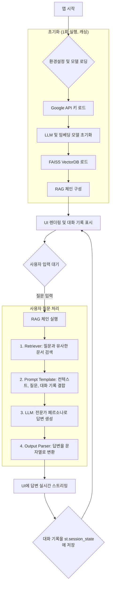

# 🤖 신뢰성 분석 전문가 챗봇

이 프로젝트는 Streamlit과 LangChain을 기반으로 구축된 RAG(Retrieval-Augmented Generation) 챗봇입니다. 사용자는 기술 문서 기반의 지식 베이스에 대해 질문하고, 신뢰성 공학 전문가의 관점에서 심층적인 답변을 얻을 수 있습니다.

## 🚀 주요 기능

- **RAG 기반 답변 생성**: FAISS 벡터 데이터베이스에 저장된 기술 문서를 검색하여 질문과 관련된 내용을 답변에 활용합니다.
- **전문가 페르소나**: "신뢰성 공학 전문가"라는 특정 역할을 부여하여, 단순히 정보를 요약하는 것을 넘어 분석적이고 체계적인 답변을 제공합니다.
- **대화 기록 유지**: 이전 대화 내용을 기억하고 다음 답변에 활용하여 맥락에 맞는 대화를 이어갑니다.
- **출처 표시**: 답변의 근거가 된 기술 문서의 출처(source)를 명확하게 밝혀 신뢰성을 높입니다.
- **스트리밍 응답**: 사용자가 답변이 생성되는 과정을 실시간으로 볼 수 있어 대화형 경험을 향상시킵니다.

## 📂 프로젝트 구조

```
.
├── .env                  # GOOGLE_API_KEY 등 환경 변수 설정 파일
├── 1.RAG_VectorDB_load_test.py # VectorDB 로드 및 테스트 스크립트
├── app_v1.py             # 메인 Streamlit 애플리케이션
├── docs/                 # RAG의 기반이 되는 원본 문서 폴더
│   ├── AIAGVDA_FMEA_Guide_Summary.md
│   ├── failure_report-ballpen.md
│   ├── failure_report-panormic_sunroof.md
│   └── failure_report-turbocharger.md
├── faiss_index/          # 생성된 FAISS VectorDB가 저장되는 폴더
│   ├── index.faiss
│   └── index.pkl
└── README.md             # 프로젝트 설명 파일
```

## ⚙️ `app_v1.py` 상세 구현 구조

`app_v1.py`는 Streamlit UI와 LangChain RAG 체인을 결합하여 챗봇의 핵심 기능을 구현합니다.

### 1. 초기 설정 및 캐싱

- **환경 변수 로드**: `dotenv`를 사용하여 `.env` 파일의 `GOOGLE_API_KEY`를 로드합니다.
- **핵심 객체 캐싱**: `@st.cache_resource` 데코레이터를 사용하여 LLM, 임베딩 모델, VectorDB 등 초기화에 시간이 걸리는 객체들을 캐시에 저장합니다. 이를 통해 사용자가 질문할 때마다 모델을 새로 로드하는 비효율을 방지하고 응답 속도를 향상시킵니다.

### 2. RAG 체인 정의 (`get_rag_chain` 함수)

이 함수는 LangChain Expression Language (LCEL)를 사용하여 RAG 파이프라인을 구성합니다. 각 컴포넌트는 `|` (파이프) 연산자로 연결되어 데이터의 흐름을 정의합니다.

```python
# app_v1.py 내 RAG Chain의 개념적 구조
chain = (
    {
        "context": retriever | format_docs,
        "question": RunnablePassthrough(),
        "chat_history": RunnableLambda(lambda x: x["chat_history"]),
    }
    | prompt
    | llm
    | StrOutputParser()
)
```

- **`retriever`**: FAISS VectorDB에서 사용자 질문과 의미적으로 유사한 문서 조각(context)을 검색하는 역할을 합니다.
- **`format_docs`**: 검색된 문서 조각들을 LLM의 프롬프트에 적합한 형태로 가공합니다.
- **`RunnablePassthrough`**: 사용자의 질문을 다음 단계로 그대로 전달하는 역할을 합니다.
- **`RunnableLambda`**: 대화 기록(`chat_history`)을 체인에 동적으로 주입합니다.
- **`prompt`**: `ChatPromptTemplate`을 사용하여 시스템 메시지(전문가 페르소나), 대화 기록, 검색된 문서(context), 그리고 사용자 질문을 조합하여 LLM에 전달할 최종 프롬프트를 생성합니다.
- **`llm`**: Google의 `gemini-pro` 모델이 최종 프롬프트를 받아 답변을 생성합니다.
- **`StrOutputParser`**: LLM이 생성한 답변(AI Message 객체)을 사람이 읽을 수 있는 문자열 형태로 변환합니다.

### 3. Streamlit UI 및 상태 관리

- **UI 구성**: `st.title`, `st.chat_message` 등을 사용하여 챗봇 인터페이스를 구성합니다.
- **대화 기록 관리**: `st.session_state`를 사용하여 사용자와 챗봇 간의 대화 기록을 세션 내에 유지합니다. 이는 LLM이 이전 대화의 맥락을 이해하고 답변을 생성하는 데 사용됩니다.
- **사용자 입력 처리**: `st.chat_input`으로 사용자의 질문을 받고, 질문이 입력되면 RAG 체인을 실행(`chain.stream`)하여 답변 생성을 시작합니다.
- **스트리밍 출력**: `st.write_stream`을 사용하여 LLM이 생성하는 답변을 실시간으로 화면에 표시하여 사용자 경험을 향상시킵니다.

## 🔍 작동 원리 및 프로세스

아래 다이어그램은 챗봇의 전체 작동 흐름을 보여줍니다.



**프로세스 설명:**

1.  **초기화**: 사용자가 앱을 처음 실행하면, `get_rag_chain` 함수가 호출되어 LLM, 임베딩 모델, VectorDB를 로드하고 RAG 체인을 구성합니다. 이 결과는 캐시에 저장됩니다.
2.  **UI 렌더링**: Streamlit이 화면에 제목, 환영 메시지, 그리고 `st.session_state`에 저장된 이전 대화 내용을 표시합니다.
3.  **사용자 입력**: 사용자가 채팅 입력창에 질문을 입력하고 전송합니다.
4.  **RAG 체인 실행**:
    -   입력된 질문은 RAG 체인으로 전달됩니다.
    -   **검색(Retrieve)**: FAISS Retriever가 `docs` 폴더의 문서 기반 VectorDB에서 질문과 가장 관련성 높은 내용을 찾습니다.
    -   **보강(Augment)**: 시스템 프롬프트, 검색된 문서(컨텍스트), 이전 대화 기록, 그리고 사용자의 현재 질문이 모두 결합되어 LLM에게 전달될 최종 프롬프트가 만들어집니다.
    -   **생성(Generate)**: LLM(Gemini Pro)은 "신뢰성 공학 전문가"의 역할에 맞춰, 주어진 정보를 바탕으로 답변을 생성합니다.
5.  **응답 출력 및 저장**:
    -   생성된 답변은 `st.write_stream`을 통해 UI에 실시간으로 표시됩니다.
    -   답변 생성이 완료되면, 사용자의 질문과 AI의 답변이 `st.session_state`에 저장되어 다음 대화의 맥락으로 활용됩니다.
6.  **대기**: 시스템은 다시 사용자의 다음 입력을 기다립니다.

## 💡 대표 사용 사례 (Use Cases)

### 사례 1: FMEA 가이드라인에 대한 개념 질문

-   **사용자 질문**: `AIAGVDA FMEA 가이드라인의 7단계 접근법에 대해 설명해줘.`

-   **작동 절차**:
    1.  **검색**: Retriever는 VectorDB에서 `AIAGVDA_FMEA_Guide_Summary.md` 문서 내용 중 "7단계 접근법", "기획 및 준비", "구조 분석" 등과 관련된 텍스트 조각들을 추출합니다.
    2.  **보강**: 추출된 텍스트 조각들이 "신뢰성 전문가로서 다음 정보를 바탕으로 질문에 답하라"는 시스템 프롬프트 및 사용자 질문과 결합됩니다.
    3.  **생성**: LLM은 제공된 FMEA 가이드라인 요약 정보를 바탕으로 7단계 접근법(기획 및 준비, 구조 분석, 기능 분석, 고장 분석, 리스크 분석, 최적화, 결과 문서화)을 체계적으로 설명하는 답변을 생성합니다.
    4.  **출력**: 생성된 답변과 함께, 정보의 출처가 `AIAGVDA_FMEA_Guide_Summary.md`임을 명시하여 신뢰성을 더합니다.

### 사례 2: 두 가지 고장 보고서 비교 분석 요청

-   **사용자 질문**: `볼펜과 터보차저의 고장 보고서 내용을 비교해서, 고장 원인 분석의 접근 방식 차이를 설명해줘.`

-   **작동 절차**:
    1.  **검색**: Retriever는 `failure_report-ballpen.md`와 `failure_report-turbocharger.md` 두 문서에서 각각 고장 원인, 분석 방법, 메커니즘과 관련된 핵심 내용을 모두 검색합니다.
    2.  **보강**: 두 보고서의 핵심 내용이 컨텍스트로 제공되며, "두 대상의 분석 접근 방식 차이"를 설명하라는 사용자 질문과 결합됩니다.
    3.  **생성**: LLM은 "신뢰성 전문가"의 관점에서 두 사례를 비교 분석합니다.
        -   볼펜: 사용 환경 및 물리적 마모와 같은 단순하고 직관적인 원인 분석에 초점을 맞춥니다.
        -   터보차저: 재료 피로, 윤활 불량, 고온/고압 환경 등 복잡한 공학적 요소를 고려한 시스템 수준의 심층 분석이 필요함을 설명합니다.
        -   이를 통해 단순 부품과 복잡한 시스템 간의 신뢰성 분석 접근법 차이를 논리적으로 설명하는 답변을 생성합니다.
    4.  **출력**: 답변과 함께 `failure_report-ballpen.md`와 `failure_report-turbocharger.md`를 출처로 명시합니다.

## 🛠️ 실행 방법

### 1. 사전 준비

-   **Google API 키 발급**: [Google AI Studio](https://aistudio.google.com/app/apikey)에서 API 키를 발급받아 프로젝트 루트 디렉터리에 `.env` 파일을 생성하고 아래와 같이 입력합니다.

    ```
    GOOGLE_API_KEY="발급받은_API_키를_여기에_입력하세요"
    ```

-   **VectorDB 생성**: `faiss_index` 폴더가 비어있거나 존재하지 않는 경우, 먼저 VectorDB를 생성해야 합니다. (이 프로젝트에서는 이미 생성되어 있습니다. 만약 문서를 추가하거나 변경했다면 `1.RAG_VectorDB_load_test.py` 와 유사한 스크립트를 사용하여 DB를 다시 생성해야 합니다.)

### 2. 필요 라이브러리 설치

터미널 또는 명령 프롬프트에서 아래 명령어를 실행하여 필요한 파이썬 라이브러리를 설치합니다.

```bash
pip install streamlit python-dotenv langchain langchain-core langchain-google-genai langchain-community faiss-cpu
```

*참고: GPU 환경에서는 `faiss-cpu` 대신 `faiss-gpu`를 설치할 수 있습니다.*

### 3. 챗봇 실행

터미널에서 아래 명령어를 입력하여 Streamlit 앱을 실행합니다.

```bash
streamlit run app_v1.py
```

명령어 실행 후 웹 브라우저가 자동으로 열리며 챗봇 애플리케이션이 나타납니다.