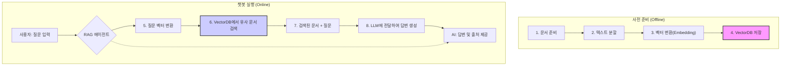

# [Lab 6] AI 기반 신뢰성 분석 챗봇 에이전트 개발

## 0. 들어가며

이 실습을 통해 우리는 **RAG(Retrieval-Augmented Generation, 검색 증강 생성)** 라는 최신 AI 기술을 활용하여, 로컬 폴더에 저장된 신뢰성 보고서, FMEA 가이드라인 등과 같은 문서를 기반으로 질문에 답변하는 챗봇을 만들 것입니다.

### 학습 목표
1.  **AI 에이전트의 핵심 개념 이해:** RAG, VectorDB, LLM 등 AI 챗봇의 기본 구성 요소를 이해합니다.
2.  **AI에게 지시하는 법(Prompt Engineering) 학습:** AI가 우리의 의도대로 작동하도록 명확한 지시를 내리는 프롬프트 설계 방법을 배웁니다.
3.  **Python 코드의 구조 파악:** 전체 챗봇 시스템이 어떤 코드로 어떻게 움직이는지 그 구조를 파악합니다.
4.  **실제 챗봇 애플리케이션 실행 및 활용:** 직접 챗봇을 실행하고, 성능을 체험하며, 활용 방안을 모색합니다.

---

## 1장: 프로젝트 개요 및 전체 아키텍처

우리가 만들 챗봇은 단순히 인터넷의 정보를 가져오는 것이 아니라, 우리가 제공하는 **특정 문서들('지식 베이스')** 안에서만 정보를 찾아 답변합니다. 이는 답변의 신뢰도를 비약적으로 높여주며, 기업 내부의 민감한 데이터를 안전하게 활용할 수 있게 합니다.

### 1.1. 시스템 작동 원리 (High-Level Architecture)

전체 시스템의 작동 흐름을 간단한 다이어그램으로 표현하면 다음과 같습니다.



**[흐름 설명]**

1.  **사전 준비 단계 (데이터 학습):**
    *   `1. 문서 준비`: 분석할 신뢰성 문서(`.md` 파일)를 `docs` 폴더에 준비합니다.
    *   `2. 텍스트 분할`: 문서가 너무 길면 AI가 처리하기 어려우므로, 의미 있는 단위(예: 제목, 소제목 기준)로 잘게 나눕니다.
    *   `3. 벡터 변환 (Embedding)`: AI가 이해할 수 있도록, 분할된 텍스트 조각들을 숫자의 배열(벡터)로 변환합니다. 이 과정을 '임베딩'이라고 합니다.
    *   `4. VectorDB 저장`: 변환된 벡터 값들을 `faiss_index`라는 '벡터 데이터베이스'에 저장합니다. 이 DB는 텍스트의 의미적 유사성을 기준으로 데이터를 빠르게 찾을 수 있는 특수한 라이브러리와 같습니다.

2.  **챗봇 실행 단계 (질문 및 답변):**
    *   `5. 질문 벡터 변환`: 사용자의 질문 역시 같은 방식으로 벡터로 변환됩니다.
    *   `6. 유사 문서 검색`: 질문 벡터와 가장 '가까운(유사한)' 의미를 가진 텍스트 조각들을 VectorDB에서 신속하게 찾아냅니다.
    *   `7. & 8. 답변 생성`: 검색된 관련성 높은 텍스트 조각들(Context)과 사용자의 원본 질문을 함께 거대 언어 모델(LLM, 여기서는 Gemini)에 전달하며, "이 자료들을 바탕으로 질문에 답해줘"라고 요청합니다.
    *   `AI 답변`: LLM은 주어진 자료에 근거하여 신뢰도 높은 답변을 생성하고, 어떤 문서를 참고했는지 '출처'를 함께 제시합니다.

---

## 2장: AI의 "두뇌" 설계 - 프롬프트 엔지니어링 (`1.Prompts/`)

AI가 아무리 뛰어나도, 우리가 무엇을 원하는지 명확하게 알려주지 않으면 좋은 결과를 얻을 수 없습니다. **프롬프트(Prompt)**란 바로 이 'AI에게 내리는 지시서'입니다. 이 프로젝트에서는 코드 개발에 앞서, 어떤 지시서(프롬프트)를 만들지 먼저 설계했습니다.

### 2.1. 1단계: RAG 분석 코드 생성 프롬프트 설계

*   **파일:** `(Step.1) RAG분석 프롬프트 설계.md`, `(Step.2) RAG분석 프롬프트.md`
*   **목표:** 위에서 설명한 '사전 준비 단계'와 '테스트'를 수행하는 Python 코드를 생성하도록 AI에게 요청할 프롬프트를 만드는 것입니다.

**[주요 설계 내용]**

1.  **역할 부여 (Persona):** AI에게 "너는 Python과 Langchain을 활용한 RAG 시스템 구축 전문가야" 라고 역할을 부여하여, 전문가 수준의 코드를 생성하도록 유도합니다.
2.  **과업 지시 (Task):** `docs` 폴더의 마크다운 파일을 읽고, 헤더 기준으로 자르고, Gemini 모델로 임베딩하고, FAISS VectorDB로 저장 후 재사용하는 등, **우리가 원하는 기능들을 매우 구체적이고 상세하게 지시**합니다.
3.  **단계별 사고 유도 (Chain-of-Thought):** "단계별로 생각해서(Let's think step by step)" 코드를 짜도록 요구하여, AI가 스스로 논리적인 순서에 따라 체계적인 코드를 만들게 합니다.
4.  **출력 형식 지정 (Format):** 최종 결과물로 하나의 Python 스크립트 파일과, 필요한 라이브러리 목록(`requirements.txt`)을 제공하도록 명시합니다.

### 2.2. 2단계: 챗봇 서비스용 프롬프트 설계

*   **파일:** `(Step.3) 챗봇서비스 프롬프트 설계.md`, `(Step.4) 챗봇서비스 구현 프롬프트.md`
*   **목표:** 위에서 만든 RAG 분석 기능을 기반으로, 사용자와 실제로 대화하는 Streamlit 웹 애플리케이션 코드를 생성할 프롬프트를 설계합니다.

**[주요 설계 내용]**

1.  **더 구체적인 역할 부여:** "소프트웨어 엔지니어"이자 "신뢰성 공학 데이터 분석 전문가"라는 이중 역할을 부여합니다. 코딩 실력과 도메인 지식을 모두 갖춘 답변을 요구하는 것입니다.
2.  **핵심 기능 구체화:**
    *   **UI:** 채팅 형태의 인터페이스를 구현하도록 지시합니다.
    *   **페르소나 적용:** 챗봇이 단순히 정보를 나열하는 게 아니라, "수십 년 경력의 신뢰성 공학 전문가"처럼 분석적이고 심층적인 답변을 하도록 상세한 행동 규칙이 담긴 시스템 프롬프트를 제공합니다.
    *   **대화 기억:** 이전 대화 내용을 기억하고 다음 답변에 활용하도록 `st.session_state` 사용법을 구체적으로 지시합니다.
3.  **성능 최적화 요구:** Streamlit의 캐시 기능(`@st.cache_resource`)을 사용하라고 직접적으로 명시하여, 불필요한 모델 로딩을 막고 응답 속도를 높이는 전문가 수준의 코드를 요구합니다.

> **[별첨] 프롬프트 엔지니어링이란?**
> 원하는 결과를 얻기 위해 AI 모델(LLM)에 제공하는 입력(지시)을 설계하고 최적화하는 과정입니다. 좋은 프롬프트는 AI의 잠재력을 최대한으로 이끌어내며, 역할 부여(Persona), 명확한 과업(Task), 구체적인 형식(Format)을 지정하는 것이 핵심입니다.

---

## 3장: AI의 "몸통" 구현 - 코드 분석 (`2.Code_Agent/`)

이제 설계된 프롬프트를 바탕으로 생성된 실제 Python 코드들을 살펴보겠습니다.

### 3.1. 지식의 원천: `docs/` 폴더

이 폴더에는 우리 챗봇이 학습할 원본 문서들이 저장되어 있습니다.
*   `AIAGVDA_FMEA_Guide_Summary.md`: FMEA 가이드라인 요약
*   `failure_report-ballpen.md`: 볼펜 고장 분석 보고서
*   `failure_report-panormic_sunroof.md`: 파노라마 선루프 고장 분석 보고서
*   `failure_report-turbocharger.md`: 터보차저 고장 분석 보고서

챗봇은 오직 이 파일들의 내용에만 근거하여 답변하게 됩니다.

### 3.2. AI의 기억 저장소: `faiss_index/` 폴더

이 폴더는 챗봇의 핵심 '기억'이 저장되는 곳입니다. `docs/` 폴더의 문서들을 벡터로 변환하여 저장한 결과물입니다.

*   `index.faiss`: 텍스트에서 변환된 수많은 벡터(숫자 배열)들이 특수한 구조로 저장된 파일입니다. 이 구조 덕분에 매우 빠른 속도로 유사한 벡터를 검색할 수 있습니다.
*   `index.pkl`: 각 벡터가 원본 텍스트의 어느 부분에 해당하는지에 대한 매핑 정보가 담긴 파일입니다.

> **[별첨] Vector Database와 FAISS**
> **Vector Database**는 텍스트, 이미지 등을 변환한 '벡터'를 저장, 관리, 검색하는 데 특화된 데이터베이스입니다. 단순히 키워드가 일치하는지를 넘어 '의미'가 유사한 데이터를 찾는 데 탁월합니다. **FAISS(Facebook AI Similarity Search)**는 이러한 벡터 검색을 매우 효율적으로 수행할 수 있도록 Facebook(Meta)에서 개발한 오픈소스 라이브러리입니다. 수백만, 수십억 개의 벡터 중에서도 가장 유사한 벡터를 순식간에 찾아낼 수 있습니다.

### 3.3. 기억력 테스트: `1.RAG_VectorDB_load_test.py`

이 스크립트는 본격적인 챗봇 앱을 만들기 전, VectorDB가 제대로 생성되고 작동하는지 테스트하는 코드입니다.

**[주요 코드 흐름]**

1.  **`initialize_vectorstore` 함수:**
    *   `faiss_index` 폴더가 **이미 있으면**, 새로 만들지 않고 기존 파일을 불러와 사용합니다. (효율성 극대화)
    *   폴더가 **없으면**, `docs` 폴더의 `.md` 파일들을 불러와(`DirectoryLoader`), 마크다운 헤더 기준으로 텍스트를 분할하고(`MarkdownHeaderTextSplitter`), Gemini 모델로 임베딩하여(`GoogleGenerativeAIEmbeddings`), 새로운 `faiss_index`를 생성하고 저장합니다.
2.  **`create_rag_chain` 함수:**
    *   초기화된 VectorDB를 기반으로 실제 RAG 파이프라인(체인)을 만듭니다.
    *   사용자 질문이 들어오면 관련 문서를 검색할 `retriever`를 정의합니다.
    *   LLM(Gemini)에게 전달할 프롬프트 템플릿을 정의합니다. (e.g., "주어진 문서를 바탕으로 답변하고, 출처를 명시해줘.")
    *   이 모든 구성요소를 LangChain Expression Language(LCEL)라는 `|` (파이프) 기호로 연결하여 전체 데이터 흐름을 정의합니다.
3.  **`main` 함수:**
    *   위 함수들을 호출하여 RAG 체인을 생성한 뒤, "파노라마 썬루프의 누수관련 고장현상"과 같은 샘플 질문을 실행하여 답변이 잘 생성되는지 콘솔에서 확인합니다.

### 3.4. 최종 애플리케이션: `app_v1.py`

이 스크립트가 바로 우리가 최종적으로 실행할 **'신뢰성 분석 전문가 챗봇' 웹 애플리케이션**입니다.

> **[별첨] Streamlit이란?**
> **Streamlit**은 데이터 과학자와 엔지니어를 위한 Python 라이브러리로, 복잡한 웹 개발 지식 없이도 단 몇 줄의 코드만으로 인터랙티브한 웹 앱을 손쉽게 만들 수 있게 해줍니다. 데이터 시각화, 머신러닝 모델 데모, AI 챗봇 프로토타이핑에 널리 사용됩니다.

**[주요 코드 구조]**

1.  **`@st.cache_resource` 데코레이터:** `get_rag_chain` 함수 위에 붙어있는 이 표시는 Streamlit에게 "이 함수의 결과물(RAG 체인)은 비싸니, 한 번만 실행하고 결과를 저장(캐싱)해뒀다가 계속 재사용해줘" 라고 알려주는 역할을 합니다. 덕분에 사용자가 질문할 때마다 모델과 DB를 새로 로드하는 비효율을 막을 수 있습니다.
2.  **`get_rag_chain` 함수:** `1.RAG_VectorDB_load_test.py`의 로직과 거의 동일하지만, 대화 기록(`chat_history`)을 처리하는 부분이 추가되고, 전문가 페르소나를 정의하는 상세한 시스템 프롬프트가 포함되어 있습니다.
3.  **UI 구성:**
    *   `st.title("🤖 신뢰성 분석 전문가 챗봇")`: 웹 페이지의 제목을 설정합니다.
    *   `st.session_state`: 사용자의 브라우저 세션 동안 대화 기록과 같은 데이터를 저장하는 공간입니다. `st.session_state.messages`에 사용자와 AI의 대화를 차곡차곡 기록하여, AI가 이전 대화의 맥락을 파악하는 데 사용합니다.
    *   `st.chat_message` & `st.chat_input`: 실제 채팅 UI를 구성하는 부분입니다. 이전 대화를 화면에 그려주고, 사용자가 새로운 질문을 입력할 수 있는 입력창을 만듭니다.
4.  **사용자 입력 및 답변 생성:**
    *   사용자가 `st.chat_input`에 질문을 입력하면,
    *   캐싱된 `rag_chain`을 호출하여 답변 생성을 요청합니다. 이때 현재 질문뿐만 아니라 `st.session_state.messages`에 저장된 과거 대화 기록도 함께 전달합니다.
    *   `st.write_stream`: AI가 답변을 생성하는 과정을 단어 하나하나씩 실시간으로 화면에 보여주는 기능으로, 사용자가 기다리는 지루함을 덜어줍니다.

---

## 4장: 심화 학습 - 프롬프트 역설계 (`3.Appendix_reverse_prompting/`)

이 폴더는 이미 만들어진 코드를 보고, "어떤 프롬프트가 이 코드를 만들었을까?"를 역으로 추적해보는 '리버스 엔지니어링' 과정을 담고 있습니다. 이는 좋은 프롬프트를 작성하는 능력을 기르는 데 매우 효과적인 훈련법입니다.

*   **파일:** `# 이미 개발된 프롬프트와 코드를 분석하여 완성도 높은 프롬프트를 역설계.txt`

**[분석의 결론]**

성공적인 코드 생성 AI 프롬프트는 단순히 "무엇을 만들라"고 지시하는 것을 넘어, 아래 요소들을 매우 구체적이고 상세하게 정의해야 합니다.

1.  **누가 (Persona):** 명확한 전문가 역할을 부여한다.
2.  **무엇을 (Task):** 목표하는 과업을 구체적으로 지시한다.
3.  **어떤 형태로 (Format):** 원하는 결과물의 형식을 명시한다.
4.  **어떤 제약 조건과 절차를 지켜서 (Constraints & Chain-of-Thought):**
    *   **핵심 기능 강조:** (e.g., VectorDB 재사용)
    *   **특정 기술 스택 명시:** (e.g., `MarkdownHeaderTextSplitter` 사용)
    *   **상세한 예시 제공:** (e.g., 프롬프트 템플릿)
    *   **소프트웨어 공학 원칙 요구:** (e.g., 모듈화, 캐싱, 예외 처리)

이러한 체계적인 접근 방식이 단순한 코드 조각이 아닌, 완성도 높고 확장 가능한 애플리케이션을 만드는 비결입니다.

---

## 5장: 프로젝트 실행하기

이제 직접 챗봇을 실행해볼 시간입니다. 아래 순서대로 따라주세요.

### 5.1. 1단계: 환경 설정

프로젝트의 가장 상위 폴더(`Lab6_RAG_Chatbot_Agent`)에 `.env` 라는 이름의 파일을 만들고, 아래 내용을 채워넣어 주세요. Google AI Studio에서 발급받은 본인의 API 키를 사용해야 합니다.

```
GOOGLE_API_KEY="여기에_발급받은_API_키를_붙여넣으세요"
```

### 5.2. 2단계: 필요 라이브러리 설치

터미널(Windows)이나 명령 프롬프트(Mac/Linux)를 열고, 현재 프로젝트 폴더로 이동한 뒤 아래 명령어를 실행하여 챗봇 구동에 필요한 모든 라이브러리를 설치합니다.

```bash
pip install streamlit python-dotenv langchain langchain-core langchain-google-genai langchain-community faiss-cpu unstructured
```
*참고: `faiss-cpu`는 CPU 환경용 라이브러리입니다. GPU가 있다면 `faiss-gpu`를 설치하여 더 빠른 속도를 경험할 수 있습니다.*

### 5.3. 3단계: 챗봇 애플리케이션 실행

모든 준비가 끝났습니다. 터미널에 아래 명령어를 입력하여 Streamlit 앱을 실행하세요.

```bash
streamlit run 2.Code_Agent/app_v1.py
```

명령어를 실행하면 잠시 후 웹 브라우저에 새로운 탭이 열리면서 "신뢰성 분석 전문가 챗봇"이 여러분을 맞이할 것입니다.

---

## 6. 결론 및 다음 단계

축하합니다! 여러분은 이제 자신만의 기술 문서를 학습한 AI 챗봇 에이전트를 성공적으로 구축하고 실행했습니다.

본 실습을 통해 우리는 다음을 배웠습니다.
*   **RAG 아키텍처**를 통해 어떻게 신뢰도 높은 답변을 생성하는지
*   AI의 행동을 설계하는 **프롬프트 엔지니어링**의 중요성
*   **Python, LangChain, Streamlit**을 사용하여 아이디어를 실제 애플리케이션으로 구현하는 방법

이제 여러분의 차례입니다. `docs` 폴더에 여러분이 분석하고 싶은 다른 문서들을 추가하고, `1.RAG_VectorDB_load_test.py`를 실행하여 `faiss_index`를 업데이트한 뒤, 챗봇이 어떻게 반응하는지 테스트해보세요. 여러분의 전문 분야 지식을 담은 강력한 AI 어시스턴트를 만들어 무한한 가능성을 탐험해보시길 바랍니다.