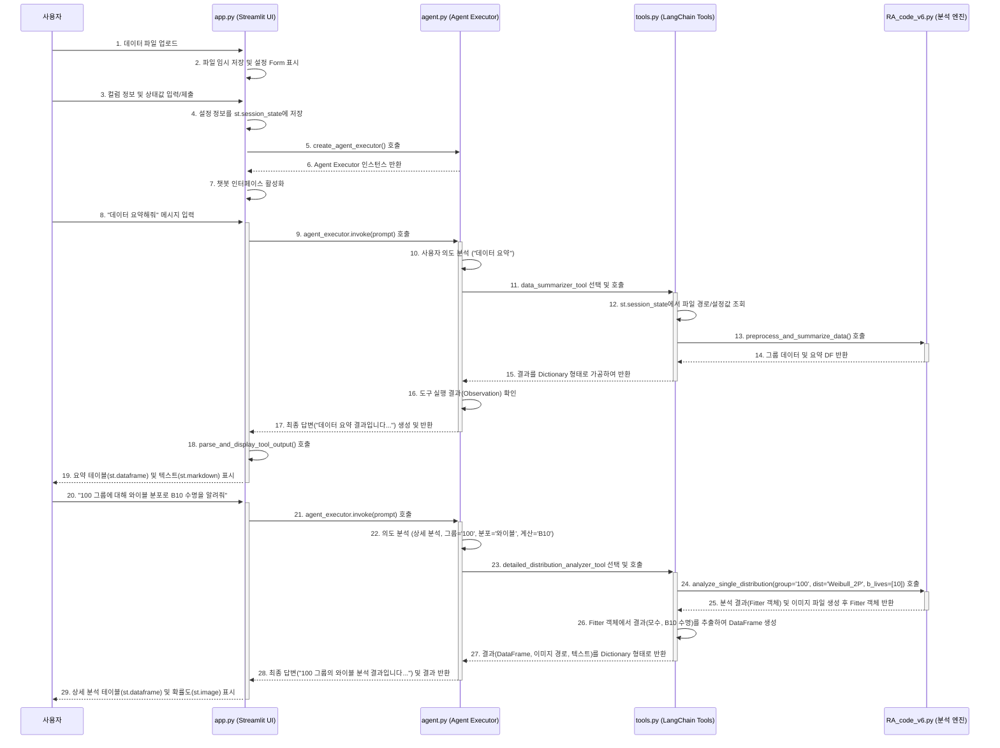

# 신뢰성 분석 챗봇 (Reliability Analysis Chatbot)

이 프로젝트는 LangChain과 Streamlit을 이용하여 수명 데이터 분석을 수행하는 대화형 AI 챗봇 애플리케이션입니다. 사용자는 웹 UI를 통해 데이터 파일을 업로드하고, 자연어 명령으로 신뢰성 분석을 수행하고 그 결과를 시각적으로 확인할 수 있습니다.

## 🚀 주요 기능

-   **웹 기반 UI**: Streamlit을 사용하여 파일 업로드, 분석 설정, 챗봇과의 대화 기능을 제공합니다.
-   **자연어 처리**: LangChain과 Google Gemini 모델을 기반으로 한 에이전트가 사용자의 자연어 요청을 해석하고 적절한 분석을 수행합니다.
-   **다양한 신뢰성 분석**:
    -   데이터 전처리 및 요약
    -   최적 수명 분포 탐색 (와이블, 로그정규 등)
    -   특정 분포를 이용한 상세 분석 (B-Life, 고장 확률 계산)
    -   가속수명시험(ALT) 데이터의 모수 동일성 검토
-   **시각화**: 분석 결과를 테이블, 텍스트, 그리고 Matplotlib으로 생성된 그래프로 시각화하여 제공합니다.

---

## 📂 파일별 역할 및 기능

### 1. `RA_code_v6.py` (백엔드 분석 엔진)

-   **요약**: 신뢰성/수명 데이터 분석의 핵심 로직을 담고 있는 순수 Python 스크립트입니다. 데이터 처리, 통계 계산, 시각화(그래프 생성) 등 모든 분석 기능이 이 파일의 함수들로 구현됩니다.
-   **역할**: Streamlit이나 LangChain에 대한 의존성 없이 독립적으로 실행될 수 있는 분석 모듈입니다.
-   **주요 함수**:
    -   `preprocess_and_summarize_data`: 엑셀/CSV 파일을 읽어 데이터를 전처리하고, 그룹별 고장/관측중단 데이터 수를 요약합니다.
    -   `find_best_distribution`: 여러 통계 분포를 데이터에 피팅하여 BIC 점수를 기준으로 가장 적합한 분포를 찾습니다.
    -   `analyze_single_distribution`: 특정 그룹 데이터에 대해 단일 분포를 적용하여 B-Life, 고장 확률 등 상세 분석을 수행합니다.
    -   `check_parameter_homogeneity`: 여러 스트레스 그룹 간의 형상모수(beta, sigma)가 통계적으로 동일한지 검토합니다.

### 2. `tools.py` (LangChain 도구 브리지)

-   **요약**: `RA_code_v6.py`에 정의된 분석 함수들을 LangChain 에이전트가 사용할 수 있는 "도구(Tool)"로 래핑(wrapping)하는 파일입니다.
-   **역할**: LangChain 에이전트와 순수 분석 코드(`RA_code_v6.py`)를 연결하는 브리지(Bridge)입니다. LLM이 보낸 입력을 분석 함수가 이해할 수 있는 형태로 변환하고, 분석 함수의 출력을 LLM이 이해할 수 있는 형태로 변환합니다.
-   **주요 기능**:
    -   `@tool` 데코레이터를 사용하여 각 분석 함수를 LangChain 도구로 변환합니다.
    -   각 도구의 docstring에 "이 도구를 언제 사용해야 하는지"를 명확히 설명하여 에이전트의 올바른 도구 선택을 돕습니다.
    -   Streamlit의 `st.session_state`를 사용하여 UI의 파일 정보나 설정값을 읽어와 분석 함수에 전달합니다.
    -   분석 결과를 표준화된 딕셔너리(JSON) 형태로 가공하여 에이전트에게 반환합니다.

### 3. `agent.py` (챗봇의 두뇌)

-   **요약**: LangChain을 사용하여 LLM(Gemini) 기반의 에이전트를 생성하고 설정하는 파일입니다.
-   **역할**: 사용자의 자연어 입력을 받아 어떤 `tools.py`의 도구를 사용해야 할지 결정하고, 실행 결과를 바탕으로 최종 답변을 생성하는 챗봇의 "두뇌" 역할을 합니다.
-   **주요 함수**:
    -   `create_agent_executor`: 에이전트의 실행기(AgentExecutor)를 생성합니다. Gemini 모델, `tools.py`의 도구들, 에이전트의 역할을 정의하는 프롬프트, 대화 기록 메모리를 조합하여 최종 에이전트를 구성합니다.

### 4. `app.py` (프론트엔드 UI)

-   **요약**: Streamlit을 사용하여 웹 기반의 사용자 인터페이스(UI)를 구현하는 메인 애플리케이션 파일입니다.
-   **역할**: 프론트엔드. 사용자와 직접 상호작용하며, 전체 애플리케이션의 진입점(Entry Point) 역할을 합니다.
-   **주요 기능**:
    -   파일 업로드(`st.file_uploader`), 분석 설정(`st.form`), 챗봇 인터페이스(`st.chat_input`) 등 UI를 구성합니다.
    -   사용자 설정이 완료되면 `agent.py`의 `create_agent_executor`를 호출하여 에이전트를 초기화합니다.
    -   사용자 채팅 입력을 받아 에이전트를 실행하고, 반환된 결과(텍스트, DataFrame, 이미지 등)를 적절한 UI 컴포넌트로 화면에 표시합니다.
    -   `st.session_state`를 통해 파일 경로, 설정값, 대화 기록 등 세션 정보를 관리합니다.

---

## 📊 시스템 아키텍처 및 작동 프로세스

### 전체 워크플로우 다이어그램

### 작동 프로세스 설명

1.  **UI (`app.py`)와 사용자**: 모든 상호작용은 Streamlit UI에서 시작됩니다. 사용자는 파일을 올리고, 설정을 입력하고, 채팅으로 분석을 요청합니다. `app.py`는 사용자의 입력을 에이전트에게 전달하고, 최종 결과물을 사용자에게 보여주는 창구입니다.

2.  **상태 관리 (`st.session_state`)**: `app.py`에서 생성된 핵심 데이터(파일 경로, 컬럼 설정 등)는 `st.session_state`에 저장됩니다. 이 정보는 세션 내내 유지되며, `tools.py`의 도구들이 분석에 필요한 데이터를 꺼내 쓰는 "공용 데이터 저장소" 역할을 합니다.

3.  **에이전트 (`agent.py`)의 역할**: 에이전트는 "지휘자"입니다. 사용자의 자연어 요청을 해석해서 어떤 도구를 어떤 입력값으로 실행해야 할지 결정합니다. 도구 실행이 끝나면 그 결과를 받아 사용자에게 친절하게 설명하는 최종 답변을 생성합니다.

4.  **도구 (`tools.py`)와 분석 엔진 (`RA_code_v6.py`)**: 도구는 "실무자"이고, 분석 엔진은 "계산기"입니다. 에이전트가 도구를 호출하면, `tools.py`는 `st.session_state`에서 데이터를 가져와 `RA_code_v6.py`의 분석 함수에게 전달합니다. `RA_code_v6.py`는 통계 계산과 그래프 생성을 수행하고, `tools.py`는 이 결과를 다시 에이전트가 이해하기 좋은 표준 형식으로 포장하여 전달합니다.

이러한 역할 분담을 통해 각 파일은 자신의 책임에만 집중하여 체계적이고 확장 가능한 아키텍처를 구성합니다.
