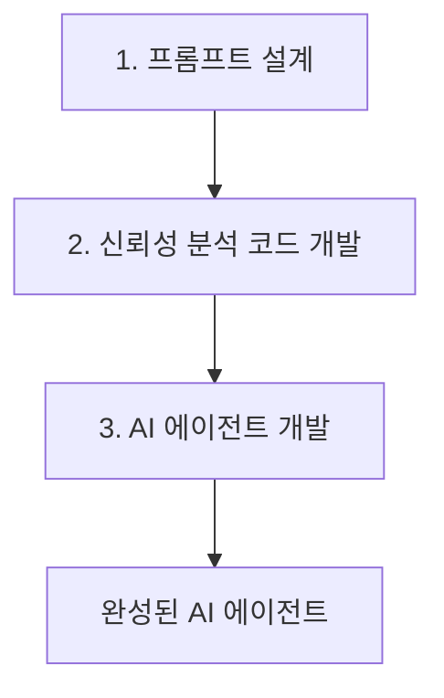
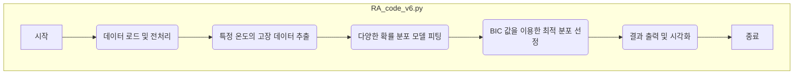
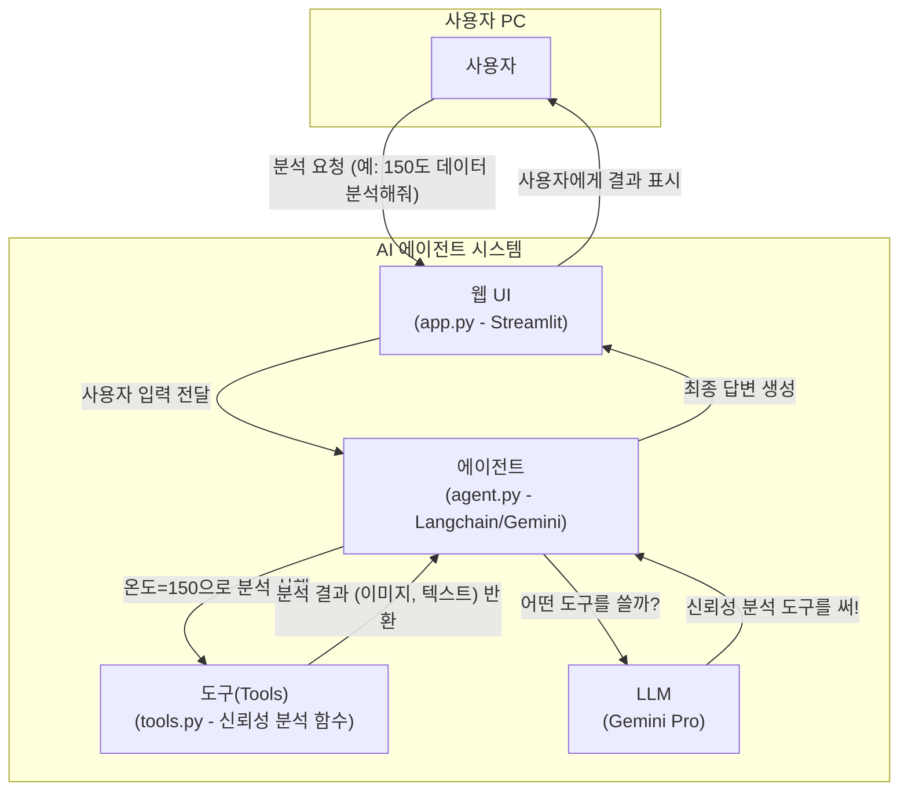

# [Lab 7] 가속수명시험 데이터 분석 AI 에이전트

**최종 목표: 가속 수명 시험(ALT) 데이터를 분석하고, 최적의 확률 분포를 찾아내며, 결과를 시각화하는 AI 에이전트를 개발한다.**
(참고: 가속수명모델 수립은 포함되지 않습니다.)
전체 과정은 다음과 같은 세 가지 주요 단계로 구성됩니다.

이 문서는 현재 폴더(`Lab7_ReliabilityAnalysis_Agent(Langchain)`)의 구조를 기반으로 각 단계에서 무엇을 배우고 어떤 결과물을 만들어 내는지 상세히 설명합니다.

---

## Part 1. 프롬프트 설계 (AI와의 소통 청사진)

**위치:** `1.Prompt/`

AI 개발의 첫걸음은 AI에게 무엇을 원하는지 명확하고 논리적으로 전달하는 것입니다. 이 과정을 **프롬프트 엔지니어링(Prompt Engineering)**이라고 합니다. 우리는 AI를 단순한 검색 도구가 아닌, 코드 개발자와 보조 연구원으로 활용할 것입니다. `1.Prompt` 폴더에는 이 과정에서 사용된 프롬프트 설계 문서들이 들어있습니다.

- **`1.RA_Prompt_Design.md`**:
  - **목적**: 본격적인 개발에 앞서, 우리가 만들고자 하는 신뢰성 분석 기능의 요구사항을 정의하는 문서입니다.
  - **내용**: 어떤 데이터를 사용하고(ALT 데이터), 어떤 분석을 수행하며(분포 찾기, 수명 예측), 어떤 결과를 원하는지에 대한 초기 아이디어를 담고 있습니다.

- **`2.RA_Coding_Prompt.md`**:
  - **목적**: 정의된 요구사항을 바탕으로, AI(Gemini)에게 실제 Python 코드 작성을 지시하기 위한 프롬프트입니다.
  - **내용**: "당신은 Python 신뢰성 분석 전문가입니다." 와 같이 AI에게 역할을 부여하고, 구체적인 데이터 처리 방식, 사용 라이브러리(`reliability`, `pandas`), 분석 절차, 결과 시각화 방법 등을 매우 상세하게 지시합니다. 이 프롬프트를 통해 `2.Code` 폴더의 Python 코드 초안을 생성하게 됩니다.

- **`3.RA_Agent_Prompt_Design.md`**:
  - **목적**: 단순한 코드 스크립트를 넘어, 사용자와 상호작용할 수 있는 AI 에이전트의 기능과 구조를 설계하는 문서입니다.
  - **내용**: 에이전트가 어떤 질문에 답해야 하는지, 어떤 도구(Tool)를 사용해야 하는지, 사용자 인터페이스는 어떻게 구성할지에 대한 계획을 담습니다.

- **`4.RA_Agent_Develop_Prompt.md`**:
  - **목적**: 설계된 에이전트를 실제로 개발하기 위해 AI에게 지시하는 프롬프트입니다.
  - **내용**: `Streamlit`으로 웹 UI를 만들고, `Langchain` 프레임워크를 사용하여 에이전트의 두뇌를 구성하며, 앞서 만든 신뢰성 분석 코드를 에이전트가 사용할 '도구'로 연결하는 구체적인 개발 지시사항이 포함됩니다.

> **핵심 학습**: 좋은 AI 결과물은 좋은 프롬프트에서 시작됩니다. 목표를 명확히 하고, AI가 이해하기 쉽도록 구체적이고 단계적으로 요구사항을 전달하는 것이 중요합니다.

---

## Part 2. 신뢰성 분석 코드 개발 (핵심 로직 구현)

**위치:** `2.Code/`

이 단계에서는 AI가 생성해준 코드를 바탕으로, 신뢰성 분석의 핵심 로직을 점진적으로 완성해 나갑니다. `RA_code_v1.py`부터 `RA_code_v6.py`까지의 파일들은 개발 과정을 보여주는 버전들입니다.

### 데이터 소개
- **`ALT_Chip_temperature.xlsx`**: 분석에 사용될 데이터입니다. 반도체 칩의 가속 수명 시험 데이터로, 특정 온도 조건(100°C, 150°C, 200°C)에서 각 칩이 고장 날 때까지의 시간(수명)을 기록한 데이터입니다.

### 코드 개발 과정 (v1 → v6)
- **`RA_code_v1.py`**: 데이터를 불러오고 기본적인 내용을 확인하는 가장 기초적인 단계의 코드입니다.
- **`RA_code_v2.py` ~ `v5.py`**: 특정 온도 조건의 데이터만 필터링하고, 단일 확률 분포(예: 와이블 분포)를 적용해보고, 여러 분포를 비교하여 최적 분포를 찾는 등 점차 분석 기능이 고도화됩니다.
- **`RA_code_v6.py`**: 최종적으로 잘 정리된 분석 스크립트입니다. 이 코드를 중심으로 상세히 살펴보겠습니다.

### 최종 코드(`RA_code_v6.py`) 심층 분석

이 코드는 특정 온도에서의 고장 데이터를 받아, 여러 확률 분포에 피팅해보고, 어떤 분포가 데이터를 가장 잘 설명하는지 찾아내어 결과를 시각화하는 기능을 수행합니다.

**분석 로직 흐름도:**

**주요 코드 설명:**
1.  **라이브러리 임포트**: `pandas`로 데이터를 다루고, `reliability`로 신뢰성 분석을 수행하며, `matplotlib`으로 그래프를 그립니다.
2.  **데이터 로딩 및 필터링**: `pd.read_excel` 함수로 엑셀 파일을 읽어온 후, 특정 '온도' 조건에 맞는 행만 추출합니다.
3.  **분석 함수 `analyze_and_plot_best_distribution`**:
    - `reliability.Fitters.Fit_Everything` 함수를 사용하여 와이블, 로그노멀, 지수 등 여러 분포 모델에 데이터를 동시에 피팅합니다.
    - `BIC` (Bayesian Information Criterion) 값을 비교하여 가장 낮은 값을 가진 분포를 '최적 분포'로 선택합니다. (별첨 참고)
    - 최적 분포의 확률도(Probability Plot)와 파라미터(모수)를 출력하고, 그래프를 이미지 파일로 저장합니다.

### 별첨: 관련 기술 및 이론
- **Python 라이브러리**:
  - **`pandas`**: 행과 열로 이루어진 표 형태의 데이터를 쉽게 다룰 수 있게 해주는 도구입니다. (엑셀과 유사)
  - **`reliability`**: 와이블 분석, 수명 데이터 분석 등 신뢰성 공학에 필요한 거의 모든 통계적 분석 기능을 제공하는 강력한 전문 라이브러리입니다.
  - **`matplotlib`**: 데이터 분석 결과를 그래프로 시각화하여 쉽게 이해할 수 있도록 돕는 라이브러리입니다.
- **신뢰성 분석 이론**:
  - **확률 분포 (Probability Distribution)**: 수집된 고장 데이터가 어떤 통계적 패턴을 따르는지 설명하는 수학적 모델입니다. 대표적으로 와이블(Weibull), 로그노멀(Lognormal) 분포가 수명 데이터 분석에 널리 사용됩니다.
  - **확률도 (Probability Plot)**: 데이터가 특정 확률 분포를 잘 따르는지 시각적으로 확인하는 그래프입니다. 점들이 직선에 가깝게 배열될수록 해당 분포에 잘 맞는다고 해석할 수 있습니다.
  - **BIC (Bayesian Information Criterion)**: 여러 통계 모델 중 어떤 모델이 가장 데이터를 잘 설명하는지(Goodness of fit) 평가하는 지표 중 하나입니다. 모델의 복잡도와 데이터에 대한 적합도를 함께 고려하며, **BIC 값이 낮을수록 더 좋은 모델**로 평가합니다.

---

## Part 3. AI 에이전트 개발 (사용자 친화적 도구 제작)

**위치:** `3.Agent/`

이 단계에서는 2단계에서 만든 Python 분석 코드를 '도구'로 사용하여, 일반 사용자가 자연어(채팅)로 쉽게 신뢰성 분석을 요청할 수 있는 AI 에이전트를 만듭니다.

### AI 에이전트 아키텍처
AI 에이전트는 다음과 같은 구성 요소들의 조합으로 동작합니다.

### 핵심 파일 설명
- **`requirements.txt`**:
  - **역할**: 이 에이전트 프로젝트를 실행하는 데 필요한 모든 Python 라이브러리 목록입니다. `pip install -r requirements.txt` 명령어로 한 번에 설치할 수 있습니다.
- **`app.py`**:
  - **역할**: 사용자가 접속하는 웹 애플리케이션의 화면을 구성합니다.
  - **기술**: `Streamlit` 이라는 라이브러리를 사용하여, 몇 줄의 Python 코드만으로 간단한 웹 UI(채팅창, 버튼, 이미지 표시 등)를 만들 수 있습니다.
- **`tools.py`**:
  - **역할**: AI 에이전트가 사용할 수 있는 '도구(Tool)'들의 실제 기능을 정의합니다.
  - **내용**: `Part 2`에서 만들었던 `RA_code_v6.py`의 핵심 분석 로직을 함수 형태로 가져와, 에이전트가 호출할 수 있도록 포장합니다. 예를 들어, `run_reliability_analysis(temperature)` 라는 함수를 만들어 두면, 에이전트는 이 함수를 직접 실행할 수 있습니다.
- **`agent.py`**:
  - **역할**: 에이전트의 '두뇌' 역할을 합니다. 사용자의 요청을 해석하고, 어떤 도구를 사용해야 할지 판단하며, 최종 답변을 생성합니다.
  - **기술**: `Langchain` 프레임워크를 사용하여 LLM(Gemini)과 `tools.py`에 정의된 함수들을 쉽게 연결합니다.
  - **동작 방식**:
    1.  사용자로부터 "150도 데이터 분석해줘" 라는 요청을 받습니다.
    2.  LLM(Gemini)에 이 요청과 함께 사용 가능한 도구 목록(`tools.py`의 함수들)을 보냅니다.
    3.  LLM은 `run_reliability_analysis` 도구를 `temperature=150` 이라는 인자와 함께 사용해야겠다고 판단합니다.
    4.  실제로 해당 함수를 실행하고, 결과(그래프 이미지 경로, 분석 텍스트)를 얻습니다.
    5.  얻어진 결과를 바탕으로 사용자에게 보여줄 최종 답변("150도 데이터에 대한 최적 분포는 OOO이며, 결과는 아래와 같습니다.")을 생성하여 `app.py`에 전달합니다.

---

## 결론

본 실습 과정을 통해 우리는 다음 과정을 거쳤습니다.
1.  **명확한 목표 설정**: 프롬프트 설계를 통해 AI에게 원하는 바를 구체적으로 지시하는 방법을 배웠습니다.
2.  **핵심 기능 구현**: AI의 도움을 받아 신뢰성 분석이라는 전문적인 작업을 수행하는 Python 코드를 개발하고 점진적으로 개선했습니다.
3.  **자동화 및 사용자화**: 개발된 코드를 AI 에이전트의 '도구'로 만들어, 코드를 모르는 사용자도 자연어만으로 쉽게 전문가 수준의 분석을 수행할 수 있는 애플리케이션을 구축했습니다.
