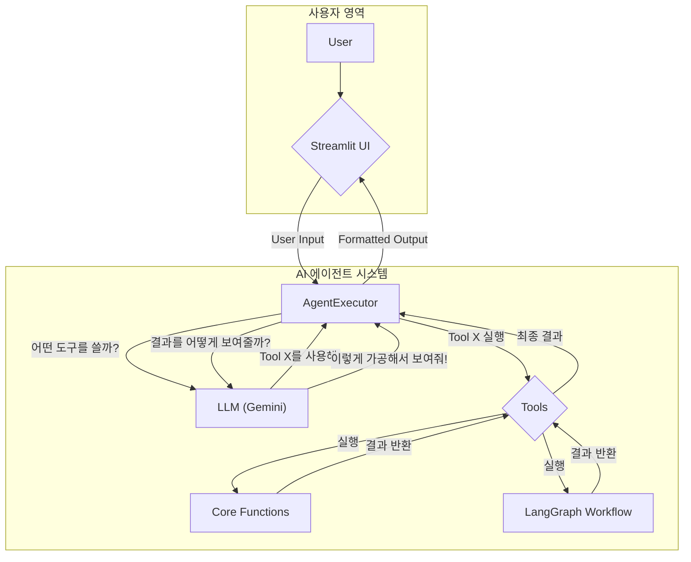
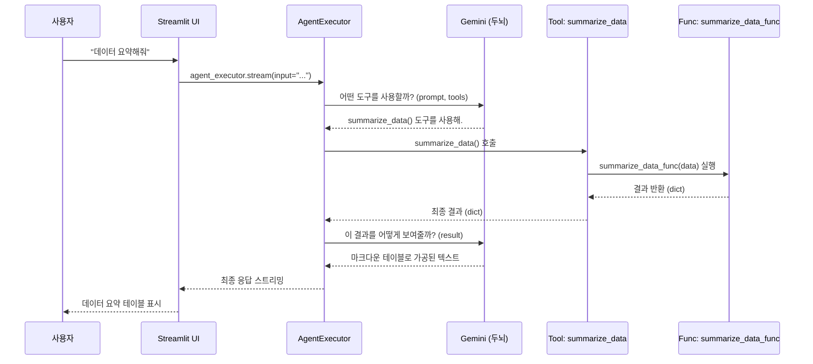
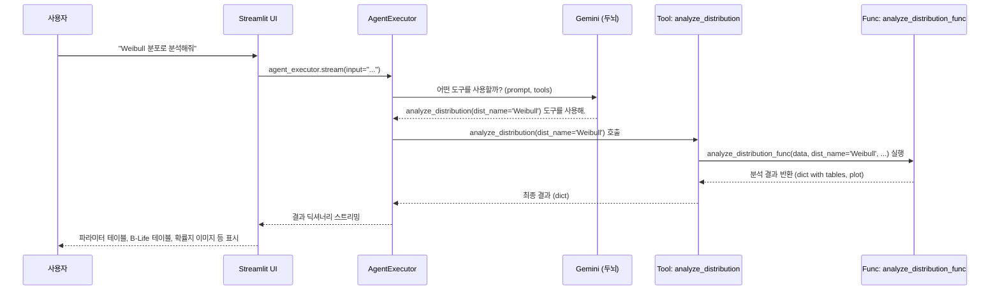
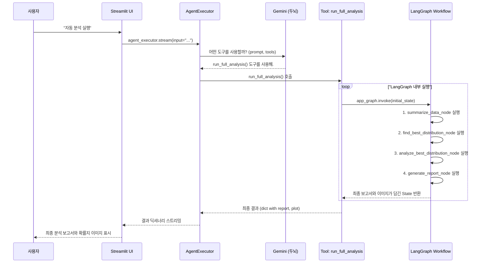

# [Lab 8] 대화형 신뢰성 분석 AI 에이전트 상세 분석

이 문서는 `app_v2.py` 파일에 구현된 AI 에이전트의 아키텍처와 작동 흐름을 종합적으로 분석하고 설명합니다.

## 1. `app_v2.py` 아키텍처 분석

AI 에이전트는 **"신뢰성 분석을 수행하는 똑똑한 AI 비서"** 컨셉으로 설계되었습니다. 전체 구조는 크게 4가지 주요 부분으로 나눌 수 있습니다.

### 1.1. 핵심 분석 기능 (Core Functions)

실제 데이터 분석을 수행하는 순수 Python 함수들입니다. AI 로직과 분리되어 있으며, 입력값에 따라 정해진 계산을 수행하고 결과를 반환하는 역할만 합니다. 코드에서는 `_func` 접미사를 붙여 AI 도구와 구분합니다.

-   `summarize_data_func(...)`: 데이터의 기본 통계 정보(샘플 수, 평균, 표준편차 등)를 계산합니다.
-   `find_best_distribution_func(...)`: 여러 확률 분포를 데이터에 피팅하여 BIC 점수가 가장 낮은 최적의 분포를 찾습니다.
-   `analyze_distribution_func(...)`: 특정 분포를 지정받아 상세 분석(파라미터, 신뢰구간, 확률지 그래프 등)을 수행합니다.

> **비유**: AI 비서가 사용하는 `망치`, `드라이버`, `계산기` 같은 개별 연장의 실제 기능입니다.

### 1.2. AI의 도구함 (`@tool` Decorator)

핵심 분석 함수들을 AI가 이해하고 사용할 수 있는 "스마트 도구"로 변환하는 역할을 합니다. `@tool` 데코레이터가 이 역할을 수행합니다.

```python
@tool
def summarize_data() -> dict:
    """업로드된 수명 데이터의 기본 통계 정보를 요약합니다..."""
    return summarize_data_func(...)
```

-   **`@tool`**: 이 함수가 AI가 사용할 수 있는 도구임을 선언하는 스티커입니다.
-   **Docstring (`"""..."""`)**: **AI를 위한 사용 설명서**입니다. AI는 사용자의 질문 의도를 파악한 후, 이 설명서를 읽고 어떤 도구를 사용해야 할지 결정합니다.

### 1.3. 자동 분석 워크플로우 (LangGraph)

여러 분석 단계를 순서대로 실행해야 하는 복잡한 요청("자동 분석")을 처리하기 위한 **"자동화된 조립 라인"**입니다.

-   **State (`GraphState`)**: 워크플로우의 각 단계에서 생성되는 정보(데이터, 중간 결과, 최종 결과 등)를 저장하는 공유 데이터 바구니입니다.
-   **Nodes (작업대)**: 각자의 작업을 수행하는 독립된 단계입니다.
    1.  `summarize_data_node`: 데이터 요약
    2.  `find_best_distribution_node`: 최적 분포 탐색
    3.  `analyze_best_distribution_node`: 최적 분포 상세 분석
    4.  `generate_report_node`: 모든 결과를 종합하여 최종 보고서 생성
-   **Edges (컨베이어 벨트)**: 노드들을 `1 → 2 → 3 → 4` 순서로 연결하여 작업의 흐름을 정의합니다.

이 전체 워크플로우는 `run_full_analysis`라는 단일 도구로 포장되어 AI에게 제공됩니다.

### 1.4. AI 두뇌 및 사용자 인터페이스 (Agent & Streamlit)

모든 구성 요소를 통합하여 사용자에게 서비스를 제공하는 부분입니다.

-   **LLM (`ChatGoogleGenerativeAI`)**: AI의 "두뇌"로, 사용자의 언어를 이해하고 어떤 도구를 사용할지 추론합니다.
-   **AgentExecutor (행동 매니저)**: LLM의 결정을 받아 실제로 도구를 실행하고, 그 결과를 다시 LLM에게 전달하여 최종 응답을 만드는 역할을 합니다.
-   **Streamlit UI**: 사용자가 파일을 업로드하고, AI와 채팅하며 분석 결과를 확인하는 웹 인터페이스입니다.

---

## 2. 에이전트 작동 흐름 분석 (케이스별)

이 문서는 `app_v2.py`로 구현된 AI 에이전트의 내부 작동 방식을 상세히 설명합니다. 사용자가 UI를 통해 특정 요청을 했을 때, 에이전트가 어떻게 이를 해석하고, 어떤 도구와 함수, 워크플로우를 사용하여 결과를 반환하는지 세 가지 대표적인 케이스를 통해 알아봅니다.

### 2.1. 전체 시스템 아키텍처

에이전트의 전체 구조는 다음과 같이 시각화할 수 있습니다. 사용자의 요청은 UI를 통해 에이전트 실행기(AgentExecutor)로 전달되며, 실행기는 LLM(두뇌)의 판단에 따라 적절한 도구(Tool)나 워크플로우(LangGraph)를 실행하여 결과를 다시 UI로 반환합니다.



### 2.2. Case 1: 간단한 단일 도구 호출 (데이터 요약)

사용자가 데이터의 기본적인 통계 정보를 요청하는 가장 간단한 시나리오입니다.

**요청**: `"데이터 요약해줘"`

#### 상세 작동 절차

1.  **사용자 입력**: 사용자가 Streamlit 채팅창에 "데이터 요약해줘"를 입력합니다.
2.  **에이전트 실행**: `AgentExecutor`가 입력을 받아 LLM(Gemini)에게 전달합니다. 이 때, 시스템 프롬프트와 사용 가능한 도구 목록(`summarize_data`, `find_best_distribution` 등)과 각 도구의 설명서(docstring)를 함께 보냅니다.
3.  **LLM의 추론**: LLM은 "요약"이라는 키워드와 `summarize_data` 도구의 설명서("...기본 통계 정보를 요약합니다.")가 가장 일치한다고 판단합니다.
4.  **도구 호출 결정**: LLM은 `AgentExecutor`에게 `summarize_data` 도구를 호출하라고 지시합니다.
5.  **함수 실행**: `summarize_data` 도구는 내부적으로 핵심 로직 함수인 `summarize_data_func`를 실행합니다. 이 함수는 Streamlit의 세션 상태(`st.session_state`)에 저장된 `failures`와 `right_censored` 데이터를 사용하여 통계치를 계산하고, 결과를 딕셔너리 형태로 반환합니다.
6.  **결과 가공**: `AgentExecutor`는 함수로부터 받은 딕셔너리 결과를 다시 LLM에게 전달합니다.
7.  **최종 응답 생성**: LLM은 이 딕셔너리를 사람이 보기 좋은 마크다운 테이블 형식으로 변환하여 최종 응답을 생성합니다.
8.  **UI 출력**: 가공된 최종 응답이 Streamlit UI에 스트리밍되어 사용자에게 표시됩니다.

#### 시각화 (Sequence Diagram)



### 2.3. Case 2: 파라미터가 있는 도구 호출 (특정 분포 분석)

사용자가 특정 분포를 지정하여 분석을 요청하는 시나리오입니다. 에이전트가 사용자의 언어에서 파라미터(`dist_name`)를 추출하는 과정이 포함됩니다.

**요청**: `"Weibull 분포로 분석해줘"`

#### 상세 작동 절차

1.  **사용자 입력**: 사용자가 "Weibull 분포로 분석해줘"를 입력합니다.
2.  **에이전트 실행**: `AgentExecutor`가 입력을 받아 LLM에게 전달합니다.
3.  **LLM의 추론**: LLM은 "Weibull 분포"라는 구체적인 대상과 "분석"이라는 행위를 인식합니다. `analyze_distribution` 도구의 설명서("특정 확률 분포에 대한 상세 분석을 수행합니다.")와 파라미터(`dist_name: str`)를 보고 이 도구가 가장 적합하다고 판단합니다. 또한, "Weibull"을 `dist_name` 파라미터의 값으로 추출합니다.
4.  **도구 호출 결정**: LLM은 `AgentExecutor`에게 `analyze_distribution(dist_name='Weibull')`을 호출하라고 지시합니다.
5.  **함수 실행**: `analyze_distribution` 도구는 내부적으로 `analyze_distribution_func`를 실행합니다. 이 때 `dist_name`으로 'Weibull'을 전달합니다. 함수 내에서는 'Weibull'을 `Weibull_2P`와 같이 내부에서 사용하는 이름으로 변환하여 `reliability` 라이브러리로 상세 분석을 수행합니다. 분석 결과(파라미터 테이블, B-Life 테이블, 확률지 이미지 등)는 딕셔너리 형태로 반환됩니다.
6.  **결과 처리**: `AgentExecutor`는 결과 딕셔너리를 받습니다. 이 경우, 결과에는 텍스트(테이블)와 이미지 데이터가 섞여 있습니다.
7.  **최종 응답 생성 및 UI 출력**: 코드에 정의된 스트리밍 로직에 따라, 결과 딕셔너리의 내용물을 종류별로 나누어 UI에 직접 렌더링합니다.
    -   `parameter_table`, `b_life_table` 등은 `st.dataframe()`으로 테이블을 그립니다.
    -   `probability_plot`은 `st.image()`로 이미지를 표시합니다.

#### 시각화 (Sequence Diagram)



### 2.4. Case 3: LangGraph 워크플로우 호출 (전체 자동 분석)

사용자가 포괄적인 분석을 요청하여, 여러 단계의 분석이 순차적으로 실행되는 가장 복잡한 시나리오입니다.

**요청**: `"자동 분석 실행"`

#### 상세 작동 절차

1.  **사용자 입력**: 사용자가 "자동 분석 실행"을 입력합니다.
2.  **에이전트 실행 및 LLM 추론**: `AgentExecutor`가 입력을 LLM에게 전달합니다. LLM은 "자동 분석"이라는 요청이 `run_full_analysis` 도구의 설명서("전체 자동 분석을 수행하고 최종 보고서를 생성합니다.")와 가장 일치한다고 판단합니다.
3.  **워크플로우 도구 호출**: LLM은 `run_full_analysis` 도구를 호출하라고 지시합니다.
4.  **LangGraph 실행**:
    -   `run_full_analysis` 도구는 내부적으로 `run_full_analysis_func` 함수를 호출합니다.
    -   이 함수는 미리 정의된 **LangGraph 워크플로우(`app_graph`)**를 `invoke` 메소드로 실행시킵니다.
    -   **Graph State**라는 공유 데이터 바구니가 생성되고, 초기 데이터(failures, right_censored 등)가 담깁니다.
5.  **노드 순차 실행**:
    -   **(1) `summarize_data_node`**: 데이터 요약 노드가 실행되고, 결과가 State에 추가됩니다.
    -   **(2) `find_best_distribution_node`**: 최적 분포 탐색 노드가 실행되고, 최적 분포 이름과 BIC 테이블이 State에 추가됩니다.
    -   **(3) `analyze_best_distribution_node`**: 위에서 찾은 최적 분포로 상세 분석 노드가 실행되고, 분석 결과(테이블, 이미지)가 State에 추가됩니다.
    -   **(4) `generate_report_node`**: 보고서 생성 노드가 State에 축적된 모든 정보를 종합하여 하나의 구조화된 마크다운 보고서를 생성하고, State에 최종 저장합니다.
6.  **워크플로우 결과 반환**: LangGraph는 모든 노드 실행을 마친 후, 최종 정보가 담긴 State를 `run_full_analysis_func`에 반환합니다.
7.  **최종 결과 추출**: 함수는 최종 State에서 `final_report`(마크다운 텍스트)와 `probability_plot`(이미지)을 추출하여 딕셔너리 형태로 `AgentExecutor`에게 반환합니다.
8.  **UI 출력**: `AgentExecutor`는 이 딕셔너리를 받아 UI에 전달하고, UI는 보고서 텍스트와 이미지를 화면에 표시합니다.

#### 시각화 (Sequence Diagram)

