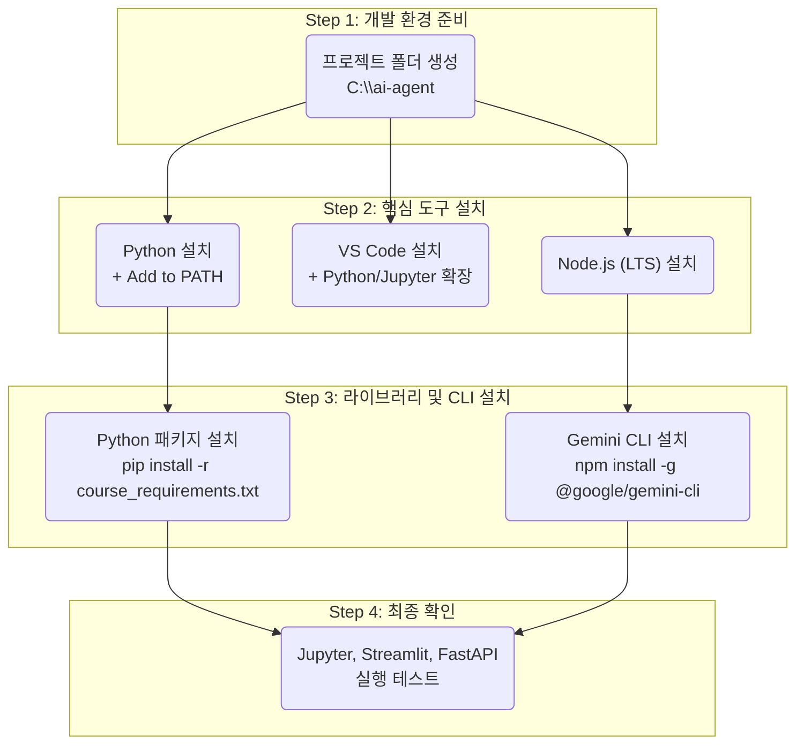

# AI-Agent 실습을 위한 개발환경 설치 가이드

AI-Agent 개발의 첫걸음을 떼는 여러분을 환영합니다! 이 가이드는 코딩 경험이 없는 입문자도 Windows, macOS, Ubuntu 환경에서 실습에 필요한 모든 도구를 설치하고, 간단한 실행 검증까지 한 번에 마칠 수 있도록 돕기 위해 만들어졌습니다.

## 전체 설치 과정 한눈에 보기

이 가이드는 아래와 같은 순서로 개발 환경을 구축합니다. 전체적인 그림을 먼저 이해하면 각 단계를 진행하는 데 도움이 됩니다.




## 1\. 사전 준비

### 1.1. 필수 확인 사항

  * **운영체제(OS)**: 본인의 컴퓨터 운영체제 버전을 확인하세요.
  * **관리자 권한**: 일부 프로그램 설치 시 관리자 암호가 필요할 수 있습니다.
  * **인터넷 연결**: 모든 설치 과정에서 안정적인 인터넷 연결이 필요합니다.
  * **재부팅**: 설치 과정 중간에 재부팅이 필요할 수 있습니다. 중요한 작업은 미리 저장해주세요.

### 1.2. 프로젝트 폴더 생성

**무엇을?** 앞으로 모든 실습 코드와 파일을 저장할 최상위 폴더를 만듭니다.
**왜?** 파일을 체계적으로 관리하고, 경로 문제 발생을 예방하기 위함입니다.

> ⚠️ **중요**: 폴더 경로나 파일 이름에 **공백**이나 **한글**을 사용하지 마세요. 많은 개발 도구에서 예기치 않은 오류를 발생시키는 주된 원인입니다.

  * **Windows**: 파일 탐색기를 열고 `C:\` 드라이브에 `ai-agent` 라는 이름의 새 폴더를 만드세요. 최종 경로는 `C:\ai-agent`가 됩니다.

  * **macOS/Ubuntu**: 터미널을 열고 다음 명령어를 입력하세요.

    ```bash
    mkdir ~/ai-agent
    cd ~/ai-agent
    ```

### 1.3. Windows 사용자를 위한 커맨드라인(터미널) 빠른 가이드

**무엇을?** 앞으로의 설치 및 실행 명령어를 입력할 '명령어 창'을 켭니다. 윈도우에서는 'PowerShell' 또는 'cmd'를 사용하는 것이 일반적입니다.
**왜?** 개발자들이 사용하는 많은 도구들은 그래픽 인터페이스(GUI)가 아닌 텍스트 기반의 명령어 인터페이스(CLI, Command Line Interface)로 작동합니다. 마우스 클릭 대신 키보드로 명령을 내리는 방식이며, 개발자에게는 필수적인 도구입니다.

**1. 터미널 열기 (여러 방법)**

- **시작 메뉴 → PowerShell** (권장)\
  검색창에 `PowerShell` 입력 → **Windows PowerShell** 실행 (키보드의 `Windows` 키(보통 `Ctrl`과 `Alt` 키 사이에 있는 창문 모양 키)를 누르고 'PowerShell' 타이핑)
- **명령 프롬프트(cmd)**\
  검색창에 `cmd` 입력 → **명령 프롬프트** 실행
- **VS Code 내장 터미널** (프로젝트 폴더에서 바로 실행. 추후 실습과정에서 활용)\
  VS Code 열기 → **Terminal > New Terminal** (단축키: `Ctrl` + `Shift` + `｀`)\
- **파일 탐색기에서 현재 폴더로 열기**\
  탐색기에서 원하는 폴더를 연 뒤, 주소창에 `powershell` 또는 `cmd` 입력 후 **Enter**


**2. PowerShell 기본 사용법**

  * **명령어 복사/붙여넣기**:

      * 이 가이드에 있는 명령어 블록 오른쪽 위의 'Copy' 버튼을 클릭하여 복사(`Ctrl+C`)합니다.
      * PowerShell 창 안에서 마우스 오른쪽 버튼을 한 번 클릭하면 자동으로 붙여넣기 됩니다. 또는 `Ctrl+V`를 사용해도 됩니다.

  * **명령어 실행**:

      * 명령어를 붙여넣거나 직접 입력한 후, `Enter` 키를 누르면 명령이 실행됩니다.

  * **폴더 이동 (`cd` 명령어)**:

      * `cd`는 Change Directory의 약자로, 현재 작업 위치를 다른 폴더로 변경하는 명령어입니다.
      * 우리의 프로젝트 폴더인 `C:\ai-agent`로 이동하려면 아래와 같이 입력하고 `Enter`를 누릅니다.

    <!-- end list -->

    ```powershell
    cd C:\ai-agent
    ```
      * `cd C:\ai-agent` 명령어를 실행했을 때, 프롬프트(명령어 입력 줄)의 경로가 `PS C:\ai-agent>` 와 같이 변경되었는지 확인하세요. 앞으로 모든 터미널 작업은 이 폴더 안에서 진행합니다.

      * 경로에 공백이 있을 때: 따옴표로 묶기 예) `cd "C:\Users\Hong Kim\ai-agent"`

  * **현재 폴더 확인:** PowerShell: `Get-Location` 또는 `pwd`
  
  * **폴더 목록 보기:** `dir`

**3. 자주 쓰는 기본 명령(Windows)**

```powershell
:: 폴더 만들기 & 이동 (cmd or PowerShell)
mkdir C:\ai-agent && cd /d C:\ai-agent
```

-----

## 2\. Python 설치

**무엇을?** AI 개발의 핵심 언어인 Python을 설치합니다.
**왜?** 대부분의 AI 라이브러리와 프레임워크가 Python을 기반으로 동작하기 때문입니다.

### 2.1. Windows 10/11

1.  **Python 공식 사이트**([https://www.python.org/downloads/](https://www.python.org/downloads/))에 접속하여 최신 버전을 다운로드합니다.
2.  다운로드한 설치 파일을 실행합니다.
3.  **설치 화면 하단**에서 **"Add Python to PATH"** 또는 **"Add python.exe to PATH"** 체크박스를 **반드시** 체크합니다. 이 옵션을 선택해야만 1.3에서 배운 PowerShell 어디서든 `python` 명령어를 사용할 수 있습니다.
4.  `Install Now`를 클릭하여 설치를 진행합니다.

### 2.2. macOS 13+

macOS에는 기본적으로 Python이 설치되어 있지만, 버전이 오래되었을 수 있습니다. `Homebrew`라는 패키지 관리자를 통해 최신 버전을 설치하는 것을 권장합니다.

1.  **Homebrew 설치** (이미 설치되어 있다면 건너뛰세요)
    터미널을 열고 아래 명령어를 붙여넣어 실행합니다.

    ```bash
    /bin/bash -c "$(curl -fsSL https://raw.githubusercontent.com/Homebrew/install/HEAD/install.sh)"
    ```

2.  **Python 설치**
    Homebrew 설치가 완료되면, 터미널에 아래 명령어를 입력합니다.

    ```bash
    brew install python3
    ```


### 2.3. Ubuntu 22.04+

Ubuntu에는 기본적으로 Python 3가 설치되어 있지만, 개발에 필요한 도구들을 추가로 설치합니다.

1.  터미널을 열고 패키지 목록을 업데이트합니다.

    ```bash
    sudo apt update
    sudo apt upgrade -y
    ```

2.  Python 개발 도구와 `pip`(패키지 설치 도구), `venv`(가상환경 도구)를 설치합니다.

    ```bash
    sudo apt install -y python3-pip python3.10-venv
    ```


**설치 후 공통 확인**

**확인(Check)**

터미널을 열고 (윈도우 사용자는 1.3에서 배운 방법으로 **새로운 PowerShell 창을 엽니다**) 아래 명령어를 입력하여 버전이 올바르게 출력되는지 확인하세요. (버전 숫자는 설치 시점에 따라 다를 수 있습니다.)

```bash
# Python 버전 확인
python --version
# pip 버전 확인
pip --version
```

  * **기대 출력 (예시)**: `Python 3.11.4`, `pip 23.2.1 ...`

### 2.4. 가상환경(venv) 설정 (선택)

**무엇을?** 프로젝트별로 독립된 Python 실행 환경을 만듭니다.
**왜?** 프로젝트마다 사용하는 패키지 버전이 달라 발생하는 충돌을 방지하고, 내 컴퓨터를 깨끗하게 유지하기 위함입니다. 

> 💡 **안내**: 가상환경(venv) 설치는 선택사항이며, 본 교육실습을 위해서는 설치하지 않아도 실습진행에 전혀 문제가 없습니다. 추후 본격적인 개발시에 적용할 수 있도록 사전안내하는 용도입니다.

1.  **가상환경 생성**:

      * **Windows**: PowerShell을 실행하고 `cd C:\ai-agent` 명령어로 프로젝트 폴더로 이동합니다.
      * **macOS/Ubuntu**: 터미널이 `~/ai-agent` 경로에 있는지 확인합니다.
      * **공통**: 현재 폴더에 `.venv`라는 이름의 가상환경을 생성합니다.

    <!-- end list -->

    ```bash
    python -m venv .venv
    ```

2.  **가상환경 활성화**:
    터미널 프롬프트 앞에 `(.venv)`가 붙으면 성공입니다.

      * **Windows (PowerShell)**:
        ```powershell
        .venv\Scripts\Activate.ps1
        # 권한 오류 발생 시: Set-ExecutionPolicy -ExecutionPolicy RemoteSigned -Scope Process 실행 후 재시도
        ```
      * **macOS/Ubuntu**:
        ```bash
        source .venv/bin/activate
        ```

**확인(Check)**: PowerShell 프롬프트가 `(.venv) PS C:\ai-agent>` 와 같이 변경되었는지 확인하세요.

3.  **가상환경 비활성화**
      * 가상환경을 비활성화하기 위해서는 아래 명령어를 입력하면 됩니다.
       ``` powershell
           deactivate 
       ```

> 💡 **Tip:** 앞으로 이 프로젝트 관련 작업을 할 때는 항상 터미널을 열고 **가장 먼저 프로젝트 폴더로 이동(`cd C:\ai-agent`)한 후, 가상환경을 활성화**하는 습관을 들이세요.

-----


## 3\. 필수 Python 패키지 설치 (Jupyter, reliability)

**무엇을?** AI-Agent 개발 및 데이터 분석에 필수적인 Jupyter와 신뢰성 패키지 및 관련 도구를 설치합니다. 이후에도 실습 과정에서 필요한 Python 패키지는 이 방법을 통해서 설치할 것입니다.
**왜?** Jupyter 노트북은 코드, 설명, 실행 결과를 한 번에 볼 수 있어 실험과 분석에 매우 유용합니다. 그리고 reliability 패키지는 Python에서 가장 널리 사용되는 신뢰성 분석 패키지입니다.

1.  **pip 업그레이드**
    이전 단계의 **터미널 창**에서 이어서 아래 명령어를 실행합니다.

    ```bash
    python -m pip install --upgrade pip
    ```

2.  **핵심 패키지 설치**
    Jupyter Notebook, reliability와 VS Code 연동에 필요한 패키지들을 한 번에 설치합니다.
    커맨드라인에 많은 메세지가 표시되면서 설치가 진행되고, 시간이 꽤 걸립니다.

    ```bash
    pip install jupyter ipykernel matplotlib numpy pandas reliability
    ```

    > 💡 **Tip: 전체 패키지 한번에 설치하기 (적극 권장)**
    > 
    > 본 교육과정의 모든 실습에 필요한 패키지를 한 번에 설치하는 두 가지 방법입니다.
    > 
    > **방법 1: `requirements.txt` 파일 사용 (가장 권장)**
    > 프로젝트 루트 폴더에 있는 `course_requirements.txt` 파일을 이용하여 모든 패키지를 설치합니다.
    > 
    > ```bash
    > pip install -r course_requirements.txt
    > ```
    > 
    > **방법 2: 직접 모든 패키지 나열**
    > 아래 명령어를 복사하여 붙여넣어도 동일하게 설치할 수 있습니다.
    > 
    > ```bash
    > pip install requests beautifulsoup4 html2text jupyter ipykernel matplotlib numpy pandas reliability typing typing_extensions streamlit agent python-dotenv dotenv langgraph langchain langchain_google_genai langchain_core langchain_community faiss-cpu Ipython fastapi "uvicorn[standard]" python-multipart openpyxl
    > ```

**확인(Check)**

설치된 패키지 목록을 확인합니다.

```bash
pip list
```

  * **기대 출력**: `jupyter`, `ipykernel`, `matplotlib`, `numpy`, `pandas` 등의 패키지가 목록에 보이면 성공입니다.

----

## 4\. VS Code 설치 & 기본 설정

**무엇을?** 코드를 작성하고 실행할 통합 개발 환경(IDE)인 Visual Studio Code를 설치합니다.
**왜?** 가볍고 빠르며, 강력한 확장 기능을 통해 Python, Jupyter, 웹 개발 등 모든 작업을 하나의 도구에서 처리할 수 있습니다.

### 4.1. VS Code 설치

  * **공식 사이트**([https://code.visualstudio.com/](https://code.visualstudio.com/))에 접속하여 본인 OS에 맞는 버전을 다운로드하여 설치합니다.

> ⚠️ **경고**: 관리자 권한으로 VS Code를 실행하지 마세요. 불필요하며, 확장 프로그램 설치나 파일 권한 관련 문제를 일으킬 수 있습니다.

### 4.2. 권장 설정 및 확장 프로그램 설치

VS Code를 실행하고, 아래 순서대로 설정을 진행하세요.

1.  **한국어 언어 팩 설치**

      * 좌측 메뉴에서 네모 블록 모양의 **확장(Extensions)** 아이콘을 클릭합니다. (단축키: `Ctrl+Shift+X`)
      * 검색창에 `korean`을 입력합니다.
      * `Korean Language Pack for Visual Studio Code`를 찾아 `Install` 버튼을 누르고, 안내에 따라 VS Code를 재시작합니다.

2.  **필수 확장 프로그램 설치**
    같은 방식으로 아래 확장 프로그램들을 검색하여 설치합니다.

      * **Python** (`ms-python.python`): Python 코드 작성의 필수 도구 (디버깅, 린팅 등)
      * **Jupyter** (`ms-toolsai.jupyter`): VS Code 내에서 Jupyter 노트북을 만들고 실행
      * **Markdown All in One** (`yzhang.markdown-all-in-one`): 마크다운 문서 작성을 편리하게 해줌

3.  **자동 저장 설정 (권장)**

      * `파일` \> `기본 설정` \> `설정` (단축키: `Ctrl+,`)으로 이동합니다.
      * 검색창에 `auto save`를 입력합니다.
      * `Files: Auto Save` 옵션을 `onFocusChange`(파일 외부를 클릭할 때) 또는 `afterDelay`(일정 시간 후)로 변경합니다.

### 4.3. Python 인터프리터 설정

**무엇을?** VS Code가 우리가 설치한 Python을 사용하도록 지정합니다.
**왜?** 이 설정을 해야만 VS Code가 Python 코드를 올바르게 인식하고 실행할 수 있습니다.

1.  VS Code에서 `파일` > `폴더 열기`를 선택하고, 1.2에서 만든 `ai-agent` 폴더를 엽니다. '이 폴더에 있는 작성자를 신뢰합니까?'를 물어보는 경우 '예. 작성자를 신뢰합니다.' 를 클릭합니다.
2.  `Ctrl+Shift+P`를 눌러 명령 팔레트를 엽니다.
3.  `Python: Select Interpreter`를 검색하고 선택합니다.
4.  목록에서 2장에서 설치한 Python 버전을 선택합니다. 보통 `Python 3.x.x` 와 같이 표시되며, 경로가 `C:\Python3x\python.exe` (Windows) 또는 `/usr/bin/python3` (macOS/Ubuntu)와 같이 전역 경로로 되어 있는 것을 선택합니다.
    > (참고: 만약 2.4절에 따라 가상환경을 만드셨다면, `'.venv': venv` 라고 표시된 인터프리터를 선택해도 됩니다.)

**확인(Check)**

VS Code 창의 **오른쪽 하단 파란색 상태 표시줄**을 보세요. `Python 3.x.x` 와 같이 여러분이 설치한 Python 버전이 표시되면 올바르게 설정된 것입니다. (가상환경 사용 시에는 `Python 3.x.x ('.venv': venv)`로 표시됩니다.)

## 5\. Jupyter 노트북 간단 실행검증

**무엇을?** VS Code 안에서 Jupyter 노트북을 만들어 간단한 코드를 실행해 봅니다.
**왜?** 지금까지 설치한 Python, 가상환경, 패키지, VS Code 설정이 모두 올바르게 연동되었는지 최종 확인하는 과정입니다.

1.  VS Code 탐색기에서 `새 파일` 아이콘을 클릭하고, 파일 이름을 `test.ipynb`로 만듭니다. (`.ipynb` 확장자가 중요합니다.)

2.  `test.ipynb` 파일을 열면 Jupyter 노트북 화면이 나타납니다.

3.  **커널 선택**: 화면 우측 상단에 `커널 선택(Select Kernel)` 버튼을 클릭하고, 목록에서 3.3에서 등록한 `ai-agent`를 선택합니다. 만약 `ai-agent` 커널이 보이지 않는다면, 목록에서 `Python 3.x.x` (Global) 이라고 표시된 것을 선택해도 무방합니다.

4.  `+ 코드` 버튼을 클릭하여 코드 셀을 생성하고 첫 번째 코드 셀에 아래 코드를 입력합니다.

    ```python
    print("Hello, AI-agent!")
    ```

5.  셀 왼쪽에 있는 **재생(▶️)** 버튼을 누르거나, `Ctrl+Enter`를 눌러 코드를 실행합니다. 셀 바로 아래에 `Hello, AI-agent!`가 출력되면 성공입니다.

6.  아래쪽 `+ 코드` 버튼을 눌러 새 셀을 추가하고, 아래 코드를 붙여넣은 후 실행해보세요.

    ```python
    import numpy as np
    import matplotlib.pyplot as plt

    x = np.linspace(0, 10, 100)
    y = np.sin(x)

    plt.figure(figsize=(8, 4))
    plt.plot(x, y)
    plt.title("Test Plot from Jupyter in VS Code")
    plt.xlabel("x")
    plt.ylabel("sin(x)")
    plt.grid(True)
    plt.show()
    ```

**확인(Check)**

코드 셀 아래에 사인파(sin wave) 그래프가 나타나면, 데이터 분석 및 시각화 패키지까지 완벽하게 설치된 것입니다.

-----

## 6\. Node.js(LTS) 설치

**무엇을?** JavaScript 런타임인 Node.js와 패키지 매니저인 npm을 설치합니다.
**왜?** 최신 웹 프론트엔드(React 등)를 개발하거나, JavaScript 기반의 AI 관련 도구(Gemini CLI 등)를 사용할 때 필요합니다. **LTS(Long-Term Support)** 버전은 장기적으로 안정적인 지원이 보장되므로 권장됩니다.

### 6.1. Windows 10/11

1.  **Node.js 공식 사이트**([https://nodejs.org/](https://nodejs.org/))에 접속합니다.
2.  **LTS**라고 표시된 버전을 다운로드하여 설치합니다. 설치 과정은 기본 옵션을 그대로 두고 진행하면 됩니다. `PATH`도 자동으로 추가됩니다.

### 6.2. macOS 13+

Homebrew를 사용하여 설치하는 것이 가장 간편합니다.

```bash
brew install node
```

### 6.3. Ubuntu 22.04+

`nvm`(Node Version Manager)을 사용하면 다양한 Node.js 버전을 쉽게 관리할 수 있습니다.

1.  **nvm 설치 스크립트 실행**

    ```bash
    curl -o- https://raw.githubusercontent.com/nvm-sh/nvm/v0.39.7/install.sh | bash
    ```

2.  터미널을 껐다가 다시 켜거나, `source ~/.bashrc` 를 실행하여 nvm 명령어를 활성화합니다.

3.  **Node.js LTS 버전 설치 및 사용 설정**

    ```bash
    nvm install --lts
    nvm use --lts
    ```

**확인(Check)**

**새로운 터미널 창을 열고** (윈도우 사용자는 시작 메뉴에서 PowerShell을 새로 실행) 아래 명령어를 입력하여 버전이 올바르게 출력되는지 확인하세요.

```bash
# Node.js 버전 확인
node -v
# npm 버전 확인
npm -v
```

  * **기대 출력 (예시)**:
    ```
    v22.5.1
    10.8.1
    ```

### 6.4. Windows 문제 해결 (Troubleshooting)

Node.js 설치 후 Windows 환경에서 발생할 수 있는 몇 가지 일반적인 문제와 해결 방법입니다.

*   **증상 1: `npm -v` 실행 시 오류 발생**

    `node -v`는 정상적으로 실행되지만, `npm -v`를 실행하면 '파일을 로드할 수 없습니다' 또는 '실행할 수 없습니다'와 같은 경로 관련 오류가 발생하는 경우, PowerShell의 실행 정책(Execution Policy) 문제일 수 있습니다.

    *   **해결 방법: PowerShell 실행 정책 변경**
        1.  **관리자 권한으로 PowerShell 실행**: 시작 메뉴에서 `PowerShell`을 검색한 후, **Windows PowerShell**에 마우스 오른쪽 버튼을 클릭하여 **'관리자 권한으로 실행'**을 선택합니다.
        2.  **실행 정책 변경**: 아래 명령어를 입력하고 `Enter`를 누릅니다. 실행 정책을 변경할지 묻는 메시지가 나타나면 `Y` 또는 `A`를 입력하고 `Enter`를 누릅니다.
            ```powershell
            Set-ExecutionPolicy RemoteSigned -Scope CurrentUser
            ```
        3.  **PowerShell 창 닫고 새로 열기**: 관리자 PowerShell 창을 닫고, 일반 PowerShell 창을 새로 열어 `npm -v`가 정상적으로 실행되는지 다시 확인합니다.

*   **증상 2: `python` 명령어 실행 시 Microsoft Store가 열리는 경우**

    터미널에서 `python`을 입력했을 때 Python 인터프리터가 실행되지 않고 Microsoft Store의 Python 앱 페이지로 연결되는 경우가 있습니다. 이는 Windows가 `python` 명령어에 대한 바로 가기를 앱 스토어로 기본 설정해두었기 때문입니다.

    *   **해결 방법**:
        1.  Windows `설정` > `앱` > `고급 앱 설정` > `앱 실행 별칭`으로 이동합니다.
        2.  목록에서 `Python`과 관련된 항목(`앱 설치 관리자 (python.exe)`)을 찾아 **끔(Off)**으로 변경합니다.
        3.  만약 해결되지 않으면, Python이 올바르게 설치되지 않았거나 설치 시 **"Add Python to PATH"** 옵션을 체크하지 않았을 가능성이 높습니다. 가이드의 **2.1절**을 참고하여 Python을 재설치하세요.


-----

## 7\. Gemini CLI 설치 & 테스트

**무엇을?** 터미널에서 명령어로 Gemini AI 모델을 통해 개발하고 테스트할 수 있는 `gemini-cli` 도구를 설치합니다.
**왜?** 코딩 없이 아이디어를 빠르게 프로토타이핑하고 모델의 성능을 시험해볼 수 있습니다. 

### 7.1. Gemini CLI 설치

PowerShell과 같은 터미널 창에서 아래 명령어를 입력하여 `gemini-cli`를 전역(global)으로 설치합니다.

```bash
npm install -g @google/gemini-cli
```

  * **macOS/Ubuntu에서 권한 오류(`EACCES`) 발생 시**:
    ```bash
    sudo npm install -g @google/gemini-cli
    ```

### 7.2. Gemini 인증: 로그인 방식

API 키를 직접 관리하는 대신, Google 계정으로 직접 로그인하는 방식입니다. 간편하고 안전하여 초보자에게 권장됩니다.

1.  원하는 경로로 이동하여 터미널에 아래 명령어를 입력하고 Gemini CLI를 실행합니다. (C:\ai-agent 경로 이동 권장)

    ```bash
    gemini
    ```

2.  명령을 실행하면 로그인 방식을 묻는 질문이 나타납니다. 화살표키로 '1. Login with Google'을 선택하고 `Enter` 키를 누릅니다.

3.  자동으로 웹 브라우저가 열리면서 Google 계정 로그인 및 권한 요청 화면이 나타납니다.

4.  **Gemini API를 사용할 Google 계정을 선택**하고, "모두 선택"을 통해 필요한 권한을 허용한 후 "계속" 버튼을 클릭합니다.

5.  "Authentication successful" (인증 성공) 메시지가 표시된 페이지가 보이면 브라우저 창을 닫아도 됩니다. 터미널이 자동으로 인증을 완료합니다.

### 7.3. Gemini 인증: API 키 직접 발급 및 .env 설정

웹 기반 로그인이 실패하거나, 서버 환경 등에서 수동으로 키를 관리해야 할 때 사용하는 방법입니다. 이 방법은 CLI 도구를 직접 인증하는 대신, 애플리케이션이 사용할 `.env` 파일을 바로 설정합니다.

1.  **Google AI Studio에서 API 키 발급 (상세내용 부록 참조)**

      * **Google AI Studio**([https://aistudio.google.com/](https://aistudio.google.com/))에 접속하여 구글 계정으로 로그인합니다.
      * 좌측 메뉴에서 \*\*`Get API key`\*\*를 클릭하고, `Create API key in new project` 버튼을 눌러 새로운 키를 생성합니다.
      * 생성된 API 키 문자열을 복사합니다.

2.  **.env 파일에 키 저장**

      * VS Code를 열어 `ai-agent` 폴더 최상위에 `.env` 라는 이름의 새 파일을 만듭니다. (이미 있다면 해당 파일을 엽니다.)
      * 파일 안에 아래 형식으로 1단계에서 복사한 키를 붙여넣고 저장합니다.

    <!-- end list -->

    ```
    GOOGLE_API_KEY="여기에-AI-Studio에서-발급받은-키를-따옴표-없이-그대로-붙여넣으세요"
    ```

    이것으로 여러분의 **애플리케이션**은 API 키를 사용할 준비가 되었습니다. 
    Gemini 로그인 시에 '2. Use Gemini API Key'를 선택하면 해당 폴더에서 `.env` 파일을 찾아서 자동으로 인증을 수행합니다.

### 7.4. 동작 확인

프롬프트 화면에서 `gemini` 를 입력하고 `enter`를 누르면, 텍스트환경의 Gemini CLI가 구동됩니다.

```bash
gemini
```

Gemini 실행화면창에서 에서 아래와 같이 간단한 프롬프트를 전달하여 Gemini 모델이 응답하는지 확인합니다.

```bash
# Gemini 실행화면에서 직접 아래 메세지를 입력

"AI-agent 개발 환경 구축에 대해서 초보자도 이해하기 쉽게 한 줄로 설명해줘."
```

**확인(Check)**

  * **기대 출력**:
    ```
    (AI 응답) AI-agent 개발 환경은 Python, VS Code, Node.js 등 필수 도구를 설치하고 가상환경을 설정하여 독립적이고 효율적인 개발 기반을 마련하는 과정입니다.
    ```
    위와 같이 AI의 답변이 정상적으로 출력되면 CLI 설정이 성공적으로 완료된 것입니다.

-----


## 8\. 프론트엔드/백엔드 실습 준비

이제 AI 모델을 활용한 웹 애플리케이션을 만들 준비를 합니다. 대표적인 3가지 프레임워크를 설치하고 실행해봅니다.

### 8.1. Streamlit (간단한 웹 UI)

데이터 분석 결과를 손쉽게 인터랙티브 웹 앱으로 만들 때 유용합니다. (Python 가상환경이 활성화된 상태에서 진행하세요.)

1.  **설치**:

    `ai-agent` 폴더로 이동한 터미널에서 아래 명령어를 실행합니다.

    ```bash
    pip install streamlit
    ```

2.  **실행 검증**:


    ```bash
    streamlit hello
    ```

**확인(Check)**

웹 브라우저가 자동으로 열리면서 Streamlit 데모 페이지가 나타납니다. 터미널에서 `Ctrl+C`를 눌러 서버를 중지할 수 있습니다.


### 8.2. React (최신 프론트엔드)

복잡하고 동적인 사용자 인터페이스(UI)를 구축할 때 사용되는 표준 프론트엔드 라이브러리입니다. `Vite`를 사용해 프로젝트를 빠르게 생성합니다.

1.  **프로젝트 생성**:
    **가상환경이 활성화되지 않은 일반 터미널 창**에서 `ai-agent` 폴더로 이동 후 아래 명령어를 실행합니다. (`cd C:\ai-agent`로 이동)

    ```bash
    npm create vite@latest my-react-app -- --template react

    ```

2.  **의존성 설치 및 개발 서버 실행**:
    명령어 실행이 끝나면, **같은 터미널 창에서** 새로 생긴 `my-react-app` 폴더로 이동한 후 개발 서버를 실행합니다.

    ```bash
    cd my-react-app
    npm install
    npm run dev
    ```

**확인(Check)**

터미널에 `Local: http://localhost:5173/` (포트 번호는 다를 수 있음)와 같은 주소가 출력됩니다. 이 주소를 웹 브라우저에서 열었을 때 React 로고가 회전하는 페이지가 보이면 성공입니다. `Ctrl+C`로 서버를 중지하세요.

### 8.3. FastAPI (고성능 백엔드)

AI 모델을 서빙하는 API 서버를 만들 때 매우 유용한 Python 웹 프레임워크입니다.

1.  **설치**:

    `ai-agent` 폴더로 이동한 터미널에서 FastAPI와 서버 실행 도구인 `uvicorn`을 설치합니다.

    ```bash
    pip install fastapi uvicorn[standard]
    ```

2.  **최소 API 서버 코드 작성**:
    VS Code를 이용해 `main.py` 파일을 만들고 아래 코드를 붙여넣습니다.

    ```python
    # main.py
    from fastapi import FastAPI

    app = FastAPI()

    @app.get("/health")
    def read_health():
        return {"status": "ok"}
    ```

3.  **서버 실행**:
    `main.py` 파일이 있는 `ai-agent` 폴더의 터미널에서 아래 명령을 실행합니다.

    ```bash
    uvicorn main:app --reload
    ```

**확인(Check)**

웹 브라우저에서 `http://127.0.0.1:8000/health` 주소로 접속했을 때 `{"status":"ok"}` 라는 JSON 응답이 보이면 성공입니다. `Ctrl+C`로 서버를 중지하세요.

-----

## 9. 프로젝트 폴더 구조 제안

본 교육 과정의 실습은 복잡한 폴더 구조 없이 `C:\ai-agent` 폴더 하나에서 모든 파일을 관리하는 것을 기본으로 합니다. 모든 Python 패키지는 전역(Global) 환경에 설치되므로, 별도의 프로젝트 폴더나 가상환경을 만들지 않아도 실습을 진행하는 데 문제가 없습니다.

### 9.1. 기본 실습 구조 (본 과정)

모든 실습 파일(`*.py`, `*.ipynb`, `.env` 등)은 `ai-agent` 폴더에 직접 만들어 관리합니다.

```
ai-agent/
│
├── test.ipynb
├── main.py
├── simple_test.py
└── ... (다른 실습 파일들)
```

### 9.2. 참고: 향후 프로젝트를 위한 폴더 구조 (심화)

실제 현업 개발에서는 여러 프로젝트를 동시에 진행하며, 프로젝트마다 사용하는 라이브러리(패키지) 버전이 달라 충돌이 발생할 수 있습니다. 이를 방지하기 위해 프로젝트별로 폴더를 나누고 그 안에 독립된 가상환경(`.venv`)을 구성하는 것이 일반적입니다.

아래는 가상환경을 사용하는 경우의 예시이며, **본 실습 과정에서는 필수가 아닙니다.**

1.  **프로젝트 폴더 생성**: `ai-agent` 폴더 아래에 `project-01-fmea` 와 같은 새 프로젝트 폴더를 만듭니다.
2.  **VS Code에서 폴더 열기**: VS Code에서 `project-01-fmea` 폴더를 엽니다.
3.  **가상환경 생성 및 활성화**: 해당 프로젝트 폴더 내에 터미널을 열고 `python -m venv .venv` 명령으로 가상환경을 만듭니다. 그리고 `.venv\Scripts\Activate.ps1` (Windows) 또는 `source .venv/bin/activate` (macOS/Ubuntu)로 활성화합니다.
4.  **독립적인 패키지 설치**: 활성화된 가상환경 안에서 `pip install ...` 명령을 사용하면, 설치된 패키지들은 해당 프로젝트 폴더(.venv)에만 종속됩니다.

이러한 구조는 여러 프로젝트를 체계적으로 관리하고 싶을 때 사용하는 좋은 습관이므로 참고용으로 알아두시면 좋습니다.


-----

## 10\. 부록

### 10.1. 부록: Gemini API 키 발급 및 테스트 예제

이 섹션은 여러분이 자신만의 AI 애플리케이션을 만들기 위해 필수적인 Gemini API 키를 발급받고, 이 키가 정상적으로 작동하는지 Python 코드를 통해 확인하는 과정을 안내합니다.

#### 1\. Gemini API 키 발급 절차

API 키는 여러분의 애플리케이션이 Google의 AI 모델과 통신할 때 사용하는 비밀 열쇠와 같습니다.

1.  **Google AI Studio 접속 및 로그인**

      * 웹 브라우저에서 \*\*[Google AI Studio](https://aistudio.google.com/)\*\*로 이동합니다.
      * Google 계정으로 로그인합니다.

2.  **API 키 메뉴로 이동**

      * 로그인 후, 화면 오른쪽 위에서 열쇠(🔑) 모양의 **`Get API key`** 버튼을 클릭합니다.

3.  **새 API 키 생성**

      * `Create API key` 버튼을 클릭합니다.
      * 기존에 만들어 둔 Google Cloud 프로젝트가 있다면 선택하거나, 없다면 `Create API key in new project`를 클릭하여 새로운 프로젝트 내에 키를 생성합니다.

4.  **API 키 복사 및 보관**

      * 잠시 후, 영문과 숫자로 조합된 긴 문자열의 API 키가 생성됩니다. 오른쪽에 있는 복사 버튼을 눌러 키를 복사합니다.

    > ⚠️ **매우 중요**:
    >   * **API 키는 비밀번호와 같습니다.** 이 키가 외부에 노출되면 다른 사람이 여러분의 사용량으로 비용을 발생시킬 수 있습니다.
    >   * 절대로 코드에 직접 작성하거나, 블로그, GitHub와 같은 공개된 장소에 올리지 마세요.
    >   * 이 가이드에서 배운 `.env` 파일에 저장하여 안전하게 관리하세요.

이제 여러분은 자신만의 API 키를 발급받았습니다. 다음 단계에서 이 키가 잘 작동하는지 테스트해 보겠습니다.

-----

#### 2\. Python으로 Gemini LLM 간단 호출 예제

가장 기본적인 Python 코드를 작성하여 우리가 발급받은 API 키로 Gemini 모델에게 질문하고 답변을 받아보겠습니다.

**1단계: 필요 라이브러리 설치**

먼저, Gemini API를 Python에서 쉽게 사용할 수 있도록 도와주는 Google 공식 라이브러리와 `.env` 파일을 읽기 위한 라이브러리를 설치해야 합니다.

  * `ai-agent` 폴더로 이동한 터미널에서 아래 명령어를 실행하세요.

    ```bash
    pip install google-generativeai python-dotenv
    ```

**2단계: `.env` 파일 준비**

  * 앞서 발급받은 API 키가 프로젝트 폴더 내 `.env` 파일에 아래와 같이 저장되어 있는지 확인하세요.
    ```
    GOOGLE_API_KEY="여기에_발급받은_API_키를_붙여넣으세요"
    ```

**3단계: Python 코드 작성**

  * VS Code를 사용하여 프로젝트 폴더에 `simple_test.py`라는 새 파일을 만들고 아래 코드를 그대로 붙여넣으세요.

    ```python
    # simple_test.py

    import os
    import google.generativeai as genai
    from dotenv import load_dotenv

    # 1. .env 파일에서 환경 변수 로드
    load_dotenv()

    # 2. API 키를 사용하여 Gemini API 설정
    #    os.getenv()는 환경 변수에서 'GOOGLE_API_KEY' 값을 찾아옵니다.
    try:
        genai.configure(api_key=os.getenv("GOOGLE_API_KEY"))
    except Exception as e:
        print("API 키 설정에 실패했습니다. .env 파일을 확인해주세요.")
        print(f"오류: {e}")
        exit()

    # 3. 사용할 Gemini 모델 설정
    #    'gemini-2.5-flash-latest'는 빠르고 효율적인 최신 모델입니다.
    model = genai.GenerativeModel('gemini-2.5-flash-lite')

    # 4. 모델에게 전달할 프롬프트(질문) 작성
    prompt = "인공지능으로 할 수 있는 재미있는 일 3가지를 간단하게 알려줘."

    # 5. 모델에 프롬프트를 전달하고 응답 생성
    print("Gemini 모델에게 질문하는 중...")
    response = model.generate_content(prompt)

    # 6. 모델의 답변(텍스트) 출력
    print("\n--- Gemini 모델의 답변 ---\n")
    print(response.text)
    print("\n--------------------------\n")

    ```

**4단계: 코드 실행**

  * 파일을 저장한 뒤, 터미널에서 아래 명령어를 입력하여 코드를 실행합니다.

    ```bash
    python simple_test.py
    ```

**예상 출력 결과**

코드가 성공적으로 실행되면, 터미널에 다음과 유사한 형태의 답변이 출력됩니다. (답변 내용은 실행할 때마다 달라질 수 있습니다.)

```
Gemini 모델에게 질문하는 중...

--- Gemini 모델의 답변 ---

AI로 할 수 있는 재미있는 일 3가지를 간단하게 알려드릴게요!

1.  **나만의 이야기나 시 쓰기:** AI에게 특정 주제나 분위기를 주면, 그에 맞춰서 흥미로운 이야기나 아름다운 시를 만들어낼 수 있어요. 동화 작가가 된 것처럼 상상력을 발휘해보세요.
2.  **새로운 노래 멜로디 만들기:** AI에게 좋아하는 음악 장르나 악기를 알려주면, 신나는 멜로디나 감성적인 곡을 즉석에서 작곡해 줄 수 있습니다. 나만의 히트곡을 만들어보는 건 어떨까요?
3.  **나만의 그림 스타일로 사진 변환:** 평범한 사진을 AI에게 맡기면, 유명 화가의 화풍처럼 독특한 스타일로 바꿔줄 수 있어요. 특별한 나만의 예술 작품을 만들 수 있답니다.

--------------------------
```

축하합니다\! 여러분은 성공적으로 API 키를 발급받고, Python을 통해 처음으로 대규모 언어 모델과 통신하는 데 성공했습니다. 이제 이 기본 원리를 응용하여 더 복잡하고 재미있는 AI Agent를 만들 준비가 되었습니다.

### 10.2. 자주 쓰는 명령 치트시트

| 목적 | Windows (PowerShell) | macOS / Ubuntu |
| :--- | :--- | :--- |
| **가상환경 활성화 (선택)** | `.venv\Scripts\Activate.ps1` | `source .venv/bin/activate` |
| **가상환경 비활성화 (선택)** | `deactivate` | `deactivate` |
| **Python 패키지 설치**| `pip install <package_name>` | `pip install <package_name>` |
| **npm 전역 패키지 설치**| `npm install -g <package_name>` | `sudo npm install -g <package_name>` |
| **React 개발 서버** | `npm run dev` | `npm run dev` |
| **FastAPI 개발 서버** | `uvicorn main:app --reload` | `uvicorn main:app --reload` |
| **Streamlit 앱 실행** | `streamlit run app.py` | `streamlit run app.py` |

### 10.3. 간단한 용어 설명

  * **venv (가상환경)**: 프로젝트별로 독립된 Python 실행 공간. "프로젝트용 책가방"처럼, 필요한 라이브러리만 담아 서로 섞이지 않게 해줍니다.
  * **커널(Kernel)**: Jupyter 노트북에서 실제 코드를 실행하고 계산을 담당하는 엔진. 어떤 버전의 Python(또는 다른 언어)을 사용할지 결정합니다.
  * **LTS (Long-Term Support)**: 장기 지원 버전. 새로운 기능 추가는 적지만, 오랜 기간 동안 안정성과 보안 업데이트가 보장되는 버전입니다. 서버나 중요한 환경에서 선호됩니다.
  * **CLI (Command-Line Interface)**: 마우스 클릭 대신 텍스트 명령어로 컴퓨터와 상호작용하는 방식. 개발자들이 선호하는 빠르고 강력한 작업 환경입니다.
  * **PATH (환경 변수)**: 운영체제가 `python`이나 `node` 같은 명령어를 어느 폴더에서 찾아야 할지 알려주는 "주소록"입니다. 여기에 등록되어야 터미널 어디서든 해당 명령어를 실행할 수 있습니다.

### 10.4. 참고 링크 (공식 문서)

  * [Python 공식 사이트](https://www.python.org/)
  * [Visual Studio Code 공식 사이트](https://code.visualstudio.com/)
  * [Node.js 공식 사이트](https://nodejs.org/)
  * [Google AI Studio (Gemini)](https://aistudio.google.com/)

