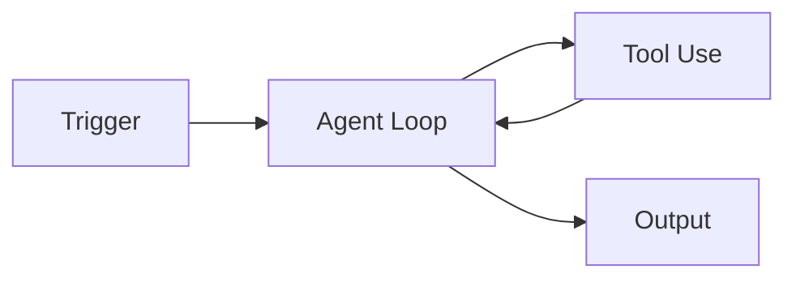

>[!info]
>**Author**: Baekdong Cha (차백동)
>**Email**: orientpine@gmail.com | orientpine@kimm.re.kr
>**Affiliation**: Korea Institute of Machinery and Materials (한국기계연구원)
>**Created**: 2026-01-27
>**Location**: 퇴직준비세미나/세미나자료/회차별강의자료
>**Tag**: #세미나 #퇴직준비 #4회차 #AI자동화 #Agent #백그라운드태스크
>**License**: CC BY 4.0

---

# 4회차: 24시간 일하는 나의 분신 만들기

> "내가 잠든 사이에도 AI는 일합니다.  
> 단순 반복 업무를 AI Agent에게 맡기고, 당신은 더 창의적인 일에 집중하세요."

---

## 🎯 학습 목표

이번 세션을 완료하면 다음을 할 수 있습니다:

- [ ] 백그라운드 태스크 자동화의 원리와 구현 방법을 이해한다
- [ ] 스케줄링과 트리거를 활용하여 AI를 자동으로 실행시킨다
- [ ] Skills 시스템과 Context-aware 작업의 개념을 파악한다
- [ ] 일일 리포트 자동 생성 Agent를 실제로 구축해본다
- [ ] Phase 3 과제(자동화 태스크 완성)의 요구사항을 이해한다

---

## 📋 강의 개요 (3시간)

| 시간 | 내용 | 형식 |
|------|------|------|
| 00:00-00:40 | Part 1: 백그라운드 태스크 자동화 원리 | 강의 |
| 00:40-00:50 | 휴식 | - |
| 00:50-01:30 | Part 2: 스케줄링과 트리거 기반 실행 | 강의 + 실습 |
| 01:30-01:40 | 휴식 | - |
| 01:40-02:20 | Part 3: Skills 시스템과 Context-aware 작업 | 강의 |
| 02:20-02:30 | 휴식 | - |
| 02:30-03:00 | Part 4: 일일 리포트 Agent 실습 + Phase 3 과제 안내 | 실습 |

---

## Part 1: 백그라운드 태스크 자동화 원리 (40분)

### 1.1 왜 백그라운드 자동화인가? (10분)

대부분의 AI 활용은 사용자가 질문하고 AI가 답하는 '대화형'에 머물러 있습니다. 하지만 진정한 생산성 혁명은 사용자가 개입하지 않아도 AI가 스스로 판단하고 실행하는 **백그라운드 자동화**에서 시작됩니다.

- **24/7 가동**: 사람이 자는 시간에도 데이터 수집, 정리, 보고서 작성이 가능합니다.
- **비동기 처리**: 시간이 오래 걸리는 작업을 백그라운드에 던져두고 다른 업무를 볼 수 있습니다.
- **정기적 수행**: 잊기 쉬운 반복 업무를 정해진 시간에 정확히 수행합니다.
- **심리적 해방**: "내가 챙겨야 한다"는 압박감에서 벗어나 더 중요한 의사결정에 집중할 수 있습니다.
- **데이터 일관성**: 사람이 수동으로 할 때 발생할 수 있는 누락이나 실수를 방지합니다.

### 1.2 자동화의 핵심 아키텍처 (15분)

백그라운드 자동화는 크게 세 가지 요소로 구성됩니다:

1. **Trigger (트리거)**: "언제 실행할 것인가?" (시간, 이벤트, 파일 변경 등)
2. **Agent Logic (에이전트 로직)**: "무엇을 할 것인가?" (계획 수립, 도구 사용, 결과 생성)
3. **Output (출력)**: "결과를 어디에 둘 것인가?" (파일 저장, 이메일 발송, DB 업데이트)



### 1.3 Claude Code의 백그라운드 모드 (15분)

Claude Code와 같은 최신 도구들은 터미널을 점유하지 않고도 작업을 수행할 수 있는 기능을 제공합니다.

- **비대화형 실행**: 명령줄 인자(CLI Arguments)를 통해 한 번에 지시를 내립니다.
- **로그 기록**: 백그라운드에서 일어나는 모든 과정을 파일로 기록하여 나중에 검토할 수 있게 합니다.
- **상태 관리**: 작업이 중단되어도 어디까지 진행되었는지 기억하고 재개할 수 있습니다.
- **리소스 최적화**: 필요한 순간에만 CPU와 메모리를 사용하여 효율적으로 작동합니다.
- **보안**: 백그라운드 실행 시 권한 범위를 제한하여 안전하게 작업을 수행합니다.

### 1.4 자동화의 단계별 진화 (10분)

1. **1단계: 단순 스크립트**: 정해진 명령어를 반복 실행 (예: 매일 파일 백업)
2. **2단계: 조건부 실행**: 특정 조건이 맞을 때만 실행 (예: 에러 로그 발생 시 알림)
3. **3단계: 자율 에이전트**: 목표만 주어지면 스스로 판단하여 실행 (예: "이번 주 연구 동향 요약해줘")
4. **4단계: 협업 에이전트**: 여러 에이전트가 서로 소통하며 복잡한 프로젝트 완수

---

## Part 2: 스케줄링과 트리거 기반 실행 (40분)

### 2.1 시간 기반 스케줄링 (Cron) (15분)

가장 기본적인 자동화는 정해진 시간에 실행하는 것입니다.

- **Linux/Mac (Cron)**: `0 9 * * 1-5` (평일 오전 9시 실행)
- **Windows (작업 스케줄러)**: GUI를 통해 특정 시간대 실행 설정
- **Cloud (GitHub Actions 등)**: 서버 없이 클라우드에서 정기 실행
- **장점**: 예측 가능하고 관리가 쉬움
- **단점**: 불필요한 실행이 발생할 수 있음 (데이터 변화가 없어도 실행)

### 2.2 이벤트 기반 트리거 (15분)

특정 사건이 발생했을 때 AI를 깨우는 방식입니다.

- **파일 변경**: 특정 폴더에 새 파일이 들어오면 즉시 요약 시작
- **이메일 수신**: 특정 제목의 메일이 오면 답장 초안 작성
- **웹훅 (Webhook)**: 외부 서비스(Slack, Notion 등)에서 신호를 주면 실행
- **장점**: 실시간 대응이 가능하고 불필요한 실행을 줄임
- **단점**: 설정이 다소 복잡할 수 있음

### 2.3 [실습] 5분마다 폴더 감시하기 (10분)

간단한 쉘 스크립트를 활용하여 특정 폴더를 감시하고, 새 파일이 생기면 Claude Code가 자동으로 분석하게 만드는 구조를 실습합니다.

```bash
# 예시 스크립트 (watch.sh)
while true; do
  if [ -f "./input/new_task.txt" ]; then
    echo "새로운 작업을 발견했습니다. 분석을 시작합니다..."
    claude "input/new_task.txt 파일을 분석해서 요약본을 output 폴더에 저장해줘"
    mv ./input/new_task.txt ./archive/
    echo "작업이 완료되었습니다."
  fi
  sleep 300
done
```

---

## Part 3: Skills 시스템과 Context-aware 작업 (40분)

### 3.1 무한 확장 가능한 Skills (20분)

AI Agent의 능력은 그가 사용할 수 있는 '도구(Tools)'에 의해 결정됩니다. 이를 **Skills**라고 부릅니다.

- **기본 Skill**: 파일 읽기, 쓰기, 검색, 터미널 실행
- **확장 Skill (MCP)**: 외부 API 연동, 브라우저 제어, 데이터베이스 쿼리
- **커스텀 Skill**: 본인의 업무에 특화된 전용 도구를 직접 정의하여 연결
- **생태계**: 전 세계 개발자들이 공유하는 다양한 MCP 서버를 활용 가능
- **보안**: 각 Skill이 접근할 수 있는 데이터 범위를 세밀하게 조정 가능

### 3.2 Context-aware (맥락 인식) 작업 (20분)

단순히 명령을 수행하는 것을 넘어, 현재 프로젝트의 전체 맥락을 이해하고 작업하는 기법입니다.

- **RAG (Retrieval-Augmented Generation)**: 방대한 문서 중 필요한 부분만 찾아내어 참조
- **Project Context**: `.claude.md`나 `CLAUDE.md` 파일을 통해 프로젝트의 규칙과 스타일을 학습
- **History Awareness**: 과거에 수행했던 작업 결과를 바탕으로 다음 단계를 결정
- **개인화**: 사용자의 선호도와 과거 피드백을 기억하여 점점 더 정확한 결과 제공
- **멀티모달 맥락**: 텍스트뿐만 아니라 이미지, 도표 등 시각적 정보도 맥락으로 활용

### 3.3 지식 베이스와의 연결 (10분)

에이전트가 단순히 파일을 읽는 것을 넘어, Obsidian과 같은 지식 베이스와 연결되어 과거의 기록을 바탕으로 현재의 작업을 수행하는 구조를 이해합니다.

---

## Part 4: 일일 리포트 Agent 실습 + Phase 3 과제 안내 (30분)

### 4.1 [실습] 일일 리포트 자동 생성 Agent 구축 (20분)

오늘 배운 내용을 종합하여, 하루 동안의 작업 로그를 모아 자동으로 리포트를 작성하는 Agent를 만듭니다.

1. **데이터 수집**: 오늘 생성/수정된 파일 목록 추출
2. **분석**: 각 파일의 변경 사항 요약
3. **작성**: 정해진 템플릿에 맞춰 마크다운 문서 생성
4. **저장**: `Reports/YYYY-MM-DD_Daily.md` 경로에 저장

### 4.2 실습 시나리오 상세 (10분)

- **입력**: 오늘 작성한 메모 파일들
- **처리**: 각 메모의 핵심 주제 추출 및 카테고리 분류
- **출력**: PARA 구조에 맞춘 일일 요약 보고서

### 4.3 Phase 3 과제 안내 (10분)

이제 여러분의 실제 업무를 자동화할 시간입니다.

---

## 요약 및 마무리

### 오늘 배운 핵심 내용

1. **백그라운드 자동화**: 사용자의 개입 없이 24시간 작동하는 AI 시스템의 가치
2. **트리거와 스케줄링**: Cron과 이벤트 기반 실행을 통한 자동화 구현
3. **Skills와 MCP**: 도구 사용 능력을 확장하여 복잡한 업무 처리
4. **Context-aware**: 프로젝트 맥락을 이해하는 똑똑한 에이전트

---

## 다음 회차 예고 및 과제 안내

### 5회차 예고: Obsidian - 제2의 뇌 구축

> **"PARA 방법론으로 지식을 연결하라"**

다음 시간에는 AI가 생성한 지식을 체계적으로 관리하는 방법을 배웁니다:
- PARA 방법론 (Projects, Areas, Resources, Archives)
- Obsidian 핵심 플러그인 활용법
- AI와 Obsidian의 결합: 자동 분류 및 연결

### Phase 3 과제 (5회차 전까지 완료)

>[!warning] **필수 제출**
> **제목**: Claude Code / oh-my-opencode로 자동화 태스크 1건 완성
> **마감**: 5회차 세미나 3일 전
>
> **제출물**:
> 1. Claude Code 또는 oh-my-opencode 설치 완료 (설치 가이드: [[oh-my-opencode 시작]])
> 2. 본인 업무에서 반복되는 작업 1건 선정 및 Agent화 설계 문서 작성
> 3. 실제 Agent 실행 및 결과물 제출 (코드 또는 출력물)
> 4. Agent Loop(요청→계획→실행→결과) 각 단계 로그 캡처
> 5. 예시 참고: 일일 리포트 생성, 이메일 초안 작성, 데이터 정리 등
>
> **제출 방법**: 이메일 (orientpine@kimm.re.kr)

자세한 내용: [[세미나자료/회차별과제/Phase3_Claude_Code_자동화_태스크]]

---

## 📚 관련 문서

- [[퇴직준비_세미나_소개]] - 세미나 전체 개요
- [[3회차_AI_Agent_개념과_아키텍처]] - 이전 강의
- [[세미나자료/회차별과제/Phase3_Claude_Code_자동화_태스크]] - Phase 3 과제 상세

---

## ✅ 4회차 완료 체크리스트

오늘 세미나를 마치며 다음을 확인하세요:

- [ ] 백그라운드 자동화가 왜 필요한지 이해했다
- [ ] 트리거와 에이전트 로직의 관계를 설명할 수 있다
- [ ] Skills 시스템(MCP)의 확장 가능성을 확인했다
- [ ] 일일 리포트 Agent의 작동 원리를 파악했다
- [ ] Phase 3 과제 주제를 선정했다

**모든 체크가 완료되면 4회차를 성공적으로 마친 것입니다! 🎉**

---

## 부록: 백그라운드 자동화 예시 코드

### 1. 일일 리포트 생성 프롬프트
```markdown
당신은 일일 리포트 생성 전문가입니다.
오늘 수정된 모든 .md 파일을 읽어서 다음 형식으로 요약해주세요:
1. 주요 작업 내용 (불렛 포인트)
2. 새로 배운 점
3. 내일 할 일
결과는 'Daily_Reports/YYYYMMDD.md'에 저장하세요.
```

### 2. 이메일 자동 분류 스크립트
```bash
# 이메일 본문이 담긴 파일을 읽어 중요도 판단
claude "email.txt를 읽고 [긴급/보통/낮음]으로 분류한 뒤, 긴급인 경우 답장 초안을 작성해줘"
```

### 3. 데이터 정리 자동화
```bash
# 매주 월요일 오전 9시에 실행되는 데이터 정리 작업
0 9 * * 1 claude "data/raw/ 폴더의 최신 CSV 파일을 읽어서 중복 제거 후 data/processed/에 저장해줘"
```

---

## 학습 참고 자료

- [Anthropic 공식 문서: Tool Use](https://docs.anthropic.com/claude/docs/tool-use)
- [MCP(Model Context Protocol) 소개](https://modelcontextprotocol.io/)
- [GitHub Actions로 AI 자동화하기](https://github.com/features/actions)
- [Node-RED를 활용한 시각적 자동화](https://nodered.org/)
- [Zapier와 Claude 연동 가이드](https://zapier.com/apps/claude/integrations)
- [Make.com (구 Integromat) 활용법](https://www.make.com/)
- [Python 기반 AI 에이전트 프레임워크 (CrewAI, AutoGPT)](https://www.crewai.com/)

---

## 실습용 템플릿: Agent화 설계 문서

자동화하고 싶은 업무를 다음 양식에 맞춰 정리해보세요.

```markdown
# Agent화 설계 문서 (템플릿)

## 1. 업무 분석
- 업무명: 
- 반복 주기: 
- 소요 시간: 
- 주요 단계: 

## 2. Agent 설계
- 입력 데이터: 
- 사용 도구 (Skills): 
- 처리 로직: 
- 출력 결과물: 

## 3. 프롬프트 초안
[여기에 Agent에게 내릴 지시 사항을 작성하세요]
```

---

## 심화 학습: 자율 에이전트의 윤리와 안전

자동화가 고도화될수록 AI가 내리는 결정에 대한 책임과 안전 장치가 중요해집니다.

- **Human-in-the-loop**: 중요한 결정 단계에서는 반드시 사람의 승인을 거치도록 설계합니다.
- **Sandboxing**: AI가 시스템 전체에 영향을 주지 않도록 격리된 환경에서 실행합니다.
- **Audit Log**: AI가 수행한 모든 작업을 기록하여 사후 검증이 가능하게 합니다.
- **Data Privacy**: 민감한 정보가 외부 AI 모델로 유출되지 않도록 필터링 시스템을 구축합니다.
- **Cost Management**: 무한 루프에 빠져 API 비용이 과다 청구되지 않도록 제한을 설정합니다.

---

## 마무리 인사

4회차 세미나를 통해 여러분은 단순히 AI와 대화하는 수준을 넘어, AI를 여러분의 든든한 '분신'으로 만드는 첫걸음을 뗐습니다. 처음에는 설정이 복잡하고 시행착오가 있겠지만, 한 번 구축해둔 자동화는 여러분에게 수십, 수백 배의 시간을 되돌려줄 것입니다.

Phase 3 과제를 통해 여러분만의 멋진 자동화 에이전트를 만들어보시기 바랍니다. 궁금한 점은 언제든 질문해주세요!

---

## [참고] 자동화 아이디어 리스트

여러분의 업무에 적용할 수 있는 아이디어들입니다:

1. **뉴스레터 요약**: 매일 아침 관심 분야의 뉴스레터를 요약하여 슬랙으로 전송
2. **회의록 자동 정리**: 녹음된 텍스트 파일을 읽어 핵심 결정 사항과 액션 아이템 추출
3. **코드 리뷰**: 깃허브에 코드가 올라오면 자동으로 보안 취약점 및 스타일 체크
4. **고객 문의 분류**: 들어오는 문의 메일을 카테고리별로 분류하고 담당자에게 배정
5. **연구 논문 스캐닝**: 특정 키워드가 포함된 신규 논문을 찾아 초록 요약 보고서 작성
6. **개인 재무 관리**: 카드 결제 내역 CSV를 읽어 가계부 자동 기입 및 소비 패턴 분석
7. **학습 플래너**: 공부한 내용을 바탕으로 복습 퀴즈를 생성하여 정해진 시간에 발송
8. **시스템 모니터링**: 서버 상태를 주기적으로 체크하고 이상 징후 발견 시 보고서 작성
9. **SNS 콘텐츠 생성**: 블로그 글을 바탕으로 인스타그램, 트위터용 요약 문구 자동 생성
10. **번역 및 로컬라이징**: 새로 생성된 영문 문서를 자동으로 한국어로 번역하여 저장

---

## [참고] 에이전트 루프(Agent Loop)의 이해

에이전트가 작업을 수행하는 내부 과정을 이해하면 더 좋은 프롬프트를 작성할 수 있습니다.

1. **Perception (인식)**: 사용자의 명령과 현재 환경(파일, 시스템 상태)을 파악합니다.
2. **Reasoning (추론)**: 목표를 달성하기 위해 어떤 단계가 필요한지 생각합니다.
3. **Action (행동)**: 도구를 사용하여 실제로 작업을 수행합니다.
4. **Observation (관찰)**: 행동의 결과를 확인하고 성공 여부를 판단합니다.
5. **Refinement (개선)**: 실패했다면 원인을 분석하고 계획을 수정하여 다시 시도합니다.

이 루프가 반복되면서 복잡한 작업이 완성됩니다.

---

## [참고] 효과적인 자동화 프롬프트 작성 팁

- **명확한 종료 조건**: 언제 작업이 끝난 것으로 간주할지 명시하세요.
- **에러 처리 지침**: 문제가 발생했을 때 어떻게 행동할지(중단, 재시도, 보고) 알려주세요.
- **중간 보고**: 작업이 길어질 경우 중간 과정을 어떻게 출력할지 지정하세요.
- **결과물 검증**: 최종 결과물이 올바른지 스스로 체크하는 단계를 포함시키세요.
- **리소스 제한**: 한 번에 처리할 파일 개수나 최대 실행 시간을 지정하세요.

---

## [참고] 백그라운드 자동화의 한계와 극복

- **한계**: 인터넷 연결 끊김, API 할당량 초과, 예상치 못한 입력 데이터 형식
- **극복**: 재시도 로직 구현, 예외 상황 알림 설정, 데이터 전처리 단계 강화

---

## [참고] 미래의 자동화: 자율 조직(DAO)과 AI

미래에는 개인의 자동화를 넘어, 여러 AI 에이전트가 모여 하나의 조직처럼 움직이는 시대가 올 것입니다. 오늘 배운 기초는 그 거대한 변화에 적응하기 위한 가장 중요한 밑거름이 될 것입니다.

---

> 다음 회차: [[5회차_Obsidian_제2의_뇌_구축]]


---

## [심화] AI Agent의 기억력: 단기 기억 vs 장기 기억

에이전트가 더 똑똑하게 일하기 위해서는 '기억'이 필요합니다.

### 1. 단기 기억 (Context Window)
- 현재 대화 세션 내에서의 기억입니다.
- 장점: 매우 빠르고 정확하게 참조합니다.
- 단점: 대화가 길어지면 앞부분을 잊어버리거나 비용이 증가합니다.

### 2. 장기 기억 (Vector Database / RAG)
- 과거의 모든 작업 기록이나 방대한 지식 베이스를 저장합니다.
- 장점: 무한한 용량의 지식을 참조할 수 있습니다.
- 단점: 검색 과정에서 약간의 오차가 발생할 수 있습니다.

### 3. 자동화에서의 활용
- 에이전트가 어제 수행한 작업 결과를 오늘 작업의 맥락으로 사용하는 '연속성' 있는 자동화를 구축할 수 있습니다.

---

## [심화] 멀티 에이전트 시스템 (Multi-Agent Systems)

혼자 일하는 에이전트보다 팀으로 일하는 에이전트가 더 강력합니다.

- **Manager Agent**: 전체 계획을 세우고 다른 에이전트에게 업무를 배분합니다.
- **Worker Agent**: 특정 기술(코딩, 글쓰기, 검색)에 특화되어 실제 작업을 수행합니다.
- **Reviewer Agent**: 작업 결과물을 검토하고 품질을 보증합니다.

이러한 구조를 통해 복잡한 프로젝트 전체를 자동화할 수 있습니다.

---

## [심화] AI 자동화의 경제학: ROI 계산하기

자동화를 도입할 때 고려해야 할 경제적 가치입니다.

- **비용 (Cost)**: API 사용료, 초기 구축 시간, 유지보수 비용
- **편익 (Benefit)**: 절감된 업무 시간, 업무 품질 향상, 24시간 대응 가능성
- **ROI (Return on Investment)**: (편익 - 비용) / 비용

단순히 "신기해서" 하는 자동화가 아니라, 실제로 나의 삶의 질을 높여주는 "가치 있는" 자동화에 집중하세요.

---

## [심화] 자동화 도구 비교 분석

| 도구 | 난이도 | 유연성 | 추천 대상 |
|------|--------|--------|-----------|
| Claude Code | 중 | 고 | 개발자, 터미널 익숙한 사용자 |
| Zapier / Make | 하 | 중 | 비개발자, 웹 서비스 연동 위주 |
| Python / CrewAI | 고 | 최고 | 복잡한 로직, 커스텀 에이전트 구축 |
| oh-my-opencode | 중 | 고 | 다중 모델 활용, 빠른 실행 속도 선호 |

---

## [심화] AI Agent와 함께하는 미래의 일상

자동화가 일상이 된 미래의 하루는 어떤 모습일까요?

- **오전 7시**: 밤새 AI가 요약해둔 뉴스레터와 이메일 리포트를 읽으며 하루 시작
- **오전 10시**: AI가 초안을 잡아둔 보고서를 검토하고 최종 승인
- **오후 2시**: 복잡한 데이터 분석 작업을 AI에게 맡기고 창의적인 기획 회의 참석
- **오후 6시**: AI가 정리해둔 일일 업무 일지를 확인하며 퇴근

이것은 먼 미래의 이야기가 아니라, 오늘 여러분이 배우고 있는 기술로 지금 당장 시작할 수 있는 현실입니다.

---

## [심화] 자동화 구축 시 흔히 하는 실수들

1. **너무 복잡한 업무부터 시작하기**: 처음에는 아주 단순한 것부터 자동화하세요.
2. **예외 상황 고려하지 않기**: 데이터가 없거나 형식이 틀릴 때를 대비해야 합니다.
3. **AI를 100% 신뢰하기**: 최종 검토는 항상 사람이 해야 합니다.
4. **유지보수 방치하기**: 업무 환경이 변하면 자동화 스크립트도 업데이트해야 합니다.

---

## [심화] 나만의 'AI 비서' 이름 짓기

단순히 'Agent'라고 부르는 것보다 이름을 붙여주면 더 애착이 생기고 협업하는 느낌이 듭니다.

- 예: '알프레드' (집사), '자비스' (아이언맨 비서), '똑똑이' 등
- 이름에 맞는 페르소나를 프롬프트에 설정하면 더 일관성 있는 결과를 얻을 수 있습니다.

---

## [심화] 자동화의 끝은 어디인가?

자동화의 궁극적인 목표는 '일을 안 하는 것'이 아니라, '가치 있는 일에 집중하는 것'입니다. AI가 여러분의 손과 발이 되어주는 동안, 여러분은 여러분만이 할 수 있는 '생각'과 '공감', '결정'에 더 많은 시간을 쏟으시길 바랍니다.

---

## [심화] 학습 커뮤니티 활용하기

혼자 고민하지 마세요. 전 세계의 수많은 사람들이 비슷한 고민을 하고 자동화 코드를 공유하고 있습니다.

- **Reddit**: r/ChatGPT, r/ClaudeAI
- **Discord**: Anthropic 공식 서버, 각종 AI 도구 서버
- **GitHub**: 오픈 소스 에이전트 프로젝트 탐색

---

## [심화] 마지막 당부: 꾸준함이 답이다

자동화는 한 번에 완성되지 않습니다. 매일 조금씩 프롬프트를 수정하고, 새로운 도구를 붙여보면서 여러분만의 시스템을 진화시켜 나가세요. 1년 뒤 여러분의 생산성은 지금과는 비교할 수 없을 정도로 높아져 있을 것입니다.

