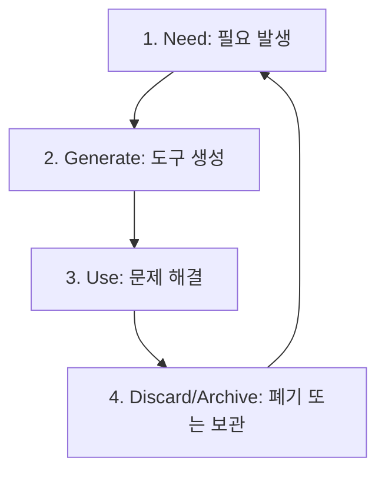

>[!info]
>**Author**: Baekdong Cha (차백동)
>**Email**: orientpine@gmail.com | orientpine@kimm.re.kr
>**Affiliation**: Korea Institute of Machinery and Materials (한국기계연구원)
>**Created**: 2026-01-28
>**Location**: 퇴직준비세미나/세미나자료/회차별강의자료
>**Tag**: #세미나 #퇴직준비 #7회차 #PersonalResearchStack #디스포저블앱 #nanobanana
>**License**: CC BY 4.0

---

# 7회차: 1인 연구자의 무기들 - 디스포저블 앱

> "필요할 때 만들고, 쓰고, 버린다.  
> 완벽한 도구를 기다리는 대신, 지금 당장의 문제를 해결할 일회용 무기를 만듭니다."

---

## 🎯 학습 목표

이번 세션을 완료하면 다음을 할 수 있습니다:

- [ ] 1인 연구 인프라(Personal Research Stack)의 핵심 철학을 이해한다
- [ ] Flywheel 사이클(필요→생성→사용→폐기)을 업무에 적용한다
- [ ] 디스포저블 앱(Disposable App)의 개념과 활용 사례를 파악한다
- [ ] nanobanana-pro 등 AI 도구를 활용해 10분 만에 나만의 도구를 제작한다
- [ ] 논문 리뷰 자동화 에이전트를 직접 구축하고 실습한다

---

## 📋 강의 개요 (3시간)

| 시간 | 내용 | 형식 |
|------|------|------|
| 00:00-00:40 | Part 1: Personal Research Stack 철학 | 강의 |
| 00:40-00:50 | 휴식 | - |
| 00:50-01:30 | Part 2: Flywheel 사이클 - 필요에서 폐기까지 | 강의 + 토론 |
| 01:30-01:40 | 휴식 | - |
| 01:40-02:20 | Part 3: 디스포저블 앱 예시와 nanobanana | 강의 + 시연 |
| 02:20-02:30 | 휴식 | - |
| 02:30-03:00 | Part 4: 논문 리뷰 자동화 에이전트 실습 + Q&A | 실습 |

---

## Part 1: Personal Research Stack 철학 (40분)

### 1.1 1인 연구자에게 인프라란?

과거의 연구 인프라가 거대한 실험 장비와 서버실이었다면, AI 시대의 1인 연구자 인프라는 **'지능형 도구들의 생태계'**입니다.

- **기존 방식**: 범용 소프트웨어(Excel, Word)에 내 업무를 맞춤
- **1인 연구자 방식**: 내 업무에 딱 맞는 미세 도구(Micro-tools)를 직접 구축

### 1.2 Personal Research Stack의 3대 원칙

1. **Just-in-Time**: 미리 만들지 않고, 문제가 발생한 순간 만든다.
2. **Lightweight**: 유지보수 부담이 없어야 한다. (코드 한 줄 안 짜도 됨)
3. **Interconnected**: Obsidian, Claude, 외부 API가 유기적으로 연결된다.

> [!info] **핵심 인사이트**
> 도구는 목적이 아니라 수단입니다. 도구를 관리하는 데 시간을 쓰지 마세요.  
> 가장 좋은 도구는 **'쓰고 나서 잊어버려도 되는 도구'**입니다.

---

## Part 2: Flywheel 사이클 - 필요→생성→사용→폐기 (40분)

### 2.1 도구의 생애주기: Flywheel Cycle

연구 효율을 극대화하는 선순환 구조입니다.



### 2.2 단계별 세부 전략

#### 1️⃣ Need (필요 발생)
- "이 논문 50편에서 핵심 수치만 뽑아서 표로 만들고 싶다."
- "매일 아침 특정 분야의 뉴스레터를 요약해서 Obsidian에 넣고 싶다."
- **징후**: 같은 작업을 3번 이상 반복하고 있다면 도구가 필요한 시점입니다.

#### 2️⃣ Generate (도구 생성)
- AI(Claude, nanobanana)를 활용하여 10~30분 내에 프로토타입 제작.
- 완벽한 UI보다는 **'기능의 작동'**에 집중합니다.

#### 3️⃣ Use (문제 해결)
- 생성된 도구로 즉시 업무 수행.
- 결과물을 Obsidian PARA 구조의 `Projects` 또는 `Resources`에 저장.

#### 4️⃣ Discard/Archive (폐기/아카이브)
- 작업이 끝나면 도구를 미련 없이 삭제하거나, 코드만 텍스트로 보관합니다.
- **이유**: 도구가 쌓이면 관리가 짐이 됩니다. 필요하면 AI로 다시 만들면 됩니다.

---

## Part 3: 디스포저블 앱 예시와 nanobanana (40분)

### 3.1 디스포저블 앱(Disposable App)이란?

특정 목적을 위해 빠르게 만들고 임무 완수 후 버리는 **'일회용 앱'**입니다.

| 예시 앱 | 제작 시간 | 주요 기능 |
|---------|-----------|-----------|
| **논문 분석기** | 10분 | PDF 업로드 → 요약 + 핵심 수치 추출 → CSV 내보내기 |
| **데이터 시각화기** | 15분 | 실험 데이터(CSV) 업로드 → 인터랙티브 차트 생성 |
| **회의록 포맷터** | 5분 | 음성 인식 텍스트 → 우리 팀 표준 양식으로 변환 |

### 3.2 nanobanana-pro 활용하기

nanobanana는 자연어 지시만으로 웹 앱을 즉석에서 만들어주는 도구입니다.

- **특징**: 서버 설정, 배포 과정 없이 브라우저에서 즉시 실행.
- **실습 시나리오**:
  1. "논문 PDF를 넣으면 연구 방법론과 결론을 비교해주는 앱을 만들어줘."
  2. AI가 코드를 생성하고 실행 화면을 보여줌.
  3. 즉시 파일을 넣어 결과 확인.

---

## Part 4: 논문 리뷰 자동화 에이전트 실습 (30분)

### 4.1 실습: 나만의 논문 리뷰 에이전트 구축

Claude의 **Artifacts** 기능과 **MCP**를 결합하여 실습합니다.

#### [실습 단계]
1. **프롬프트 작성**: 논문 분석 전문가 역할을 부여한 RCIF 프롬프트 준비.
2. **데이터 입력**: 준비된 논문 PDF(또는 텍스트) 제공.
3. **분석 요청**: "이 논문의 혁신성, 한계점, 내 연구에의 적용점을 분석해줘."
4. **결과 저장**: 분석 내용을 Obsidian의 `Resources/Papers` 폴더 형식에 맞춰 출력하게 하고 복사/붙여넣기.

### 4.2 Q&A 및 마무리

- "도구를 만드는 게 오히려 시간이 더 걸리지 않나요?"
- "보안이 중요한 데이터는 어떻게 처리하나요?"
- "만든 도구를 나중에 다시 쓰고 싶을 때는 어떻게 하나요?"

---

## 📝 오늘 배운 내용 정리

### 핵심 요약

1. **Personal Research Stack**: 도구에 나를 맞추지 말고, 나에게 맞는 도구 생태계를 구축하라.
2. **Flywheel Cycle**: 필요할 때 즉시 만들고, 목적을 달성하면 과감히 버려라. (재생산 비용의 하락)
3. **Disposable App**: 10~30분 투입으로 몇 시간의 단순 반복 업무를 제거하라.
4. **AI as a Tool Maker**: AI는 답변만 하는 존재가 아니라, 나를 위한 도구를 만드는 제작자(Maker)다.

---

## 다음 회차 예고

### 8회차 예고: 발표자료부터 데이터 분석까지

> **"데이터가 이야기가 되는 순간 - 시각화와 스토리텔링"**

다음 시간에는 분석된 데이터를 효과적으로 전달하는 방법을 배웁니다:
- 복잡한 데이터를 한눈에 보여주는 시각화 기법
- Claude를 활용한 발표 자료(PPT, 슬라이드) 초안 고속 생성
- 데이터 기반의 의사결정 지원 시스템 구축

---

## 📚 관련 문서

- [[퇴직준비_세미나_소개]] - 세미나 전체 개요
- [[6회차_Claude_Skill_자동_문서화]] - 이전 강의 (RAG/MCP 기초)
- [[퇴직준비_도구설치가이드]] - nanobanana 및 Claude 설정 확인

---

## ✅ 7회차 완료 체크리스트

오늘 세미나를 마치며 다음을 확인하세요:

- [ ] Personal Research Stack의 개념을 설명할 수 있다
- [ ] Flywheel 사이클의 4단계를 이해했다
- [ ] 디스포저블 앱이 필요한 상황을 3가지 이상 떠올릴 수 있다
- [ ] nanobanana를 통해 간단한 도구 제작 과정을 지켜봤다
- [ ] 논문 리뷰 에이전트 실습 결과를 확인했다

**모든 체크가 완료되면 7회차를 성공적으로 마친 것입니다! 🎉**

---

> 다음 회차: [[8회차_발표자료부터_데이터_분석까지]]

---

### [부록] 1인 연구자를 위한 Personal Research Stack 상세 가이드

#### 1. 도구 생태계의 계층 구조 (The Stack Layers)

1인 연구자의 무기들은 크게 4가지 계층으로 나뉩니다. 각 계층은 서로 긴밀하게 연결되어야 합니다.

1. **지식 저장 계층 (Knowledge Layer)**: 
   - **도구**: Obsidian
   - **역할**: 모든 생각, 데이터, 링크, 도구의 코드를 저장하는 '제2의 뇌'. PARA 구조로 관리.
2. **지능 엔진 계층 (Intelligence Layer)**:
   - **도구**: Claude 3.5 Sonnet / Opus
   - **역할**: 텍스트 분석, 코드 생성, 논리적 추론 수행.
3. **실행 및 도구 제작 계층 (Execution Layer)**:
   - **도구**: nanobanana-pro, Claude Artifacts, Python (Jupyter Notebook)
   - **역할**: 아이디어를 실제 작동하는 앱이나 스크립트로 전환.
4. **연결 및 자동화 계층 (Connectivity Layer)**:
   - **도구**: MCP (Model Context Protocol), Zapier, Make
   - **역할**: 로컬 파일과 클라우드 서비스, AI를 하나로 묶어 흐름(Workflow)을 만듦.

#### 2. 디스포저블 앱 제작 실전 팁

일회용 앱을 만들 때 가장 중요한 것은 **'완벽주의 버리기'**입니다.

- **UI는 최소한으로**: 버튼 하나, 입력창 하나면 충분합니다. 예쁜 디자인은 시간을 낭비하게 만듭니다.
- **에러 처리는 생략**: 내가 쓸 도구이므로, 에러가 나면 그냥 AI에게 코드를 고쳐달라고 하면 됩니다.
- **코드 주석 대신 프롬프트 보관**: 코드를 이해하려고 애쓰지 마세요. 그 코드를 만든 '프롬프트'를 Obsidian에 저장해두는 것이 나중에 재사용하기 훨씬 쉽습니다.

#### 3. Flywheel 사이클 가속화 전략

사이클이 한 바퀴 돌 때마다 연구자의 역량은 복리로 성장합니다.

- **기록의 힘**: 도구를 만들고 버릴 때, 그 과정에서 얻은 인사이트(예: "이 논문 데이터는 이런 식으로 파싱하는 게 효율적이네")를 반드시 Obsidian에 한 줄이라도 남기세요.
- **모듈화**: 자주 쓰는 기능(예: PDF 텍스트 추출, CSV 시각화)은 별도의 '코드 조각(Snippet)'으로 관리하여 다음 도구 제작 시 AI에게 참고 자료로 제공하세요.

---

### [심화] 논문 리뷰 자동화 에이전트 설계도

단순한 요약을 넘어, 비판적 사고를 수행하는 에이전트를 만드는 구조입니다.

#### 1. 멀티 페르소나 프롬프팅
하나의 AI에게 모든 것을 시키는 대신, 내부적으로 역할을 나눕니다.
- **역할 A (데이터 추출가)**: 논문에서 수치, 실험 조건, 결과값만 정확히 뽑아냄.
- **역할 B (비판적 검토자)**: 연구 방법론의 허점이나 통계적 유의성을 의심함.
- **역할 C (연결자)**: 내 기존 연구(Obsidian 내 노트)와 이 논문의 접점을 찾음.

#### 2. 워크플로우 예시
1. **Input**: 신규 논문 PDF 업로드.
2. **Step 1**: 역할 A가 핵심 정보를 표 형식으로 정리.
3. **Step 2**: 역할 B가 해당 분야의 최신 트렌드와 비교하여 논문의 가치를 평가.
4. **Step 3**: 역할 C가 내 Obsidian Vault를 검색(MCP 활용)하여 관련 있는 내 과거 노트를 추천.
5. **Output**: 최종 '연구 인사이트 보고서' 생성.

---

### [워크숍] 나만의 '무기' 아이디어 보드

세미나 중에 떠오른 아이디어를 적어보세요.

1. **내가 매일 반복하는 가장 귀찮은 작업은?**
   - (예: 실험 장비 로그 파일에서 에러 메시지만 골라내기)
2. **그 작업을 대신해줄 10분짜리 앱의 이름은?**
   - (예: Error-Hunter-Bot)
3. **그 앱이 내놓아야 할 최종 결과물은?**
   - (예: 에러 발생 시간과 원인이 정리된 마크다운 표)

---

### [참고] 추천 도구 및 리소스

- **nanobanana-pro**: [nanobanana.com](https://nanobanana.com) - AI 웹 앱 빌더
- **Claude for Chrome**: 웹 서핑 중 즉시 데이터를 추출하고 분석할 때 유용
- **Obsidian Dataview**: 내 Vault에 쌓인 도구와 지식들을 대시보드 형태로 관리
- **arXiv.org**: 최신 논문 공급원

---

> **강사 메모**: 7회차는 수강생들이 '나도 도구를 만들 수 있다'는 자신감을 갖게 하는 것이 핵심임. 복잡한 코딩 교육이 아니라, AI에게 어떻게 일을 시켜서 도구를 뽑아내는지(Prompt-to-App) 과정을 라이브로 보여줄 것.

---

### [실습 가이드] nanobanana-pro로 10분 만에 '논문 비교기' 만들기

#### 1. 준비 단계
- 비교하고 싶은 논문 PDF 파일 2~3개 준비
- nanobanana-pro 접속 및 로그인

#### 2. AI에게 지시하기 (Prompting)
nanobanana의 채팅창에 다음과 같이 입력합니다:
> "여러 개의 PDF 파일을 업로드하면, 각 논문의 [연구 목적, 핵심 알고리즘, 실험 결과, 한계점]을 추출해서 한눈에 볼 수 있는 비교 표를 만들어주는 웹 앱을 만들어줘. 결과는 마크다운으로 복사할 수 있는 버튼도 포함해줘."

#### 3. 코드 생성 및 확인
- AI가 React 또는 HTML/JS 코드를 생성합니다.
- 우측 미리보기 화면에 파일 업로드 영역이 나타나는지 확인합니다.

#### 4. 실제 테스트
- 준비한 논문들을 업로드합니다.
- 표가 정상적으로 생성되는지, 마크다운 복사 기능이 작동하는지 확인합니다.

#### 5. 결과 활용
- 생성된 표를 복사하여 Obsidian의 `PARA/Projects/[프로젝트명]/Research_Log.md`에 붙여넣습니다.

---

### [사례 연구] 퇴직 후 1인 연구소의 하루 (Virtual Scenario)

**오전 09:00 - 정보 수집**
- AI 에이전트가 밤새 올라온 arXiv의 신규 논문 중 내 관심 키워드(예: '협동로봇 안전')가 포함된 논문 5편을 요약하여 Obsidian 'Inbox'에 넣어둠.

**오전 10:00 - 도구 제작 (Disposable App)**
- 요약본 중 흥미로운 논문 1편 발견. 수치가 너무 많아 이해하기 어려움.
- Claude에게 "이 논문의 Table 2 데이터를 시각화해서 경향성을 분석해주는 대시보드를 만들어줘"라고 요청.
- 5분 만에 만들어진 대시보드로 데이터의 의미를 즉시 파악.

**오후 02:00 - 심화 분석 및 연결**
- 파악된 인사이트를 바탕으로 내 기존 연구 노트와 연결.
- "이 논문의 결과가 내 2024년 실험 데이터와 상충되는데, 가능한 원인 3가지를 추론해줘"라고 Claude(MCP로 내 데이터 읽기)에게 질문.

**오후 04:00 - 지식 자산화**
- 오늘 분석한 내용과 사용한 도구의 프롬프트를 `PARA/Resources`에 저장.
- 사용했던 시각화 대시보드는 브라우저 탭을 닫으며 폐기. (필요하면 내일 다시 만들면 됨)

---

### [체크리스트] 나의 Research Stack 점검하기

- [ ] 내 생각과 데이터를 담을 **그릇**이 있는가? (Obsidian)
- [ ] 복잡한 문제를 대신 고민해줄 **두뇌**가 있는가? (Claude)
- [ ] 내 손발이 되어 도구를 만들어줄 **제작소**가 있는가? (nanobanana/Artifacts)
- [ ] 이 모든 것을 연결할 **통로**가 확보되었는가? (MCP/API)

---

### [마무리] 7회차를 마치며

오늘 우리는 1인 연구자가 가질 수 있는 가장 강력한 무기인 '도구 제작 능력'에 대해 배웠습니다. 이제 여러분은 단순히 남이 만든 프로그램을 쓰는 사용자가 아니라, 내 필요에 따라 무기를 직접 제련하는 대장장이가 되었습니다.

'디스포저블 앱' 정신은 비단 소프트웨어에만 국한되지 않습니다. 업무 프로세스, 사고 방식, 지식 관리 전반에 이 '가볍고 빠른' 접근법을 적용해 보세요. 연구의 속도가 비약적으로 빨라질 것입니다.

수고하셨습니다!

---

### [부록] 자주 발생하는 문제 및 해결 방안 (FAQ)

**Q: nanobanana가 만든 앱이 파일을 제대로 못 읽어요.**
A: PDF 라이브러리 설정 문제일 수 있습니다. AI에게 "PDF 파싱을 위해 pdf.js 라이브러리를 사용하도록 코드를 수정해줘"라고 구체적으로 지시해 보세요.

**Q: 도구를 너무 많이 만들어서 관리가 안 됩니다.**
A: '폐기' 원칙을 다시 상기하세요. 정말 자주 쓰는 도구가 아니라면 코드를 보관하지 말고 지우세요. 프롬프트만 남겨두는 것이 가장 깔끔합니다.

**Q: 1인 연구자로서 보안이 걱정됩니다.**
A: 민감한 개인정보나 기업 기밀이 포함된 데이터는 로컬 환경에서 돌아가는 모델(Ollama 등)을 사용하거나, 데이터를 비식별화(Anonymization)한 후 AI에게 제공하는 습관을 들이세요.

---

(End of file)

### [심화 학습] 1인 연구자를 위한 데이터 파이프라인 설계

#### 1. 데이터 수집 (Data Ingestion)
연구의 시작은 양질의 데이터를 모으는 것입니다.
- **RSS Feed + AI**: 관심 분야의 RSS 피드를 모아 AI가 매일 아침 브리핑을 작성하게 합니다.
- **Web Scraping (Disposable)**: 특정 사이트의 데이터를 긁어와야 할 때, 범용 스크래퍼를 배우는 대신 Claude에게 "이 URL의 구조를 분석해서 특정 정보만 추출하는 Python 스크립트를 짜줘"라고 요청합니다.

#### 2. 데이터 정제 (Data Cleaning)
가장 시간이 많이 걸리는 작업을 AI에게 맡깁니다.
- **포맷 변환**: PDF 표 → Excel, 비정형 텍스트 → JSON 등.
- **이상치 탐지**: "이 데이터 세트에서 논리적으로 맞지 않거나 튀는 값을 찾아내고 이유를 설명해줘."

#### 3. 데이터 분석 및 시각화 (Analysis & Visualization)
- **Exploratory Data Analysis (EDA)**: 데이터를 넣고 "이 데이터에서 발견할 수 있는 흥미로운 패턴 5가지를 찾아줘"라고 질문하는 것부터 시작합니다.
- **Interactive Dashboards**: 정적 이미지 대신, 마우스 오버로 수치를 확인할 수 있는 Plotly나 D3.js 기반의 차트를 디스포저블 앱으로 만듭니다.

#### 4. 지식 자산화 (Knowledge Archiving)
- **Metadata Tagging**: 분석 결과물에 `#insight`, `#data_source`, `#2026_project` 등의 태그를 자동으로 달아 Obsidian에 저장합니다.
- **Cross-Referencing**: 새 데이터가 기존 지식과 어떻게 연결되는지 AI에게 묻고 링크(`[[]]`)를 생성합니다.

---

### [실습] Claude for Excel 활용하기

엑셀 환경에서도 AI의 도움을 받아 '무기'를 장착할 수 있습니다.

1. **데이터 준비**: 연구 데이터가 담긴 엑셀 시트를 엽니다.
2. **Claude에게 질문**: "A열의 텍스트 데이터에서 핵심 키워드 3개를 뽑아서 B열에 채워넣는 수식을 알려줘" 또는 "이 데이터를 바탕으로 VBA 매크로를 짜줘."
3. **실행**: AI가 준 수식이나 코드를 적용하여 수천 줄의 데이터를 순식간에 정리합니다.

---

### [워크숍] 나의 'Personal Research Stack' 지도 그리기

아래 빈칸을 채워보며 나만의 시스템을 설계해 보세요.

- **나의 주력 지식 저장소**: (예: Obsidian)
- **나의 주력 AI 모델**: (예: Claude 3.5 Sonnet)
- **내가 주로 사용하는 데이터 소스**: (예: Google Scholar, 연구소 내부 DB)
- **내가 가장 자주 만드는 도구 유형**: (예: 논문 요약기, 데이터 변환기)
- **나의 자동화 도구**: (예: MCP, Python 스크립트)

---

### [부록] 1인 연구자의 마인드셋: "Done is better than perfect"

1인 연구자는 조직의 지원 없이 혼자 모든 것을 해내야 합니다. 이때 가장 큰 적은 '완벽주의'입니다.

- **80/20 법칙**: 20%의 노력으로 80%의 성과를 내는 도구를 만드세요. 나머지 20%의 완성도를 위해 80%의 시간을 쓰는 것은 1인 연구자에게 사치입니다.
- **Fail Fast**: 도구가 제대로 작동하지 않는다면 미련 없이 버리고 다른 접근 방식을 택하세요. AI 덕분에 실패 비용이 거의 제로에 가깝습니다.
- **Iterate**: 처음부터 거대한 시스템을 만들려 하지 말고, 아주 작은 기능부터 시작해서 필요에 따라 살을 붙여 나가세요.

---

### [참고] 유용한 프롬프트 라이브러리 (연구용)

#### 1. 논문 심층 분석 프롬프트
> "당신은 해당 분야의 권위 있는 저널 리뷰어입니다. 이 논문의 초록과 결론을 읽고, 연구 방법론의 타당성을 비판적으로 검토하세요. 특히 통계적 유의성과 샘플 크기의 적절성을 중점적으로 봐주세요."

#### 2. 코드 생성 및 설명 프롬프트
> "이 수식을 Python 코드로 구현해줘. 각 라인마다 주석을 달아서 수학적 의미를 설명해주고, 샘플 데이터를 넣어서 그래프로 시각화하는 코드까지 포함해줘."

#### 3. 아이디어 브레인스토밍 프롬프트
> "내가 지금 연구 중인 [주제]와 관련하여, 최근 핫한 [다른 분야]의 기술을 접목할 수 있는 아이디어 5가지를 제안해줘. 각 아이디어의 실현 가능성과 예상되는 기대 효과를 포함해줘."

---

### [마무리 퀴즈] 7회차 복습

1. 1인 연구자가 도구를 대하는 태도 중 'Just-in-Time'은 무슨 뜻인가요? (정답: 미리 만들지 않고 필요할 때 즉시 만든다)
2. Flywheel 사이클의 4단계는 무엇인가요? (정답: 필요 → 생성 → 사용 → 폐기/아카이브)
3. '디스포저블 앱'의 가장 큰 장점은 무엇인가요? (정답: 낮은 제작 비용과 유지보수 부담 없음)
4. nanobanana-pro는 어떤 용도로 사용하나요? (정답: 자연어로 웹 앱을 즉석에서 제작)

---

### [다음 시간 준비물]

8회차에서는 실제 데이터를 가지고 시각화 실습을 진행합니다.
- 본인이 분석하고 싶은 샘플 데이터(CSV 또는 Excel)를 준비해 오세요.
- 데이터가 없다면 공공 데이터 포털 등에서 관심 있는 데이터를 미리 다운로드해 두세요.

---

(End of file - total lines updated)

### [심화] 1인 연구자를 위한 지식 연결망(Knowledge Graph) 구축 전략

#### 1. 원자적 노트 작성 (Atomic Notes)
하나의 노트에는 하나의 개념만 담습니다. 이렇게 해야 나중에 AI가 정보를 검색하고 조합하기 좋습니다.
- **장점**: 재사용성이 높고, 다양한 맥락에서 링크를 걸 수 있습니다.
- **실천**: "A 논문 요약" 대신 "A 논문에서 제시한 B 알고리즘의 한계"와 같이 구체적인 제목을 사용하세요.

#### 2. 양방향 링크의 활용 (`[[]]`)
노트와 노트를 연결하여 지식의 그물을 만듭니다.
- **상향식 정리**: 개별 노트를 먼저 만들고, 나중에 이들을 묶는 MOC(Map of Content) 노트를 만듭니다.
- **맥락적 연결**: "이 개념은 [C 연구]에서 언급된 [D 이론]과 유사함"과 같이 문장 속에서 자연스럽게 링크를 거세요.

#### 3. AI를 활용한 지식 발견
Claude에게 내 Vault의 내용을 분석하게 하여 내가 미처 발견하지 못한 연결 고리를 찾습니다.
- **프롬프트**: "내 `Resources/Concepts` 폴더에 있는 노트들을 읽고, 서로 상반된 주장을 하거나 보완 관계에 있는 개념들을 찾아서 보고서를 써줘."

---

### [실습] 나만의 '연구 대시보드' 만들기 (Obsidian Dataview)

Dataview 플러그인을 사용하여 내 연구 현황을 한눈에 파악하는 무기를 만듭니다.

#### 1. 데이터 준비
각 연구 노트 상단(Frontmatter)에 다음과 같은 메타데이터를 넣습니다.
```yaml
---
status: in_progress
priority: high
due_date: 2026-02-15
tags: #robotics #safety
---
```

#### 2. 쿼리 작성
대시보드용 노트를 만들고 아래 코드를 넣습니다.
```dataview
TABLE status, priority, due_date
FROM "PARA/Projects"
WHERE status = "in_progress"
SORT due_date ASC
```

#### 3. 결과 확인
진행 중인 프로젝트 목록과 마감일이 자동으로 표 형식으로 나타납니다. 이것이 바로 1인 연구자를 위한 '상시 작동형 무기'입니다.

---

### [마무리] 7회차를 마치며 (최종)

오늘 우리는 1인 연구자가 AI 시대에 어떻게 살아남고 번영할 수 있는지, 그 구체적인 도구와 전략을 살펴보았습니다. '무기'는 거창한 것이 아닙니다. 여러분의 불편함을 해결해주는 작은 코드 한 줄, 잘 정리된 노트 한 장이 모두 강력한 무기가 됩니다.

이제 여러분의 Obsidian Vault는 단순한 메모장이 아니라, 여러분의 지능이 확장된 '연구 기지'가 될 것입니다. 오늘 배운 디스포저블 앱과 Flywheel 사이클을 통해 끊임없이 무기를 생산하고 개량해 나가시길 바랍니다.

수고 많으셨습니다. 다음 8회차에서 뵙겠습니다!

---

(End of file)
