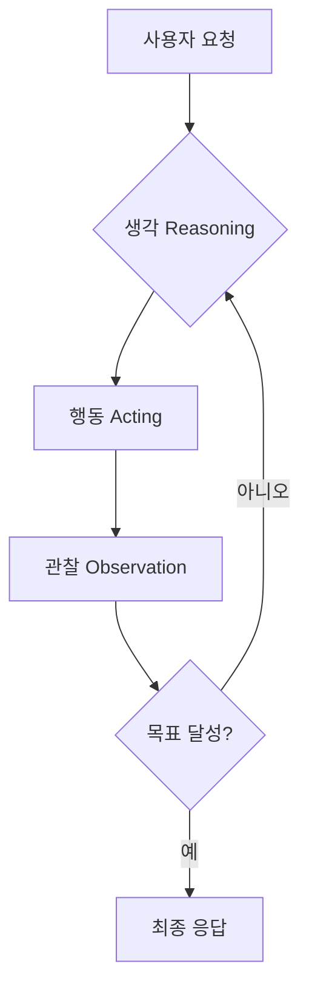

>[!info]
>**Author**: Baekdong Cha (차백동)
>**Email**: orientpine@gmail.com | orientpine@kimm.re.kr
>**Affiliation**: Korea Institute of Machinery and Materials (한국기계연구원)
>**Created**: 2026-01-27
>**Location**: 퇴직준비세미나/세미나자료/회차별강의자료
>**Tag**: #세미나 #퇴직준비 #3회차 #AIAgent #에이전트아키텍처 #ClaudeCode
>**License**: CC BY 4.0

---

# 3회차: 24시간 협업 파트너 - Tool Use, Planning, Memory

> "AI 에이전트는 단순히 대화하는 상대가 아닙니다.  
> 스스로 생각하고, 도구를 사용하며, 목표를 달성할 때까지 멈추지 않는 당신의 디지털 분신입니다."

---

## 🎯 학습 목표

이번 세션을 완료하면 다음을 할 수 있습니다:

- [ ] AI Agent의 정의와 단순 챗봇과의 차이점을 명확히 설명한다
- [ ] Agent의 3대 핵심 요소(Planning, Tool Use, Memory)를 이해한다
- [ ] Agent Loop(ReAct 패턴)의 동작 원리를 파악한다
- [ ] Claude Code가 내부적으로 어떻게 Agent로 동작하는지 이해한다
- [ ] 반복적인 업무를 Agent화하기 위한 설계 프로세스를 습득한다

---

## 📋 강의 개요 (3시간)

| 시간 | 내용 | 형식 |
|------|------|------|
| 00:00-00:40 | Part 1: Agent란 무엇인가 - 3요소(Tool Use, Planning, Memory) | 강의 |
| 00:40-00:50 | 휴식 | - |
| 00:50-01:30 | Part 2: Agent Loop 이해 - 요청→계획→실행→결과→학습 | 강의 + 데모 |
| 01:30-01:40 | 휴식 | - |
| 01:40-02:20 | Part 3: Claude Code Agent 심화 활용 | 실습 |
| 02:20-02:30 | 휴식 | - |
| 02:30-03:00 | Part 4: 반복 업무 Agent화 설계 워크숍 + Q&A | 워크숍 |

---

## Part 1: Agent란 무엇인가 - 3요소 (40분)

### 1.1 챗봇 vs 에이전트 (10분)

단순한 **챗봇(Chatbot)**과 **에이전트(Agent)**의 가장 큰 차이는 **'자율성'**과 **'실행력'**입니다.

| 구분 | 챗봇 (Chatbot) | 에이전트 (Agent) |
|------|---------------|-----------------|
| **동작 방식** | 질문에 대한 답변 생성 | 목표 달성을 위한 행동 수행 |
| **상호작용** | 1회성 대화 중심 | 목표 달성까지 반복적 루프 |
| **도구 사용** | 텍스트 생성에 국한 | 파일, 웹, API 등 외부 도구 활용 |
| **기억** | 현재 대화 맥락 유지 | 장단기 기억을 활용한 전략 수정 |

> [!info] **핵심 정의**
> **AI 에이전트**란 LLM이 스스로 계획을 세우고, 필요한 도구를 사용하며, 결과를 관찰하고 반성하며 목표를 달성하는 시스템을 말합니다.

---

### 1.2 Agent의 3대 핵심 요소 (30분)

에이전트가 지능적으로 동작하기 위해서는 다음 세 가지 요소가 필수적입니다.

#### 1️⃣ Planning (계획 수립)
복잡한 목표를 작은 단위의 실행 가능한 작업으로 나누는 능력입니다.
- **목표 분해**: "보고서 작성" → "자료 조사", "개요 작성", "본문 작성", "검토"
- **단계별 실행**: 우선순위에 따라 순차적 또는 병렬적으로 작업 배치
- **자기 반성(Reflection)**: 계획대로 되지 않을 때 스스로 계획을 수정

#### 2️⃣ Tool Use (도구 사용)
LLM의 텍스트 생성 능력을 넘어 실제 세상에 영향을 미치는 수단입니다.
- **파일 시스템**: 문서 읽기, 코드 작성, 데이터 저장
- **웹 브라우징**: 실시간 정보 검색, 데이터 수집
- **코드 실행**: 복잡한 계산 수행, 데이터 시각화
- **외부 API**: 이메일 발송, 일정 등록, 클라우드 서비스 제어

#### 3️⃣ Memory (기억 유지)
과거의 경험과 현재의 상태를 저장하고 활용하는 능력입니다.
- **단기 기억 (Short-term Memory)**: 현재 진행 중인 작업의 컨텍스트 (대화 이력)
- **장기 기억 (Long-term Memory)**: 과거에 배운 지식, 사용자 선호도, 성공/실패 사례 (RAG 또는 외부 DB 활용)

---

## Part 2: Agent Loop 이해 (40분)

### 2.1 ReAct 패턴: 생각하고 행동하기 (20분)

가장 대표적인 에이전트 동작 방식은 **ReAct (Reasoning + Acting)** 패턴입니다.

1. **Thought (생각)**: 현재 상황을 분석하고 무엇을 해야 할지 결정합니다.
2. **Action (행동)**: 결정된 행동을 수행하기 위해 도구를 호출합니다.
3. **Observation (관찰)**: 도구 실행 결과를 확인하고 정보를 업데이트합니다.
4. **반복**: 목표가 달성될 때까지 위 과정을 반복합니다.

---

### 2.2 Agent Loop 라이브 데모 (20분)

Claude Code가 복잡한 요청을 처리하는 과정을 실시간으로 관찰합니다.

**데모 시나리오**: "현재 폴더의 모든 마크다운 파일을 읽어서 핵심 키워드를 추출하고, 이를 표 형식으로 정리한 summary.md 파일을 생성해줘."

**관찰 포인트**:
- Claude가 어떻게 작업을 단계별로 나누는지 (Planning)
- `ls`, `read`, `write` 도구를 어떻게 호출하는지 (Tool Use)
- 오류가 발생했을 때 어떻게 스스로 수정하는지 (Reflection)

---

## Part 3: Claude Code Agent 심화 활용 (40분)

### 3.1 Claude Code의 내부 아키텍처 (15분)

Claude Code는 단순한 CLI 도구가 아니라 고도로 설계된 에이전트입니다.

- **System Prompt**: 에이전트로서의 정체성과 도구 사용 규칙 부여
- **Tool Definition**: 사용 가능한 도구들의 명세 (JSON Schema)
- **Context Management**: 토큰 제한 내에서 최적의 정보를 유지하는 기술

### 3.2 실습: 복잡한 태스크 수행하기 (25분)

참석자들이 직접 Claude Code를 사용하여 다단계 작업을 수행해봅니다.

#### 실습 과제: 연구 자료 자동 정리 에이전트
1. 특정 주제(예: 'Physical AI')에 대한 메모 파일들을 찾습니다.
2. 각 파일의 내용을 요약합니다.
3. 요약된 내용을 바탕으로 '연구_트렌드_보고서.md'를 작성합니다.
4. 작성된 보고서에 오타나 논리적 오류가 없는지 스스로 검토하게 합니다.

---

## Part 4: 반복 업무 Agent화 설계 워크숍 (30분)

### 4.1 Agent화 설계 프로세스 (10분)

어떤 업무를 에이전트에게 맡길 것인가?

1. **업무 분해**: 업무를 최소 단위의 단계(Step)로 나눕니다.
2. **도구 매핑**: 각 단계에서 필요한 도구(검색, 읽기, 쓰기, 계산)를 정의합니다.
3. **프롬프트 설계**: 에이전트에게 부여할 역할과 지침을 작성합니다.
4. **예외 처리**: 예상되는 오류 상황과 대응 방안을 설정합니다.

---

### 4.2 워크숍: 나의 업무 Agent 설계하기 (20분)

본인의 업무 중 매주 반복되는 작업을 하나 선정하여 에이전트 설계도를 작성합니다.

#### 설계 템플릿
- **에이전트 이름**: (예: 주간 보고서 작성 비서)
- **목표**: (예: 한 주간의 일정과 메일을 분석하여 보고서 초안 작성)
- **필요한 도구**: (예: Outlook API, Notion API, 파일 시스템)
- **실행 단계**:
  1. ...
  2. ...
  3. ...
- **성공 판정 기준**: (예: 모든 항목이 포함된 마크다운 파일 생성)

---

## 📝 오늘 배운 내용 정리

### 핵심 요약

1. **에이전트의 본질**: 단순 답변을 넘어 **목표 달성을 위해 스스로 행동**하는 시스템입니다.
2. **3대 요소**: **Planning**(계획), **Tool Use**(도구), **Memory**(기억)가 에이전트의 지능을 결정합니다.
3. **ReAct 루프**: **생각 → 행동 → 관찰**의 반복을 통해 복잡한 문제를 해결합니다.
4. **Claude Code**: 우리가 사용하는 가장 강력하고 접근하기 쉬운 **실전형 에이전트**입니다.

---

## 다음 회차 예고

### 4회차 예고: 24시간 일하는 나의 분신 만들기

> **"나만의 커스텀 에이전트 구축과 자동화 워크플로우"**

다음 시간에는 오늘 배운 개념을 바탕으로 실제 자동화 시스템을 구축해봅니다:
- MCP(Model Context Protocol)를 활용한 도구 확장
- GitHub Actions와 연동한 자동 실행 에이전트
- 나만의 업무 비서 에이전트 최적화 기법

---

## 📚 관련 문서

- [[퇴직준비_세미나_소개]] - 세미나 전체 개요
- [[2회차_프롬프트_엔지니어링_기초]] - 이전 강의 (프롬프트 기초)
- [[퇴직준비_강사준비지식]] - 에이전트 기술 상세 참조

---

## ✅ 3회차 완료 체크리스트

오늘 세미나를 마치며 다음을 확인하세요:

- [ ] 챗봇과 에이전트의 차이점을 설명할 수 있다
- [ ] Planning, Tool Use, Memory의 역할을 이해했다
- [ ] ReAct 패턴의 동작 과정을 파악했다
- [ ] Claude Code를 활용해 다단계 작업을 수행해봤다
- [ ] 본인 업무의 에이전트 설계 초안을 작성했다

**모든 체크가 완료되면 3회차를 성공적으로 마친 것입니다! 🚀**

---

> 다음 회차: [[4회차_24시간_일하는_나의_분신_만들기]]

### Part 1 상세: Agent의 3요소 심층 분석

#### 1. Planning (계획 수립)
에이전트의 '두뇌'에 해당합니다. 복잡한 문제를 해결하기 위해 LLM은 다음과 같은 전략을 사용합니다.
- **Chain of Thought (CoT)**: 문제를 단계별로 생각하도록 유도하여 논리적 오류를 줄입니다.
- **Tree of Thoughts (ToT)**: 여러 가지 가능한 해결 경로를 탐색하고 최적의 경로를 선택합니다.
- **Task Decomposition**: 큰 목표를 하위 작업(Sub-tasks)으로 쪼개어 관리 가능한 수준으로 만듭니다.

#### 2. Tool Use (도구 사용)
에이전트의 '손과 발'에 해당합니다. LLM 자체는 외부 세계와 단절되어 있지만, 도구를 통해 현실적인 작업을 수행합니다.
- **API Interaction**: 날씨 정보 조회, 주식 데이터 추출, 이메일 발송 등.
- **Code Interpreter**: 복잡한 수학 계산이나 데이터 분석을 위해 파이썬 코드를 직접 작성하고 실행합니다.
- **Search Engines**: 최신 정보를 얻기 위해 웹 검색을 수행합니다.

#### 3. Memory (기억 유지)
에이전트의 '경험'에 해당합니다.
- **Context Window**: 현재 대화에서 주고받은 정보를 기억합니다. (단기 기억)
- **Vector Database (RAG)**: 방대한 양의 외부 문서를 인덱싱하여 필요할 때마다 관련 정보를 검색해 옵니다. (장기 기억)
- **User Profile**: 사용자의 선호도나 과거 피드백을 저장하여 개인화된 서비스를 제공합니다.

---

### Part 2 상세: Agent Loop와 ReAct 패턴

#### ReAct (Reasoning + Acting)의 실제 예시
사용자가 "오늘 서울 날씨에 맞는 옷차림을 추천해줘"라고 요청했을 때의 에이전트 내부 동작:

1. **Thought**: 서울의 현재 날씨 정보를 알아야 한다. 날씨 검색 도구를 사용하자.
2. **Action**: `search_weather(location="Seoul")`
3. **Observation**: "현재 서울 기온은 5도, 맑음, 바람이 강함"
4. **Thought**: 기온이 5도이고 바람이 강하므로 코트나 패딩이 필요하다. 추가로 미세먼지 정보도 확인해보자.
5. **Action**: `search_dust(location="Seoul")`
6. **Observation**: "미세먼지 농도 좋음"
7. **Thought**: 날씨는 춥지만 공기는 깨끗하다. 두꺼운 외투를 추천하고 마스크는 선택사항이라고 안내하자.
8. **Final Answer**: "오늘 서울은 5도로 춥고 바람이 강하니 두꺼운 코트를 입으세요. 공기는 깨끗합니다."

---

### Part 3 상세: Claude Code를 통한 에이전트 실습

#### Claude Code의 주요 도구들
Claude Code는 개발 및 문서 작업에 최적화된 도구들을 내장하고 있습니다.
- `ls`: 디렉토리 구조 파악
- `grep`: 특정 키워드 검색
- `read`: 파일 내용 읽기
- `write`: 파일 생성 및 수정
- `bash`: 터미널 명령 실행

#### 실습: 자동화 워크플로우 구축
참석자들은 다음 시나리오를 직접 수행하며 에이전트의 위력을 체감합니다.
1. **탐색**: `ls -R`을 통해 프로젝트 구조를 파악합니다.
2. **분석**: `grep`을 사용하여 특정 주제와 관련된 파일들을 찾아냅니다.
3. **생성**: 찾아낸 정보들을 종합하여 새로운 요약 문서를 작성합니다.
4. **검증**: 작성된 문서의 링크가 올바른지, 내용에 모순은 없는지 다시 한번 확인합니다.

---

### Part 4 상세: 에이전트 설계 워크숍 가이드

#### 에이전트 설계 시 고려사항
- **권한 관리**: 에이전트가 삭제하거나 수정해서는 안 되는 파일/데이터를 명확히 정의합니다.
- **비용 최적화**: 불필요한 루프를 방지하여 토큰 사용량을 관리합니다.
- **인간의 개입 (Human-in-the-loop)**: 중요한 결정 단계에서는 반드시 사용자의 승인을 받도록 설계합니다.

#### 워크숍 결과물 예시: '회의록 자동 정리 에이전트'
- **Input**: 회의 녹취록 텍스트 파일
- **Process**:
  1. 녹취록에서 참석자 및 주요 안건 추출
  2. 결정 사항과 미결 사항 구분
  3. 담당자별 액션 아이템 정리
  4. 다음 회의 일정 제안
- **Output**: 정리된 마크다운 회의록 파일 및 담당자에게 보낼 이메일 초안

---

### 핵심 요약 및 마무리

오늘 우리는 AI가 단순한 도구를 넘어 **자율적인 파트너**로 진화하는 과정을 살펴보았습니다.
에이전트 기술은 아직 초기 단계이지만, 이를 이해하고 활용하는 능력은 앞으로의 업무 생산성을 결정짓는 핵심 역량이 될 것입니다.

- **에이전트는 목표 지향적입니다.**
- **에이전트는 도구를 통해 확장됩니다.**
- **에이전트는 경험을 통해 학습합니다.**

여러분의 일상적인 업무 중 어떤 부분을 에이전트에게 맡길 수 있을지 고민해보는 시간이 되었기를 바랍니다.

---

### 부록: AI 에이전트 심화 학습 가이드

#### 1. 에이전트 아키텍처의 진화
에이전트 기술은 매달 새로운 논문과 프레임워크가 나올 정도로 빠르게 발전하고 있습니다.

- **Single Agent**: 하나의 강력한 모델이 모든 작업을 수행 (예: Claude Code)
- **Multi-Agent Systems (MAS)**: 특정 분야에 특화된 여러 에이전트가 협업 (예: 기획 에이전트 + 코딩 에이전트 + 테스트 에이전트)
- **Hierarchical Agent**: 관리자 에이전트가 하위 에이전트들에게 작업을 배분하고 결과를 취합하는 구조

#### 2. 주요 에이전트 프레임워크 소개
직접 에이전트를 개발하고 싶은 분들을 위한 도구들입니다.
- **LangChain**: LLM 애플리케이션 개발을 위한 가장 대중적인 프레임워크
- **AutoGPT / BabyAGI**: 자율적 목표 달성을 목표로 하는 초기 에이전트 프로젝트
- **CrewAI**: 역할 기반의 멀티 에이전트 협업을 쉽게 구현할 수 있는 도구
- **Microsoft AutoGen**: 복잡한 워크플로우를 가진 멀티 에이전트 시스템 구축용

#### 3. 에이전트 도입 시의 윤리적/보안적 고려사항
에이전트에게 자율성을 부여할수록 보안 리스크도 커집니다.
- **Prompt Injection**: 악의적인 입력으로 에이전트의 제어권을 탈취하는 공격
- **Data Privacy**: 에이전트가 학습하거나 참조하는 데이터에 민감 정보가 포함되지 않도록 주의
- **Unintended Actions**: 에이전트가 의도치 않게 중요한 파일을 삭제하거나 외부로 데이터를 유출하는 상황 방지

---

### 실습 가이드: Claude Code로 나만의 에이전트 경험하기

#### 단계 1: 환경 준비
- 터미널에서 `claude` 명령어를 실행하여 Claude Code를 활성화합니다.
- 현재 작업 중인 프로젝트 폴더로 이동합니다.

#### 단계 2: 목표 설정
- 명확하고 구체적인 목표를 제시합니다.
- 예: "이 프로젝트의 모든 자바스크립트 파일에서 주석이 없는 함수를 찾아 목록을 만들고, 각 함수에 대한 적절한 JSDoc 주석을 생성해서 파일에 적용해줘."

#### 단계 3: 루프 관찰
- Claude가 어떻게 파일을 검색(`grep`)하고, 내용을 읽고(`read`), 코드를 분석하여 주석을 작성하고(`write`), 결과를 확인하는지 지켜봅니다.
- 중간에 Claude가 질문을 던지면 적절한 가이드를 제공합니다.

#### 단계 4: 결과 검토
- 작업이 완료되면 생성된 주석의 품질을 확인합니다.
- 에이전트가 놓친 부분이 있다면 추가 지시를 통해 보완합니다.

---

### 강사 메모: 3회차 강의 시 유의사항

1. **개념의 추상성**: 에이전트라는 개념이 처음 접하는 분들에게는 다소 추상적일 수 있습니다. 가능한 많은 비유(예: 유능한 비서, 자율주행 자동차)를 활용하세요.
2. **데모의 중요성**: 백 마디 말보다 한 번의 데모가 효과적입니다. Claude Code가 실제로 파일을 조작하고 문제를 해결하는 과정을 반드시 보여주세요.
3. **워크숍 지원**: 참석자들이 본인의 업무를 에이전트화하는 과정에서 어려움을 겪을 수 있습니다. 각 그룹을 돌며 업무 분해(Task Decomposition) 과정을 도와주세요.
4. **기술적 한계 명시**: 현재 에이전트 기술이 만능이 아님을 분명히 하세요. 특히 복잡한 논리나 긴 문맥 유지에서의 한계를 언급하여 과도한 기대를 조절해야 합니다.

---

### 참고 문헌 및 추천 도서
- "Generative Agents: Interactive Simulacra of Human Behavior" (Stanford University Research)
- "LLM Powered Autonomous Agents" (Lilian Weng's Blog)
- "The Rise of AI Agents" (Various Tech Reports 2024-2025)

---

### Q&A 세션 예상 질문 및 답변

**Q: 에이전트가 실수로 중요한 파일을 지우면 어떻게 하나요?**
A: 그래서 'Human-in-the-loop' 설계가 중요합니다. Claude Code와 같은 도구는 위험한 명령을 실행하기 전에 반드시 사용자의 승인을 구하도록 설정되어 있습니다. 또한, 항상 Git과 같은 버전 관리 시스템을 사용하여 언제든 복구 가능한 상태를 유지해야 합니다.

**Q: 에이전트를 사용하면 비용이 많이 들지 않나요?**
A: 에이전트는 목표를 달성할 때까지 여러 번의 API 호출을 수행하므로 단순 챗봇보다 비용이 많이 발생할 수 있습니다. 따라서 효율적인 프롬프트 설계와 불필요한 도구 호출 방지가 중요합니다.

**Q: 코딩을 못 해도 에이전트를 만들 수 있나요?**
A: 네, 최근에는 코딩 없이 자연어만으로 에이전트를 설계할 수 있는 'No-code Agent Builder'들이 많이 등장하고 있습니다. 오늘 워크숍에서 진행하는 설계 과정이 바로 그 시작입니다.

---

### 실전 사례 연구: AI 에이전트 도입 전후 비교

#### 사례 1: 기술 문서 번역 및 현지화
- **기존 방식**: 번역가에게 의뢰하거나 단순 번역기를 돌린 후, 사람이 일일이 용어를 수정하고 마크다운 형식을 맞춤. (소요 시간: 파일당 2시간)
- **에이전트 방식**:
  1. 에이전트가 원본 파일을 읽음.
  2. 프로젝트 전용 용어집(Glossary)을 참조하여 번역.
  3. 번역된 내용의 마크다운 문법 오류 검사.
  4. 깨진 링크나 이미지 경로 자동 수정.
- **결과**: 소요 시간 5분으로 단축, 일관된 용어 사용 및 형식 유지.

#### 사례 2: 고객 문의 자동 분류 및 초안 작성
- **기존 방식**: 담당자가 매일 아침 수백 건의 메일을 읽고 카테고리별로 분류한 뒤 답장 작성. (소요 시간: 매일 3시간)
- **에이전트 방식**:
  1. 에이전트가 메일 서버에서 신규 메일을 가져옴.
  2. 감정 분석 및 긴급도에 따라 우선순위 부여.
  3. 과거 유사 문의 답변 사례를 검색하여 답장 초안 작성.
  4. 담당자에게 검토 요청 알림 발송.
- **결과**: 단순 반복 업무 80% 감소, 긴급 문의 대응 속도 획기적 향상.

---

### 에이전트 시대를 준비하는 우리의 자세

AI 에이전트의 등장은 우리가 일하는 방식을 근본적으로 바꾸고 있습니다. 이제 우리는 '직접 일을 하는 사람'에서 '일을 시키고 관리하는 매니저'로 역할이 변화하고 있습니다.

1. **문제 정의 능력**: 에이전트에게 무엇을 시킬지 명확하게 정의하는 능력이 가장 중요해집니다.
2. **도구 이해도**: 어떤 도구가 있고, 에이전트가 이를 어떻게 활용할 수 있는지 아는 것이 경쟁력이 됩니다.
3. **비판적 사고**: 에이전트의 결과물을 맹신하지 않고, 논리적 오류나 편향을 잡아낼 수 있는 안목이 필요합니다.
4. **협업 마인드**: AI를 도구가 아닌 파트너로 인식하고, 지속적인 피드백을 통해 함께 성장하려는 자세가 필요합니다.

---

### 맺음말: 24시간 쉬지 않는 당신의 파트너

오늘 우리는 AI 에이전트라는 새로운 가능성의 문을 열었습니다. 
처음에는 에이전트에게 일을 맡기는 것이 어색하고 불안할 수 있습니다. 하지만 작은 업무부터 하나씩 맡겨보며 신뢰를 쌓아가다 보면, 어느새 여러분 곁에는 24시간 지치지 않고 일하는 든든한 파트너가 생겨나 있을 것입니다.

다음 시간에는 오늘 설계한 내용을 바탕으로, 실제로 동작하는 '나만의 분신'을 만드는 실습을 진행하겠습니다. 
오늘 배운 개념들을 잘 복습해 오시기 바랍니다.

수고하셨습니다!

---

#### [참고] 에이전트 관련 용어 사전 (Glossary)

- **LLM (Large Language Model)**: 에이전트의 지능을 담당하는 거대 언어 모델.
- **Prompt**: 에이전트에게 전달하는 지시문.
- **Token**: LLM이 텍스트를 처리하는 최소 단위. 비용과 문맥 길이에 영향을 미침.
- **Hallucination**: AI가 사실이 아닌 정보를 그럴듯하게 지어내는 현상.
- **RAG (Retrieval-Augmented Generation)**: 외부 데이터를 검색하여 답변의 정확도를 높이는 기술.
- **Fine-tuning**: 특정 목적에 맞게 모델을 추가 학습시키는 과정.
- **Zero-shot / Few-shot**: 예시 없이 또는 몇 개의 예시만으로 작업을 수행하는 방식.
- **System Message**: 에이전트의 근본적인 역할과 제약 조건을 설정하는 메시지.

---

### [심화] 에이전트의 자기 반성(Self-Reflection) 메커니즘

에이전트가 단순히 명령을 실행하는 것을 넘어, 자신의 결과물을 스스로 평가하고 개선하는 과정은 에이전트의 성능을 비약적으로 높여줍니다.

#### 1. Self-Correction (자기 수정)
에이전트가 코드를 작성한 후 실행했을 때 에러가 발생하면, 에러 메시지를 분석하여 코드를 스스로 수정합니다.
- **동작**: 코드 작성 -> 실행 -> 에러 발생 -> 에러 분석 -> 코드 수정 -> 재실행

#### 2. Self-Critique (자기 비판)
작성된 텍스트나 결과물이 사용자의 요구사항을 충족하는지 스스로 검토합니다.
- **동작**: 초안 작성 -> "이 글에 논리적 허점은 없는가?" 자문 -> 수정 -> "더 간결하게 표현할 수 있는가?" 자문 -> 최종안 도출

#### 3. 환경 피드백 활용
외부 도구의 실행 결과(Observation)를 바탕으로 다음 행동을 결정합니다.
- **동작**: 웹 검색 -> "원하는 정보가 검색 결과에 없는가?" -> 검색어 변경 -> 재검색

---

### 에이전트 워크플로우 시각화 예시

복잡한 에이전트의 동작을 이해하기 위해 '연구 논문 요약 에이전트'의 워크플로우를 시각화해 봅니다.

1. **Trigger**: 사용자가 논문 PDF 경로를 입력함.
2. **Step 1 (Planning)**: 논문을 섹션별로 나누어 읽기로 계획함.
3. **Step 2 (Tool Use)**: `read_pdf` 도구를 사용하여 서론, 방법론, 결과, 결론을 추출함.
4. **Step 3 (Reasoning)**: 각 섹션의 핵심 내용을 파악하고 전체적인 흐름을 구성함.
5. **Step 4 (Memory)**: 사용자가 이전에 선호했던 요약 스타일(표 형식)을 기억에서 불러옴.
6. **Step 5 (Action)**: 요약된 내용을 마크다운 표 형식으로 작성함.
7. **Step 6 (Reflection)**: "요약 내용이 원문의 핵심 수치를 정확히 반영하고 있는가?"를 원문과 대조하여 검증함.
8. **Output**: 최종 요약 보고서를 사용자에게 전달함.

---

### 마무리 퀴즈: 에이전트 개념 확인

1. **에이전트의 3대 요소가 아닌 것은?**
   - (A) Planning
   - (B) Tool Use
   - (C) Memory
   - (D) Graphic Design (정답: D)

2. **ReAct 패턴에서 'Observation' 단계의 역할은?**
   - (A) 다음 행동을 계획한다.
   - (B) 도구 실행 결과를 확인하고 정보를 업데이트한다. (정답: B)
   - (C) 사용자에게 최종 답변을 보낸다.
   - (D) 에이전트의 역할을 설정한다.

3. **Claude Code에서 파일을 수정할 때 사용하는 도구는?**
   - (A) `ls`
   - (B) `grep`
   - (C) `write` (정답: C)
   - (D) `read`

---

